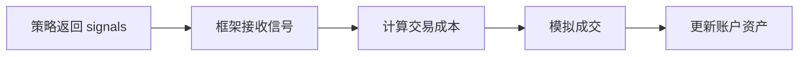

# 第 4 课：核心概念

> ⏱ **课时**：40 分钟  
> 🎯 **学习目标**：理解策略的基本结构，掌握 data 字典和核心 API 函数  
> 📚 **难度**：⭐⭐ 入门级

---

## 📖 课程概览

上一课你成功运行了第一个回测，看到了策略"跑"起来的样子。但你可能还在想：

> "策略文件里面写的那些代码，到底是什么意思？"

今天这节课，我们就来揭开策略的"神秘面纱"。

---

## 4.1 策略的本质：一套规则

在第 0 课我们说过，量化交易就是"用规则代替直觉"。

而策略文件（`.py` 文件）就是 **这套规则的代码形式**。

### 一个类比

把策略想象成一个 **机器人员工**：

- 你告诉它："当股价连续涨3天，你就买入"
- 它每天早上去看股价，判断是否满足条件
- 满足就买，不满足就不动

策略文件就是你写给这个"机器人员工"的 **工作手册**。

---

## 4.2 策略文件的基本结构

让我们看看双均线策略的完整代码：

```python
# coding: utf-8
from khQuantImport import *  # 导入所有量化工具

def init(stocks=None, data=None):
    """策略初始化函数"""
    pass

def khHandlebar(data: Dict) -> List[Dict]:
    """策略主逻辑，在每个K线到来时执行"""
    signals = []
    
    # 获取必要信息
    stock_code = khGet(data, "first_stock")
    current_price = khPrice(data, stock_code, "open")
    current_date_str = khGet(data, "date_num")
  
    # 计算技术指标
    ma_short = khMA(stock_code, 5, end_time=current_date_str)
    ma_long = khMA(stock_code, 20, end_time=current_date_str)
      
    # 检查持仓状态
    has_position = khHas(data, stock_code)
  
    # 交易逻辑
    if ma_short > ma_long and not has_position:
        signals = generate_signal(data, stock_code, current_price, 
                                  1.0, 'buy', "金叉买入")

    elif ma_short < ma_long and has_position:
        signals = generate_signal(data, stock_code, current_price, 
                                  1.0, 'sell', "死叉卖出")

    return signals
```

### 代码结构图解

```
策略文件
├── 导入语句 (from khQuantImport import *)
├── init() 函数 - 策略初始化（可选）
└── khHandlebar() 函数 - 核心逻辑（必须）
    ├── 获取数据
    ├── 计算指标
    ├── 判断条件
    └── 生成信号
```

---

## 4.3 两个核心函数

### 1. `init()` 函数

```python
def init(stocks=None, data=None):
    """策略初始化函数"""
    pass
```

**作用**：在策略启动时运行一次，用于初始化变量、加载模型等。

**使用场景**：
- 加载机器学习模型
- 初始化全局变量
- 预计算一些数据

对于简单策略，可以留空（写个 `pass`）。

### 2. `khHandlebar()` 函数 ⭐

```python
def khHandlebar(data: Dict) -> List[Dict]:
    """策略主逻辑"""
    signals = []
    # ... 你的策略逻辑
    return signals
```

**作用**：这是策略的"心脏"，每当新的 K 线或 Tick 数据到来时，系统会自动调用这个函数。

**输入**：`data` 字典，包含当前的所有信息
**输出**：`signals` 列表，包含交易信号（买/卖指令）

> 💡 **关键理解**  
> `khHandlebar` 会被反复调用，每根 K 线调用一次。你的策略逻辑就写在这里面。

---

## 4.4 data 字典：策略的"信息宝库"

`khHandlebar` 函数接收一个 `data` 字典，里面装着你需要的所有信息。

### data 字典包含什么？

| 键名 | 内容 | 示例 |
|-----|------|------|
| `__current_time__` | 当前时间戳和日期 | 时间信息 |
| `__account__` | 账户资金信息 | 现金、总资产 |
| `__positions__` | 当前持仓信息 | 持有的股票和数量 |
| `__stock_list__` | 股票池列表 | ['000001.SZ', ...] |
| `__framework__` | 框架实例 | 用于高级操作 |

### 如何访问 data 中的信息？

虽然可以直接用 `data['__current_time__']`，但 OSkhQuant 提供了更方便的函数：

#### `khGet()` - 通用获取函数

```python
# 获取第一只股票代码
stock_code = khGet(data, "first_stock")  # 返回: '002945.SZ'

# 获取当前日期（数字格式）
date_num = khGet(data, "date_num")  # 返回: '20240415'

# 获取初始资金
init_cash = khGet(data, "init_cash")  # 返回: 1000000
```

#### `khPrice()` - 获取价格

```python
# 获取开盘价
open_price = khPrice(data, stock_code, "open")

# 获取收盘价
close_price = khPrice(data, stock_code, "close")

# 获取最高价
high_price = khPrice(data, stock_code, "high")
```

#### `khHas()` - 检查持仓

```python
# 检查是否持有某只股票
has_position = khHas(data, stock_code)  # 返回: True 或 False
```

---

## 4.5 技术指标计算

策略里经常需要用到技术指标（均线、MACD、RSI 等）。

### `khMA()` - 均线计算

```python
# 计算 5 日均线
ma5 = khMA(stock_code, 5, end_time=current_date_str)

# 计算 20 日均线
ma20 = khMA(stock_code, 20, end_time=current_date_str)
```

**参数说明**：
- `stock_code`: 股票代码
- `5` / `20`: 均线周期（多少天）
- `end_time`: 截止时间（避免未来数据泄露）

### 其他技术指标

OSkhQuant 内置了 `MyTT.py` 技术指标库，包含：

| 指标 | 函数 | 说明 |
|-----|------|------|
| 均线 | `MA()` | 简单移动平均 |
| 指数均线 | `EMA()` | 指数移动平均 |
| MACD | `MACD()` | 平滑异同移动平均线 |
| RSI | `RSI()` | 相对强弱指标 |
| KDJ | `KDJ()` | 随机指标 |
| 布林带 | `BOLL()` | 布林带上中下轨 |

---

## 4.6 生成交易信号

当策略判断需要交易时，使用 `generate_signal()` 函数生成信号：

```python
signals = generate_signal(
    data,           # data 字典
    stock_code,     # 股票代码
    current_price,  # 交易价格
    1.0,            # 仓位比例（1.0 = 全仓）
    'buy',          # 方向：'buy' 或 'sell'
    "买入原因说明"   # 日志信息
)
```

### 参数详解

| 参数 | 类型 | 说明 |
|-----|------|------|
| `data` | dict | 必须传入 |
| `stock_code` | str | 如 '000001.SZ' |
| `current_price` | float | 下单价格 |
| `1.0` | float | 仓位比例（0.5=半仓，1.0=全仓） |
| `'buy'/'sell'` | str | 买入或卖出 |
| `"说明"` | str | 会显示在日志里 |

### 信号是如何被执行的？



---

## 4.7 一个完整的逻辑流程

让我们把所有知识串起来，看看一次策略执行的完整流程：

```
1. 新的 K 线到来
      ↓
2. 系统调用 khHandlebar(data)
      ↓
3. 获取信息：股票代码、价格、日期
      ↓
4. 计算指标：5日均线、20日均线
      ↓
5. 判断条件：
   - 金叉？→ 生成买入信号
   - 死叉？→ 生成卖出信号
   - 都不是？→ 返回空列表
      ↓
6. 返回 signals
      ↓
7. 系统处理信号，模拟交易
```

---

## 💡 实践任务

### 任务 1：阅读策略代码
- [ ] 打开 `strategies/双均线精简_使用khMA函数.py`
- [ ] 找到 `khHandlebar` 函数
- [ ] 标记出"获取数据"、"计算指标"、"判断条件"、"生成信号"这四个部分

### 任务 2：修改均线参数
- [ ] 把 5 日均线改成 10 日均线
- [ ] 把 20 日均线改成 30 日均线
- [ ] 重新运行回测，对比结果差异

### 任务 3：添加日志
在策略中添加 print 语句，观察输出：

```python
print(f"日期: {current_date_str}, MA5: {ma_short:.2f}, MA20: {ma_long:.2f}")
```

运行回测，在日志面板中观察输出。

---

## 📚 知识检查

回答以下问题，检验你的理解：

1. **基础问题**
   - `khHandlebar` 函数什么时候会被调用？
   - `data` 字典里包含哪些信息？

2. **进阶问题**
   - 如何获取股票的收盘价？
   - 如果想只买半仓，`generate_signal` 的仓位参数应该填多少？

3. **思考题**
   - 为什么 `khMA` 函数需要传入 `end_time` 参数？

<details>
<summary>点击查看答案</summary>

1. **基础答案**
   - 每当新的 K 线形成时自动调用
   - 包含时间、账户、持仓、股票池等信息

2. **进阶答案**
   - `khPrice(data, stock_code, "close")`
   - 填 `0.5`

3. **思考答案**
   - 为了避免"未来数据泄露"。回测时我们模拟在历史某一天做决策，不能使用那一天之后的数据来计算指标。

</details>

---

## 📌 核心要点总结

今天你学到了：

1. **策略文件结构**：`init()` 初始化 + `khHandlebar()` 主逻辑
2. **`khHandlebar` 函数**：策略的"心脏"，每根 K 线调用一次
3. **`data` 字典**：包含时间、账户、持仓等所有信息
4. **核心 API**：
   - `khGet()` - 获取通用信息
   - `khPrice()` - 获取价格
   - `khHas()` - 检查持仓
   - `khMA()` - 计算均线
   - `generate_signal()` - 生成交易信号
5. **策略执行流程**：获取数据 → 计算指标 → 判断条件 → 生成信号

---

## ➡️ 下一课预告

**第 5 课：数据管理** 📊

策略需要数据才能运行。下一课我们将学习：
- 数据中心的详细使用
- 数据补充 vs 数据下载的区别
- 不同周期数据的应用场景

数据就是策略的"粮食"，下一课见！🌾
