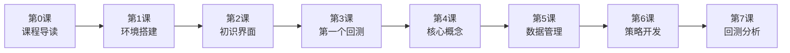

# 📚 OSkhQuant 新手入门教程

> 欢迎来到看海量化交易系统的新手入门教程！  
> 本教程专为零基础用户设计，带你从 0 到 1 学会量化交易。

---

## 🎯 课程总览

| 课程 | 主题 | 预计时间 | 难度 |
|-----|------|---------|------|
| [第 0 课](00-课程导读.md) | 📖 课程导读 | 15 分钟 | ⭐ |
| [第 1 课](01-环境搭建.md) | 🛠️ 环境搭建 | 30 分钟 | ⭐ |
| [第 2 课](02-初识界面.md) | 🖥️ 初识界面 | 20 分钟 | ⭐ |
| [第 3 课](03-第一个回测.md) | 🚀 第一个回测 | 30 分钟 | ⭐⭐ |
| [第 4 课](04-核心概念.md) | 💡 核心概念 | 40 分钟 | ⭐⭐ |
| [第 5 课](05-数据管理.md) | 📊 数据管理 | 25 分钟 | ⭐⭐ |
| [第 6 课](06-策略开发入门.md) | ✍️ 策略开发入门 | 45 分钟 | ⭐⭐⭐ |
| [第 7 课](07-回测分析.md) | 📈 回测分析 | 35 分钟 | ⭐⭐⭐ |

**总课时**：约 4 小时

---

## 🚀 快速开始

### 我该从哪里开始？

如果你是完全的新手，请从 **第 0 课** 开始，按顺序学习。

如果你已经安装好了软件，可以跳到 **第 3 课** 直接运行第一个回测。

---

## 📖 教程特色

每节课都包含：

- ⏱ **课时预估**：帮你规划学习时间
- 🎯 **学习目标**：明确本课要掌握的内容
- 📚 **难度标识**：⭐⭐⭐ 星级表示
- 💡 **通俗解释**：用大白话讲清楚概念
- 🔧 **动手操作**：跟着步骤一起做
- ✅ **实践任务**：巩固所学内容
- 📌 **要点总结**：快速回顾核心知识

---

## 📋 学习路径

---

## ❓ 常见问题

### Q: 我需要会 Python 吗？
不需要精通，会复制粘贴就够入门了。

### Q: 需要什么电脑配置？
Windows 10+，8GB 内存，普通笔记本就够。

### Q: 教程完成后能实盘吗？
本系列聚焦回测学习。实盘需要更多知识和风险意识。

---

## 📚 更多资源

- [项目简介](../wiki/项目简介.md)
- [快速入门](../wiki/快速入门.md)
- [策略开发文档](../wiki/策略开发/)
- [API 参考](../wiki/API参考/)

---

## 💬 交流反馈

- 微信公众号：看海的城堡
- 知乎：@Mr.看海
- 官网：https://khsci.com/khQuant/

---

> 投资有风险，入市需谨慎。本教程仅供学习交流，不构成投资建议。
