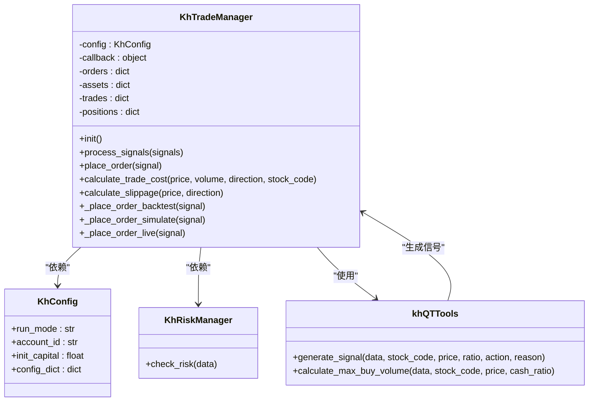
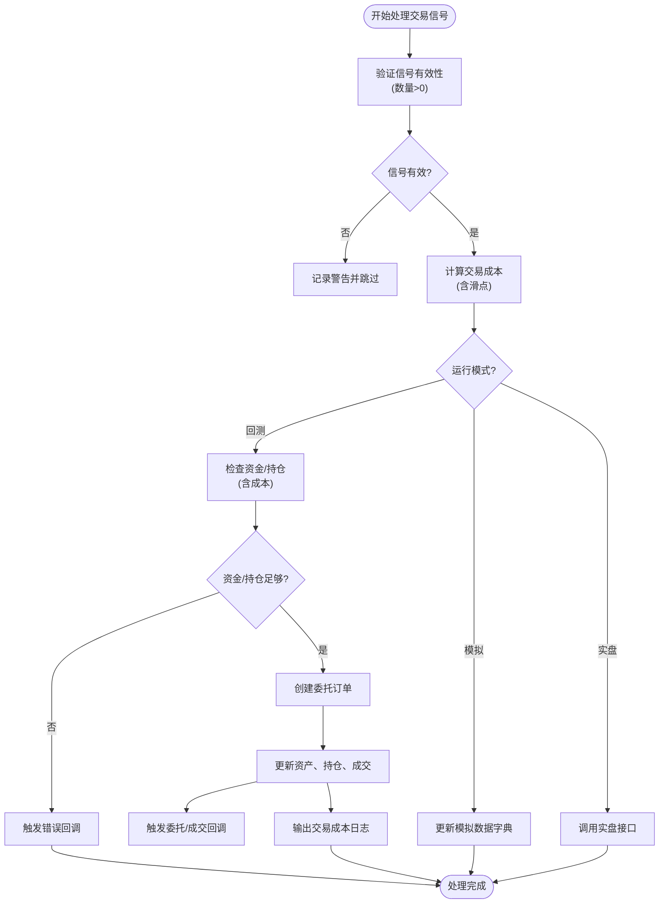
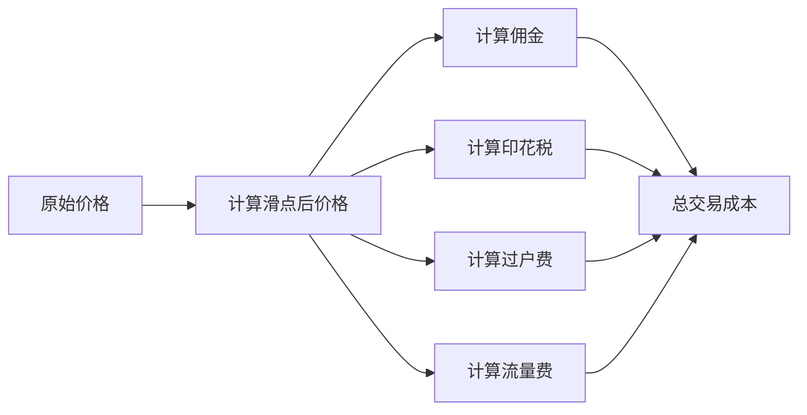
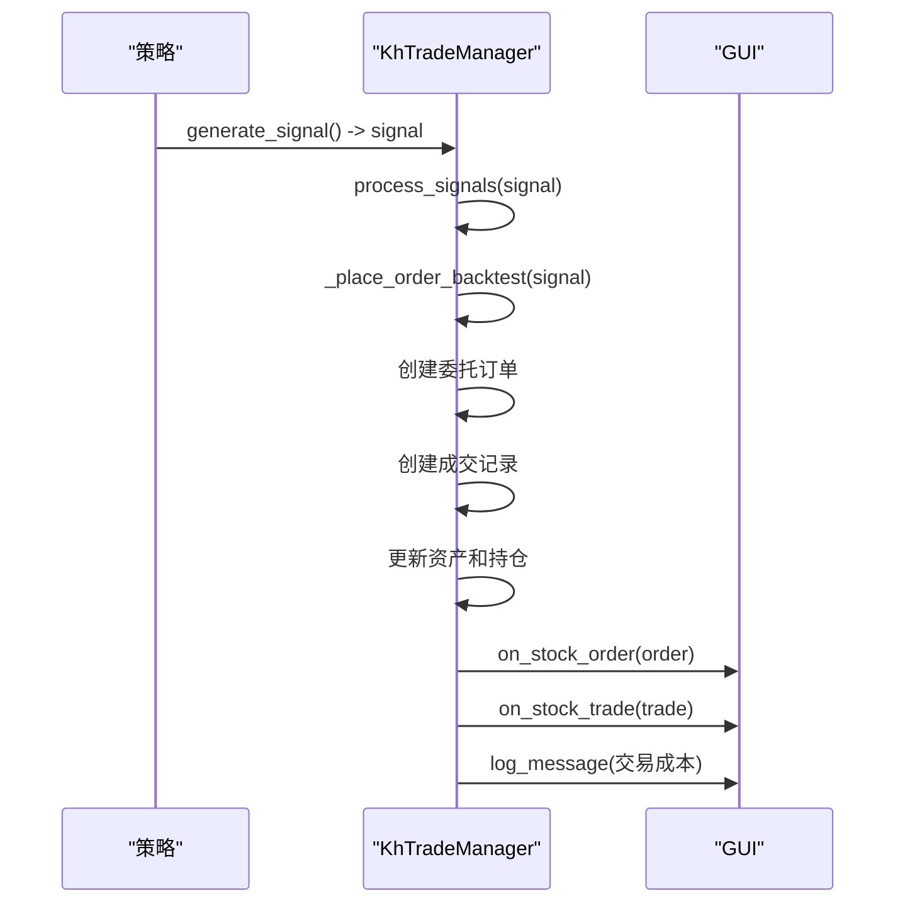

# 交易API

<cite>
**本文档引用的文件**
- [khTrade.py](file://khTrade.py)
- [khConfig.py](file://khConfig.py)
- [khRisk.py](file://khRisk.py)
- [khQTTools.py](file://khQTTools.py)
- [strategies/双均线多股票_使用khMA函数.py](file://strategies/双均线多股票_使用khMA函数.py)
</cite>

## 目录
1. [简介](#简介)
2. [项目结构](#项目结构)
3. [核心组件](#核心组件)
4. [架构概述](#架构概述)
5. [详细组件分析](#详细组件分析)
6. [依赖分析](#依赖分析)
7. [性能考虑](#性能考虑)
8. [故障排除指南](#故障排除指南)
9. [结论](#结论)
10. [附录](#附录)（如有必要）

## 简介
本文档旨在为 `khTrade.py` 模块中暴露的交易功能提供全面的API文档。该模块是OSkhQuant量化交易系统的核心组成部分，负责处理所有交易操作，包括下单、撤单、成交回报处理、交易成本计算和风控联动等。文档将详细描述每个交易接口的参数、执行逻辑、手续费计算方式及风控机制，并说明订单状态管理流程、成交回报处理机制以及模拟交易与实测交易的差异。同时，文档将结合 `context` 对象中的 `__account__` 和 `__positions__` 字段，说明如何查询账户状态并进行交易决策。

## 项目结构

OSkhQuant项目采用模块化设计，核心交易功能由 `khTrade.py` 模块实现。该模块依赖于 `khConfig.py` 提供的配置信息、`khRisk.py` 提供的风控逻辑以及 `khQTTools.py` 提供的量化工具和数据获取功能。策略文件（位于 `strategies` 目录下）通过调用 `khQTTools.py` 中的 `generate_signal` 等函数生成交易信号，最终由 `KhTradeManager` 处理这些信号并执行交易。

```mermaid
graph TD
subgraph "核心模块"
khConfig[khConfig.py<br/>配置管理]
khRisk[khRisk.py<br/>风险管理]
khTrade[khTrade.py<br/>交易管理]
khQTTools[khQTTools.py<br/>量化工具]
end
subgraph "策略层"
Strategies[strategies/<br/>策略文件]
end
subgraph "GUI"
GUI[GUI.py<br/>图形界面]
end
Strategies --> khQTTools
khQTTools --> khTrade
khConfig --> khTrade
khRisk --> khTrade
khTrade --> GUI
```

**Diagram sources**
- [khTrade.py](file://khTrade.py#L1-L560)
- [khConfig.py](file://khConfig.py#L1-L105)
- [khRisk.py](file://khRisk.py#L1-L51)
- [khQTTools.py](file://khQTTools.py#L1-L2746)

**Section sources**
- [khTrade.py](file://khTrade.py#L1-L560)
- [khConfig.py](file://khConfig.py#L1-L105)
- [khRisk.py](file://khRisk.py#L1-L51)
- [khQTTools.py](file://khQTTools.py#L1-L2746)

## 核心组件

`khTrade.py` 模块的核心是 `KhTradeManager` 类，它负责管理交易的整个生命周期。该类在初始化时会加载来自 `khConfig.py` 的交易成本和滑点配置，并维护订单、资产、成交和持仓等关键数据结构。其主要功能包括：
- **交易信号处理**：通过 `process_signals` 方法接收并处理来自策略的交易信号列表。
- **交易成本计算**：精确计算包括佣金、印花税、过户费和流量费在内的总交易成本。
- **滑点模拟**：支持按最小变动价位数（tick）或比例（ratio）两种模式计算滑点。
- **模式化执行**：根据 `config.run_mode` 的值（`live`、`simulate`、`backtest`）将交易信号路由到不同的执行逻辑。
- **状态管理**：在回测和模拟模式下，维护 `orders`、`assets`、`trades` 和 `positions` 字典，以模拟账户状态。

**Section sources**
- [khTrade.py](file://khTrade.py#L1-L560)

## 架构概述

`KhTradeManager` 的架构设计遵循了清晰的分层和职责分离原则。其核心架构如下图所示：



**Diagram sources**
- [khTrade.py](file://khTrade.py#L1-L560)
- [khConfig.py](file://khConfig.py#L1-L105)
- [khRisk.py](file://khRisk.py#L1-L51)
- [khQTTools.py](file://khQTTools.py#L1-L2746)

## 详细组件分析

### 交易接口分析

`KhTradeManager` 本身不直接暴露 `order_target`、`buy`、`sell` 等高层接口。这些接口的逻辑由 `khQTTools.py` 模块中的 `generate_signal` 函数实现，该函数生成符合 `KhTradeManager` 要求的交易信号。`KhTradeManager` 的核心接口是 `process_signals`，它接收并处理这些信号。

#### 交易信号处理流程


**Diagram sources**
- [khTrade.py](file://khTrade.py#L1-L560)

**Section sources**
- [khTrade.py](file://khTrade.py#L1-L560)
- [khQTTools.py](file://khQTTools.py#L1-L2746)

### 交易成本与风控机制

#### 交易成本计算
`KhTradeManager` 通过 `calculate_trade_cost` 方法计算总交易成本，该成本由以下几部分构成：
- **佣金 (Commission)**：按成交金额乘以 `commission_rate` 计算，但不低于 `min_commission`。
- **印花税 (Stamp Tax)**：仅在卖出时收取，按成交金额乘以 `stamp_tax_rate` 计算。
- **过户费 (Transfer Fee)**：仅对沪市股票（`sh.`开头）收取，按成交金额的0.001%计算。
- **流量费 (Flow Fee)**：每笔交易固定收取 `flow_fee` 元。



**Diagram sources**
- [khTrade.py](file://khTrade.py#L1-L560)

#### 风控联动机制
`KhTradeManager` 在回测模式下实现了基础的风控检查，主要通过 `khConfig.py` 中的配置参数来实现：
- **资金检查**：在买入时，检查可用现金是否足以支付“成交金额 + 交易成本”。
- **持仓检查**：在卖出时，检查可用持仓（`can_use_volume`）是否足够。
- **外部风控**：虽然 `khRisk.py` 模块存在，但当前 `KhTradeManager` 并未直接调用其 `check_risk` 方法。风控逻辑主要在策略层（如 `双均线多股票_使用khMA函数.py`）通过 `khHas` 等函数实现。

**Section sources**
- [khTrade.py](file://khTrade.py#L1-L560)
- [khConfig.py](file://khConfig.py#L1-L105)
- [khRisk.py](file://khRisk.py#L1-L51)

### 订单状态与成交回报

`KhTradeManager` 通过维护 `orders` 和 `trades` 字典来管理订单和成交状态。在回测模式下，订单状态被假设立即成功（`ORDER_SUCCEEDED`），并立即生成对应的成交记录。系统通过回调机制（`on_stock_order` 和 `on_stock_trade`）通知上层应用（如GUI）订单和成交的状态变化。



**Diagram sources**
- [khTrade.py](file://khTrade.py#L1-L560)

**Section sources**
- [khTrade.py](file://khTrade.py#L1-L560)

## 依赖分析

