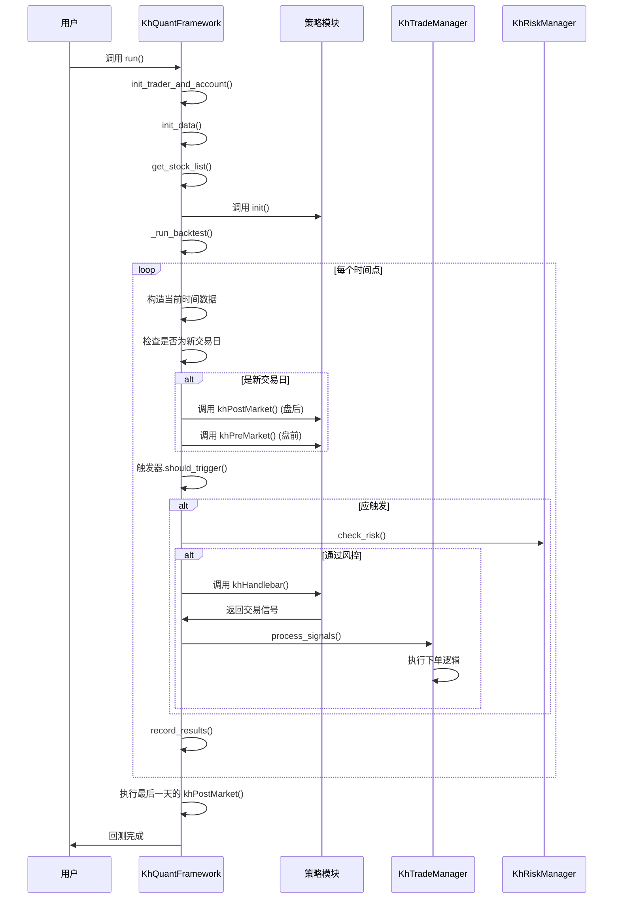
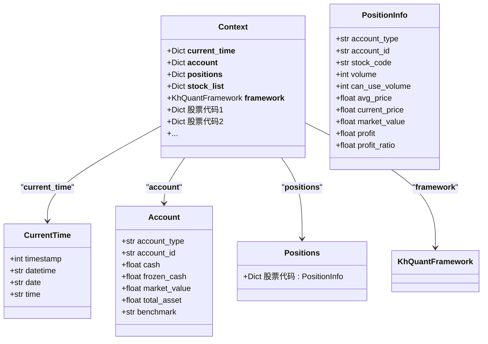
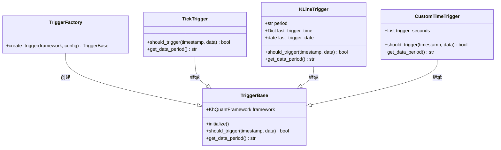

# 框架核心API

<cite>
**本文档引用文件**   
- [khFrame.py](file://khFrame.py)
- [khConfig.py](file://khConfig.py)
- [khQTTools.py](file://khQTTools.py)
- [khTrade.py](file://khTrade.py)
- [khRisk.py](file://khRisk.py)
- [khQuantImport.py](file://khQuantImport.py)
- [strategies/双均线多股票_使用khMA函数.py](file://strategies/双均线多股票_使用khMA函数.py)
</cite>

## 目录
1. [框架核心API](#框架核心api)
2. [核心方法调用时序与上下文](#核心方法调用时序与上下文)
3. [Context对象结构与生命周期](#context对象结构与生命周期)
4. [事件注册与调度机制](#事件注册与调度机制)
5. [回测引擎与触发器](#回测引擎与触发器)
6. [框架扩展点](#框架扩展点)

## 核心方法调用时序与上下文

框架的核心执行流程由`KhQuantFramework`类驱动，其`run()`方法是整个策略执行的入口。该方法遵循严格的初始化和执行时序，确保策略在正确的上下文中运行。

**Diagram sources**
- [khFrame.py](file://khFrame.py#L1000-L2678)

**Section sources**
- [khFrame.py](file://khFrame.py#L1000-L2678)

## Context对象结构与生命周期

`context`对象是框架向策略传递信息的核心载体，它是一个包含多个保留字段的字典（`Dict`），在每次`khHandlebar`调用时被构建和传递。其生命周期与单个时间点的处理周期一致，每次触发时都会创建一个新的`context`实例。

### Context对象结构

`context`对象包含以下关键字段：

**Diagram sources**
- [khFrame.py](file://khFrame.py#L1000-L2678)
- [khTrade.py](file://khTrade.py#L50-L559)

### 保留字段详解

- **`__current_time__`**: 包含当前时间戳、日期、时间和完整日期时间的字典。这是策略判断时间逻辑的核心依据。
- **`__account__`**: 包含账户信息的字典，如可用资金(`cash`)、持仓市值(`market_value`)和总资产(`total_asset`)。
- **`__positions__`**: 包含所有持仓信息的字典，键为股票代码，值为详细的持仓信息。
- **`__stock_list__`**: 当前股票池的股票代码列表。
- **`__framework__`**: 框架实例的引用，允许策略调用框架的公共方法。

**Section sources**
- [khFrame.py](file://khFrame.py#L1000-L2678)
- [khTrade.py](file://khTrade.py#L50-L559)

## 事件注册与调度机制

框架通过预定义的函数名来实现事件注册，策略通过实现这些函数来响应特定事件。调度逻辑由框架的`_run_backtest`方法控制。

### 支持的事件

| 事件函数 | 触发时机 | 上下文环境 |
| :--- | :--- | :--- |
| `init()` | 策略初始化时，仅执行一次 | 包含初始账户、股票池和时间信息 |
| `khPreMarket()` | 每个交易日开盘前 | 包含当天开盘前的时间信息和前一日收盘后的状态 |
| `khHandlebar()` | 由触发器决定，是策略的核心逻辑 | 包含当前时间点的所有市场、账户和持仓数据 |
| `khPostMarket()` | 每个交易日收盘后 | 包含当天收盘后的时间信息和最终状态 |

### 调度逻辑

事件的调度由`_run_backtest`方法中的循环逻辑实现。框架会遍历所有时间点，并根据`__current_time__`中的`date`字段判断是否为新的交易日。如果是新交易日，则会依次调用`khPostMarket`（处理上一个交易日的收盘后逻辑）和`khPreMarket`（处理当前交易日的开盘前逻辑），然后才进入`khHandlebar`的常规触发循环。

**Section sources**
- [khFrame.py](file://khFrame.py#L1000-L2678)

## 回测引擎与触发器

回测引擎的核心是`TriggerFactory`，它根据配置创建不同类型的触发器，从而驱动策略的执行。不同的触发模式决定了策略的执行频率和数据精度。

### 触发器类型与技术差异

| 触发模式 | 触发器类 | 技术差异 | 适用场景 |
| :--- | :--- | :--- | :--- |
| Tick触发 | `TickTrigger` | 每个Tick数据到达时都触发，频率最高，数据为`tick`级别。 | 高频策略，需要对市场微观结构进行精细分析。 |
| K线触发 | `KLineTrigger` | 在K线形成时触发，如每分钟、每5分钟或每日。数据周期与K线周期一致。 | 中低频趋势跟踪、技术指标策略。 |
| 定时触发 | `CustomTimeTrigger` | 在用户自定义的时间点触发，数据周期为`1s`或`tick`。 | 事件驱动策略，如在特定时间点执行再平衡或调仓。 |

### 触发器工厂

`TriggerFactory.create_trigger()`方法是创建触发器的统一入口。它根据配置文件中的`backtest.trigger.type`字段来决定创建哪种触发器。

**Diagram sources**
- [khFrame.py](file://khFrame.py#L0-L1000)

**Section sources**
- [khFrame.py](file://khFrame.py#L0-L1000)

## 框架扩展点

框架提供了多个扩展点，允许开发者根据需要进行定制。

### 自定义数据源接入

虽然框架主要依赖`xtdata`获取数据，但`khQTTools.py`中的`download_and_store_data`函数提供了一个强大的数据下载和存储框架。开发者可以修改此函数，接入其他数据源（如本地CSV文件、网络API等），并将数据存储为框架兼容的格式。

### 结果记录器开发

框架的回测结果记录在`record_results`和`_record_daily_stats`方法中完成。开发者可以通过继承`KhQuantFramework`类并重写这些方法，来实现自定义的结果记录逻辑，例如将结果写入数据库、生成特定格式的报告或发送到消息队列。

**Section sources**
- [khFrame.py](file://khFrame.py#L2400-L2678)
- [khQTTools.py](file://khQTTools.py#L0-L2746)