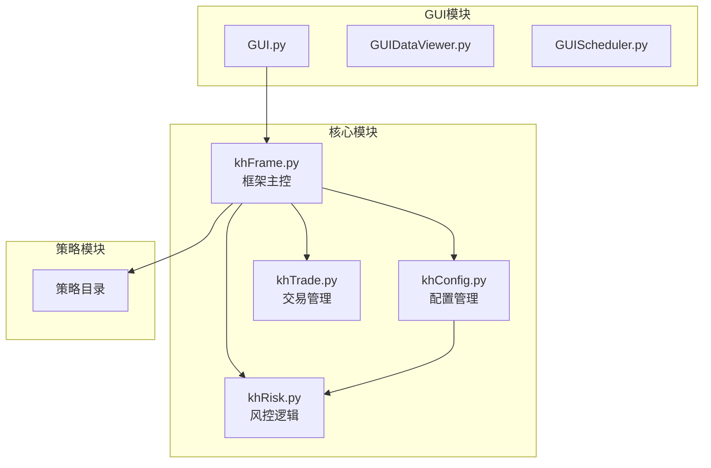
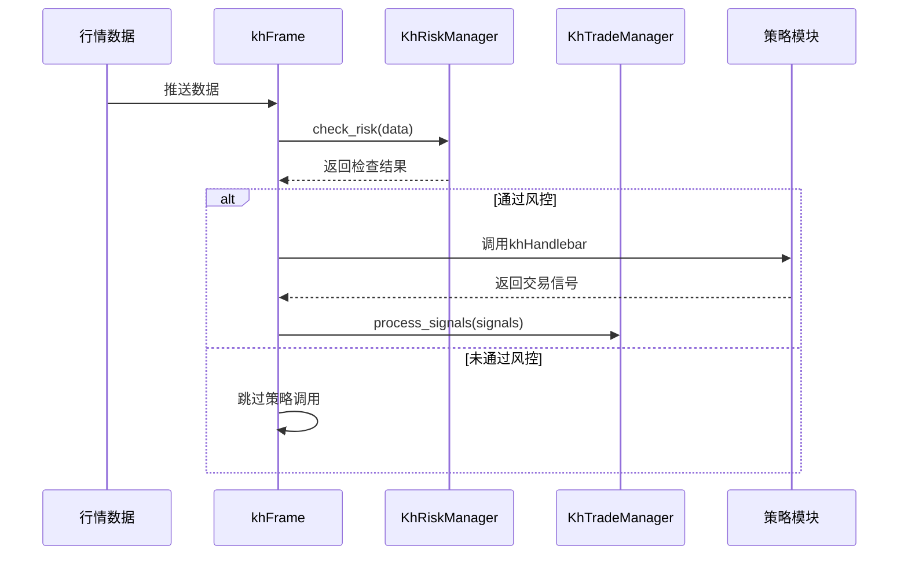
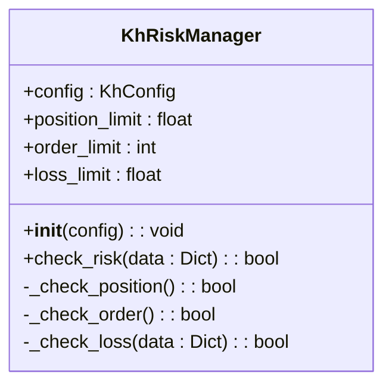
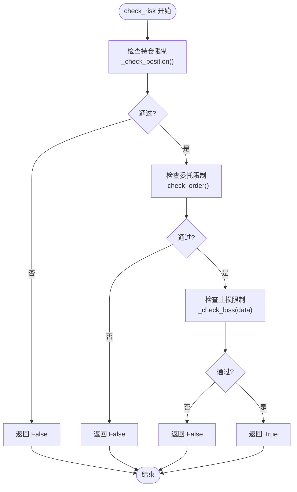
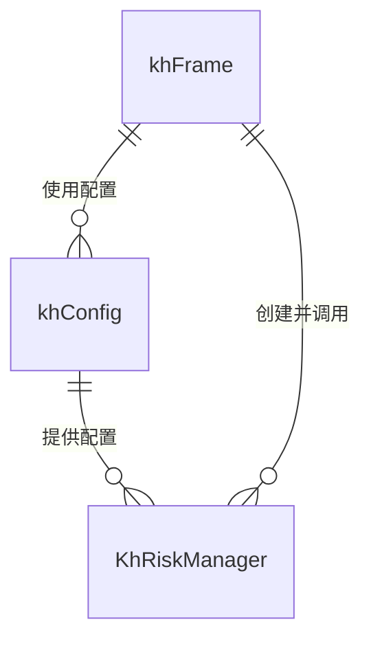

# 风控API

<cite>
**本文档引用的文件**
- [khRisk.py](file://khRisk.py)
- [khConfig.py](file://khConfig.py)
- [khFrame.py](file://khFrame.py)
</cite>

## 目录
1. [简介](#简介)
2. [项目结构](#项目结构)
3. [核心组件](#核心组件)
4. [架构概述](#架构概述)
5. [详细组件分析](#详细组件分析)
6. [依赖分析](#依赖分析)
7. [性能考虑](#性能考虑)
8. [故障排除指南](#故障排除指南)
9. [结论](#结论)

## 简介
本文件旨在为 `khRisk.py` 模块中的风险控制功能提供全面的公共接口文档。重点介绍 `KhRiskManager` 类中实现的风控规则，包括持仓限制、委托限制和止损限制等。文档详细说明了各风控规则的触发条件、配置方式以及对交易指令的拦截逻辑。同时，阐述了风控检查的执行时机（如同步在下单前调用）及其在回测与实盘中的一致性行为。此外，还提供了自定义风控策略的扩展方法，例如通过继承或回调函数注入新规则。文档包含默认风控参数说明、用户配置路径以及调试日志输出方式，帮助开发者理解风控决策过程。

## 项目结构
项目结构以模块化方式组织，主要功能模块包括策略、GUI组件、核心交易与风控逻辑。风控模块 `khRisk.py` 位于项目根目录下，与 `khConfig.py`（配置管理）和 `khFrame.py`（框架主控）紧密协作，共同构成系统的风控体系。

**图示来源**
- [khRisk.py](file://khRisk.py#L1-L50)
- [khConfig.py](file://khConfig.py#L1-L104)
- [khFrame.py](file://khFrame.py#L480-L679)

**本节来源**
- [khRisk.py](file://khRisk.py#L1-L50)
- [khConfig.py](file://khConfig.py#L1-L104)
- [khFrame.py](file://khFrame.py#L480-L679)

## 核心组件
`KhRiskManager` 是系统的核心风控组件，负责在交易执行前进行多项风险检查。它通过 `check_risk` 方法统一入口，依次调用 `_check_position`、`_check_order` 和 `_check_loss` 方法，分别对持仓、委托和止损进行校验。该类依赖于 `khConfig` 提供的配置参数，如 `position_limit`、`order_limit` 和 `loss_limit`，以实现可配置的风控策略。

**本节来源**
- [khRisk.py](file://khRisk.py#L3-L50)
- [khConfig.py](file://khConfig.py#L80-L90)

## 架构概述
风控模块的架构设计遵循单一职责原则，`KhRiskManager` 专注于风险评估，不涉及交易执行或数据获取。它作为 `khFrame` 框架的一部分，在每次行情触发策略前被调用，确保所有交易信号都经过风控检查。该设计保证了风控逻辑与业务逻辑的分离，提高了系统的可维护性和可测试性。

**图示来源**
- [khFrame.py](file://khFrame.py#L700-L730)
- [khRisk.py](file://khRisk.py#L14-L50)
- [khTrade.py](file://khTrade.py#L100-L150)

## 详细组件分析

### 风控管理器分析
`KhRiskManager` 类是风控功能的核心实现。其初始化方法接收一个配置对象，并从中提取 `position_limit`、`order_limit` 和 `loss_limit` 三个关键参数，用于后续的风控检查。

#### 类结构图

**图示来源**
- [khRisk.py](file://khRisk.py#L3-L50)

#### 风控检查流程
`check_risk` 方法是风控检查的入口，它按顺序执行三项检查：
1.  **持仓限制检查** (`_check_position`): 检查当前持仓是否超过预设比例。
2.  **委托限制检查** (`_check_order`): 检查当前委托数量是否超过限制。
3.  **止损限制检查** (`_check_loss`): 检查当前行情是否触及止损条件。

任何一项检查失败，`check_risk` 将立即返回 `False`，阻止后续交易流程。

**图示来源**
- [khRisk.py](file://khRisk.py#L14-L35)

**本节来源**
- [khRisk.py](file://khRisk.py#L3-L50)

## 依赖分析
`KhRiskManager` 的正常运行依赖于 `khConfig` 模块提供的配置信息。`khConfig` 从 JSON 配置文件中加载 `risk` 部分的参数，并将其暴露为属性，供 `KhRiskManager` 在初始化时使用。`khFrame` 作为主控框架，负责创建 `KhRiskManager` 实例，并在适当的时机调用其 `check_risk` 方法。

**图示来源**
- [khConfig.py](file://khConfig.py#L80-L90)
- [khFrame.py](file://khFrame.py#L483-L485)
- [khRisk.py](file://khRisk.py#L5-L10)

**本节来源**
- [khConfig.py](file://khConfig.py#L80-L90)
- [khFrame.py](file://khFrame.py#L483-L485)

## 性能考虑
风控检查在每次行情触发时同步执行，因此其性能直接影响策略的整体响应速度。当前实现中，`_check_position`、`_check_order` 和 `_check_loss` 方法的默认逻辑均为 `return True`，这确保了最低的性能开销。实际的风控逻辑应在这些方法中高效实现，避免复杂的计算或I/O操作，以防止阻塞主交易流程。

## 故障排除指南
当交易信号被意外拦截时，应首先检查风控日志。虽然当前代码未直接输出风控日志，但可通过在 `khFrame.py` 的 `on_quote_callback` 和 `_run_backtest` 方法中添加日志语句来追踪 `check_risk` 的返回值。此外，应验证 `config.json` 文件中的 `risk` 配置项是否正确设置。

**本节来源**
- [khFrame.py](file://khFrame.py#L714-L715)
- [khFrame.py](file://khFrame.py#L1808-L1809)
- [khConfig.py](file://khConfig.py#L80-L90)

## 结论
`khRisk.py` 模块提供了一个简洁而灵活的风控框架。通过 `KhRiskManager` 类，系统能够在交易执行前进行关键的风险评估。其与 `khConfig` 和 `khFrame` 的集成设计，保证了风控策略的可配置性和执行的及时性。开发者可以通过重写 `KhRiskManager` 的私有检查方法来实现自定义的风控逻辑，满足不同策略的需求。