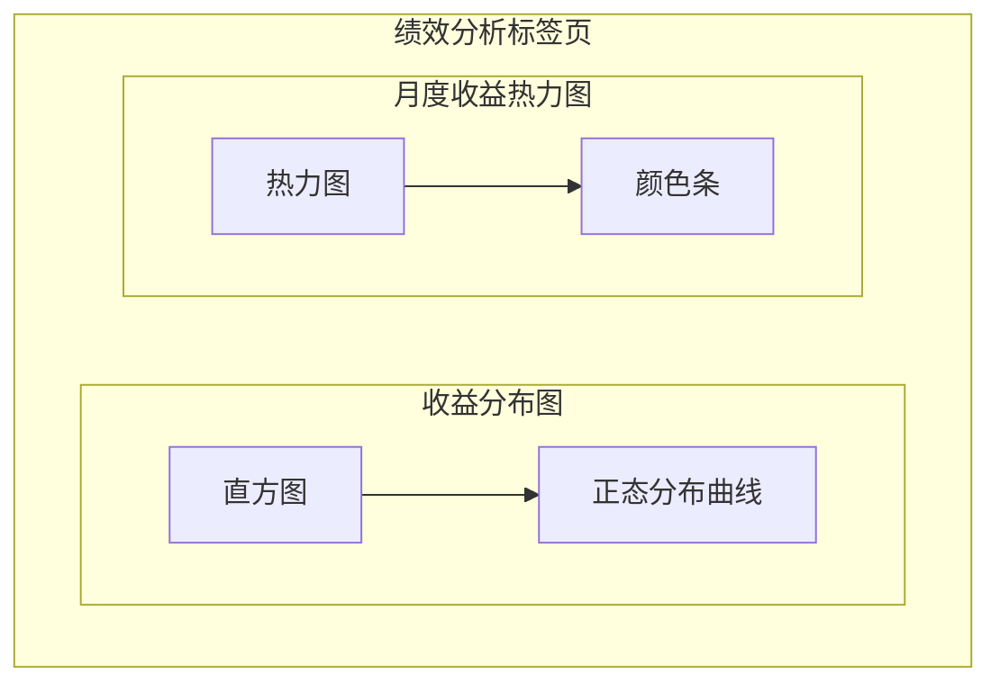

# 回测结果分析界面

<cite>
**Referenced Files in This Document**   
- [backtest_result_window.py](file://backtest_result_window.py)
- [khFrame.py](file://khFrame.py)
- [khConfig.py](file://khConfig.py)
</cite>

## 目录
1. [引言](#引言)
2. [界面布局与核心组件](#界面布局与核心组件)
3. [数据展示内容](#数据展示内容)
4. [图表渲染与数据集成](#图表渲染与数据集成)
5. [用户交互指南](#用户交互指南)
6. [数据传递机制](#数据传递机制)
7. [常见问题与解决方法](#常见问题与解决方法)

## 引言
回测结果分析界面（`backtest_result_window.py`）是量化交易框架中的核心模块，用于可视化展示策略回测的详细结果。该界面通过集成matplotlib图表和PyQt5组件，为用户提供了一个交互式的分析环境，帮助用户全面评估策略的绩效表现。本文档将深入解析其设计与功能，涵盖展示内容、数据集成、用户交互及异常处理等方面。

## 界面布局与核心组件
回测结果窗口采用上下分割的布局设计，上半部分包含基本信息面板和收益曲线图表，下半部分通过标签页（Tab）组织详细数据。

### 基本信息面板
位于窗口左侧，以两列布局展示21项关键绩效指标，包括：
- **策略名称**、**回测区间**、**初始资金**、**最终资金**
- **总收益率**、**年化收益率**、**基准收益率**、**基准年化收益率**
- **最大回撤**、**夏普比率**、**索提诺比率**、**阿尔法**、**贝塔**
- **胜率**、**盈亏比**、**日均交易次数**、**最大连续盈利/亏损**
- **最大单笔盈利/亏损**、**年化波动率**

该面板采用深色主题，数值根据正负自动显示为红色（正）或绿色（负）。

### 收益曲线图表
位于窗口右侧，是界面的核心可视化组件。它由`matplotlib`的`Figure`和`FigureCanvas`创建，并包含四个共享x轴的子图：
1.  **收益曲线图**：展示策略净值与基准指数的对比。
2.  **回撤曲线图**：展示策略的回撤率，y轴反转以直观显示回撤深度。
3.  **盈亏分析图**：以柱状图形式展示每日盈亏金额。
4.  **成交记录图**：以柱状图形式展示每日买入和卖出的成交量。

**Section sources**
- [backtest_result_window.py](file://backtest_result_window.py#L300-L350)
- [backtest_result_window.py](file://backtest_result_window.py#L400-L450)

## 数据展示内容
界面从回测结果目录中加载多个CSV文件，全面展示策略的绩效。

### 绩效指标表格
在“绩效分析”标签页中，通过多图表布局展示：
- **收益分布图**：显示日收益率的直方图分布，并叠加正态分布曲线。
- **月度收益热力图**：以热力图形式展示各年各月的月度收益率，颜色深浅表示收益高低。

**Diagram sources**
- [backtest_result_window.py](file://backtest_result_window.py#L850-L900)
- [backtest_result_window.py](file://backtest_result_window.py#L1000-L1050)

### 详细交易记录列表
在“交易记录”标签页中，以表格形式列出所有交易，包含以下列：
- **交易时间**、**证券代码**、**交易方向**（买入/卖出）
- **成交价格**、**成交数量**、**成交金额**、**手续费**

交易方向根据“买入”或“卖出”自动设置为红色或蓝色。在“日收益”标签页中，展示每日的总资产、持仓市值、可用资金和日收益率。

**Section sources**
- [backtest_result_window.py](file://backtest_result_window.py#L750-L800)
- [backtest_result_window.py](file://backtest_result_window.py#L900-L950)

## 图表渲染与数据集成
图表的渲染和数据集成是该界面的核心功能。

### Matplotlib集成
界面通过`matplotlib.backends.backend_qt5agg`将matplotlib图表无缝集成到PyQt5应用中。关键步骤如下：
1.  **创建Figure和Canvas**：在`create_chart`方法中创建一个包含四个子图的`Figure`，并将其包装在`FigureCanvas`中。
2.  **应用样式**：设置深色主题、字体、网格线和坐标轴样式。
3.  **数据绑定**：在`update_chart`方法中，将从CSV文件加载的数据绘制到各个子图上。

### 数据提取与格式化
数据从`khFrame`的回测结果中提取，主要来源为回测结果目录下的CSV文件：
- **`config.csv`**：包含策略名称、回测区间、初始资金等配置信息。
- **`daily_stats.csv`**：包含每日的总资产、现金、持仓市值等，用于计算总收益率、年化收益率、最大回撤等。
- **`trades.csv`**：包含所有交易记录，用于计算胜率、盈亏比等。
- **`benchmark.csv`**：包含基准指数（如沪深300）的收盘价，用于计算基准收益率和夏普比率。

数据加载在`load_data`方法中完成，该方法会读取这些文件，进行必要的列名重命名和数据格式化（如将`buy`/`sell`映射为“买入”/“卖出”），然后调用`update_basic_info`、`update_chart`等方法更新UI。

**Section sources**
- [backtest_result_window.py](file://backtest_result_window.py#L500-L550)
- [backtest_result_window.py](file://backtest_result_window.py#L600-L650)

## 用户交互指南
用户可以通过以下方式与界面进行交互：

### 查看不同时间段的绩效
将鼠标悬停在收益曲线图表上，会触发`hover`事件。此时，界面会：
1.  在所有子图上绘制一条垂直的参考线。
2.  在策略收益图上标记出对应日期的策略净值和基准净值。
3.  显示一个悬浮窗，汇总显示该日期的策略净值、基准净值、回撤率、盈亏金额和当日的买卖成交量。

### 导出报告
该界面本身不直接提供导出报告的功能，但回测结果数据（CSV文件）已保存在`backtest_results`目录下，用户可直接访问这些文件进行导出。

### 查看单笔交易详情
在“交易记录”表格中，每一行代表一笔交易。用户可以通过滚动和查看表格来了解单笔交易的详细信息，包括时间、价格、数量和金额。

## 数据传递机制
该界面与`khFrame`的`result`对象之间的数据传递机制是间接的，通过文件系统进行。

1.  **数据生成**：当`khFrame`类执行回测时，它会调用`_run_backtest`方法。在回测循环中，`record_results`方法被调用，将交易记录、每日统计数据和基准数据追加到内存中的`self.backtest_records`字典里。
2.  **数据持久化**：回测结束后，`_run_backtest`方法会将`self.backtest_records`中的数据分别写入`trades.csv`、`daily_stats.csv`和`benchmark.csv`等文件。
3.  **数据读取**：`BacktestResultWindow`在初始化时，通过`load_data`方法从这些已生成的CSV文件中读取数据，并将其加载到UI组件中进行展示。

因此，`BacktestResultWindow`并不直接持有`khFrame`的实例或`result`对象，而是作为一个独立的查看器，从文件系统中加载和解析回测结果。

**Section sources**
- [khFrame.py](file://khFrame.py#L1500-L1600)
- [backtest_result_window.py](file://backtest_result_window.py#L550-L600)

## 常见问题与解决方法
以下是使用该界面时可能遇到的常见问题及其解决方法。

### 常见显示异常
| 问题现象 | 可能原因 | 解决方法 |
| :--- | :--- | :--- |
| **图表显示“没有策略收益数据可显示”** | `daily_stats.csv`文件不存在或为空 | 检查回测是否成功执行，确认`backtest_results`目录下是否存在该文件。 |
| **“夏普比率”显示为0.00