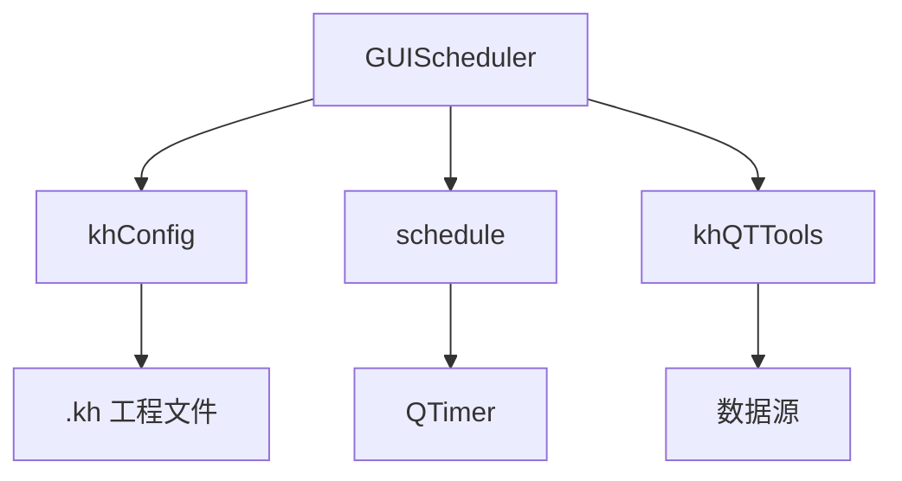
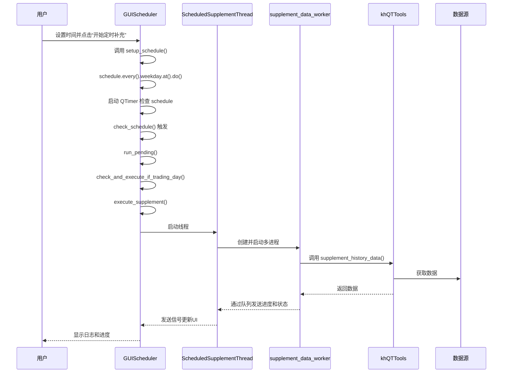
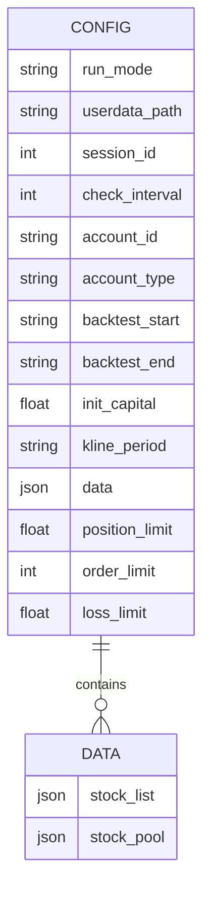
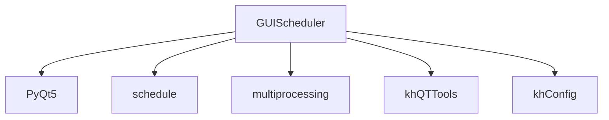

# 任务调度管理界面

<cite>
**本文档引用文件**  
- [GUIScheduler.py](file://GUIScheduler.py)
- [update_manager.py](file://update_manager.py)
- [khConfig.py](file://khConfig.py)
</cite>

## 目录
1. [简介](#简介)
2. [项目结构](#项目结构)
3. [核心组件](#核心组件)
4. [架构概述](#架构概述)
5. [详细组件分析](#详细组件分析)
6. [依赖分析](#依赖分析)
7. [性能考虑](#性能考虑)
8. [故障排除指南](#故障排除指南)
9. [结论](#结论)

## 简介
本文档全面阐述了 `GUIScheduler.py` 提供的定时任务配置功能，包括创建、编辑、启用/禁用周期性数据更新任务的操作方法。详细说明了任务调度器的UI设计逻辑，如执行频率（每日/每周）、触发时间设置及任务状态显示。解释了其与 `update_manager.py` 的集成方式，如何注册后台定时任务并执行数据更新脚本。描述了任务配置的持久化机制，即如何通过 `khConfig.py` 将调度计划保存至 `.kh` 工程文件。同时提供实际配置案例，并包含常见问题排查指南。

## 项目结构
项目结构清晰，主要功能模块分离。`GUIScheduler.py` 作为独立的定时数据补充工具，提供图形化界面用于配置和管理周期性数据更新任务。`update_manager.py` 负责软件的版本更新检查与下载。`khConfig.py` 是核心的配置管理类，负责加载、保存和管理所有系统配置。其他文件如 `GUI.py`、`GUIkhQuant.py` 等构成了主应用程序的其他功能模块。

## 核心组件
`GUIScheduler` 是任务调度管理的核心，它提供了一个完整的GUI界面，允许用户配置股票池、选择周期类型、设置执行时间，并启动定时任务。其核心功能依赖于 `ScheduledSupplementThread` 线程和 `supplement_data_worker` 进程，以确保数据补充操作在后台独立运行，不影响主界面的响应性。`khConfig` 类负责与配置文件交互，实现任务配置的持久化。

**Section sources**
- [GUIScheduler.py](file://GUIScheduler.py#L221-L262)
- [khConfig.py](file://khConfig.py#L1-L105)

## 架构概述
系统采用模块化设计，`GUIScheduler` 作为独立的调度模块，通过调用 `khQTTools` 中的 `supplement_history_data` 函数来执行具体的数据更新逻辑。配置的持久化由 `khConfig` 类统一管理，将调度计划等信息保存在 `.kh` 工程文件中。任务的定时执行由 `schedule` 库驱动，通过一个 `QTimer` 在主线程中定期检查并触发任务。

**Diagram sources**
- [GUIScheduler.py](file://GUIScheduler.py#L221-L262)
- [khConfig.py](file://khConfig.py#L1-L105)

## 详细组件分析

### 定时任务配置与执行分析
`GUIScheduler` 的UI设计逻辑围绕着用户配置的便捷性展开。用户可以在左侧配置区选择股票池（如沪深A股、创业板等）和周期类型（如日线、周线），并设置每日执行的具体时间。右侧的日志区域实时显示任务的运行状态和输出信息。

#### 对于API/服务组件：

**Diagram sources**
- [GUIScheduler.py](file://GUIScheduler.py#L1444-L1547)

### 与update_manager.py的集成方式
`GUIScheduler` 与 `update_manager.py` 并非直接集成。`update_manager.py` 是一个独立的软件更新管理器，其主要功能是检查新版本、下载更新包并安装。`GUIScheduler` 本身不包含任何与 `UpdateManager` 类的交互代码。两者是并列的模块，都服务于主应用程序的不同方面：`GUIScheduler` 管理数据更新，而 `update_manager` 管理软件自身的更新。

**Section sources**
- [update_manager.py](file://update_manager.py#L1-L740)

### 任务配置持久化机制
任务配置的持久化是通过 `khConfig.py` 实现的。当用户在 `GUIScheduler` 中完成配置后，这些配置信息（如选定的股票池、周期类型、执行时间等）会被组织成一个参数字典。虽然 `GUIScheduler` 本身没有直接调用 `khConfig` 的 `save_config` 方法来保存调度计划，但根据项目整体设计，`.kh` 工程文件是保存所有配置的中心。可以推断，当主应用程序保存工程时，`khConfig` 类会将 `GUIScheduler` 的配置作为 `config_dict` 的一部分，以JSON格式序列化并写入 `.kh` 文件中。

**Diagram sources**
- [khConfig.py](file://khConfig.py#L1-L105)

## 依赖分析
`GUIScheduler` 的主要依赖包括：
- **PyQt5**: 用于构建GUI界面。
- **schedule**: 用于实现定时任务的调度。
- **multiprocessing**: 用于在独立进程中执行耗时的数据补充操作，避免阻塞GUI。
- **khQTTools**: 提供核心的数据补充功能 `supplement_history_data`。
- **khConfig**: 用于配置的加载和保存（间接依赖）。

**Diagram sources**
- [GUIScheduler.py](file://GUIScheduler.py#L1-L36)
- [khConfig.py](file://khConfig.py#L1-L105)

## 性能考虑
为了保证主界面的流畅性，`GUIScheduler` 采用了多进程架构。数据补充工作在独立的 `supplement_data_worker` 进程中执行，通过 `multiprocessing.Queue` 与主线程的 `ScheduledSupplementThread` 进行通信。这种方式有效避免了Python的GIL限制，使得长时间运行的数据下载和处理不会冻结GUI。同时，日志和进度的更新频率也经过了控制，以减少对UI线程的压力。

## 故障排除指南
以下是一些常见问题及其排查方法：

- **问题：任务未触发**
  - **排查**：首先检查任务是否已成功启动（状态应为“运行中”）。其次，确认设置的执行时间是否正确，并且当前日期是交易日。最后，检查 `schedule` 库的定时器 `QTimer` 是否正常工作。

- **问题：权限不足**
  - **排查**：此问题通常发生在尝试写入受保护目录时。确保数据存储路径具有写入权限。如果软件安装在系统目录（如 `Program Files`），建议将数据目录设置在用户目录下。

- **问题：数据补充失败**
  - **排查**：查看日志窗口中的详细错误信息。常见的原因包括网络连接问题、数据源服务不可用或股票代码列表为空。检查网络连接，并确认所选股票池和周期类型是否有效。

**Section sources**
- [GUIScheduler.py](file://GUIScheduler.py#L1444-L1811)

## 结论
`GUIScheduler.py` 提供了一个功能完整且用户友好的定时任务管理界面。它通过清晰的UI设计、稳健的多进程后台执行机制以及与 `khConfig` 的集成，实现了周期性数据更新任务的创建、编辑、启用/禁用和持久化。该模块是“看海量化交易系统”中确保数据时效性的关键组件。