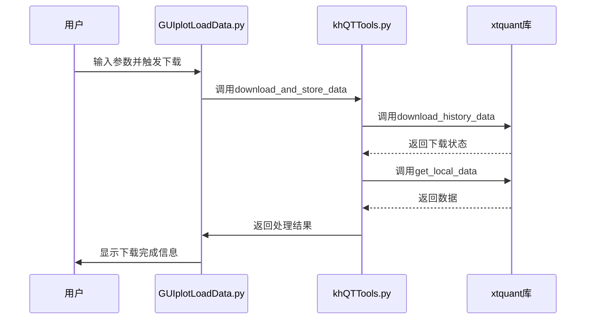

# 数据加载界面

<cite>
**本文档引用的文件**
- [GUIplotLoadData.py](file://GUIplotLoadData.py)
- [khQTTools.py](file://khQTTools.py)
- [khConfig.py](file://khConfig.py)
</cite>

## 目录
1. [简介](#简介)
2. [核心功能流程](#核心功能流程)
3. [数据获取与通信机制](#数据获取与通信机制)
4. [下载进度与异常处理](#下载进度与异常处理)
5. [配置联动与参数管理](#配置联动与参数管理)
6. [典型使用场景](#典型使用场景)
7. [错误处理建议](#错误处理建议)

## 简介
`GUIplotLoadData.py` 是一个股票数据可视化工具，提供交互式界面用于加载、分析和展示股票历史数据。该工具支持从MiniQMT客户端获取数据，并通过图形化界面展示股票价格走势。用户可以通过选择数据文件夹、股票代码和日期范围来查看特定股票的数据图表。工具还集成了日志记录和错误处理机制，确保操作的可追溯性和稳定性。

**Section sources**
- [GUIplotLoadData.py](file://GUIplotLoadData.py#L0-L1122)

## 核心功能流程
数据补充功能的实现始于用户在界面中输入股票列表、选择起止日期并触发下载任务。用户通过浏览按钮选择数据存储文件夹，系统会自动分析该文件夹内的CSV文件，提取股票代码和名称信息，并在下拉菜单中显示可用的股票列表。当用户选择特定股票时，系统会根据文件名解析股票代码、周期类型、起始和结束日期等信息，并更新图表显示。对于分钟级或逐笔数据，系统还会提供日期选择器，允许用户选择特定交易日的数据进行查看。

**Section sources**
- [GUIplotLoadData.py](file://GUIplotLoadData.py#L176-L203)
- [GUIplotLoadData.py](file://GUIplotLoadData.py#L243-L278)

## 数据获取与通信机制
系统通过调用`khQTTools.py`中的`download_and_store_data`函数与xtquant库通信，从MiniQMT客户端拉取历史数据。该函数接收本地数据路径、股票文件列表、字段列表、周期类型、起始和结束日期等参数，然后使用xtdata模块的`download_history_data`和`get_local_data`方法获取数据。对于指数数据，使用`get_market_data_ex`方法获取。获取到的数据会被处理并保存为CSV文件，文件命名遵循"{股票代码}_{周期类型}_{起始日期}_{结束日期}_{时间段}_{复权方式}.csv"的规则。

**Diagram sources**
- [GUIplotLoadData.py](file://GUIplotLoadData.py#L176-L203)
- [khQTTools.py](file://khQTTools.py#L606-L928)

## 下载进度与异常处理
系统实现了完善的下载进度反馈机制和网络异常重试策略。在数据下载过程中，通过进度回调函数实时更新UI界面的进度条，让用户了解下载进度。日志回调函数会记录每个处理步骤的状态信息，包括正在处理的股票和处理结果。系统还实现了中断检查机制，允许用户在下载过程中随时中断操作。对于网络异常，系统通过try-catch机制捕获异常，并在日志中记录错误信息，同时继续处理其他股票的数据，确保部分失败不会影响整体下载任务的完成。

**Section sources**
- [khQTTools.py](file://khQTTools.py#L606-L928)

## 配置联动与参数管理
系统与`khConfig.py`紧密联动，实现默认参数的保存和读取。`khConfig.py`中的`KhConfig`类负责管理配置文件，包括运行模式、用户数据路径、账户信息、回测配置、数据配置和风控配置等。数据补充功能会读取配置中的股票列表、周期类型、起始和结束日期等参数作为默认值，用户可以在界面上修改这些参数，修改后的值会通过`update_config`方法保存回配置文件，确保下次启动时能使用最新的设置。

**Section sources**
- [khConfig.py](file://khConfig.py#L0-L104)

## 典型使用场景
一个典型的使用场景是批量下载沪深300成分股过去两年的日线数据。用户首先准备一个包含沪深300成分股代码的CSV文件，然后在数据加载界面中选择该文件作为股票列表，设置周期类型为"1d"，起始日期为两年前的日期，结束日期为当前日期。点击下载按钮后，系统会依次下载每只股票的数据，并保存为CSV文件。下载完成后，用户可以在界面中选择任意股票查看其日线图，或导出数据用于进一步分析。

**Section sources**
- [khQTTools.py](file://khQTTools.py#L606-L928)

## 错误处理建议
在使用数据补充功能时，可能会遇到网络中断、无效代码等错误。对于网络中断，建议检查网络连接，确保MiniQMT客户端正常运行，并在网络恢复后重新尝试下载。对于无效代码，应检查股票代码文件中的代码格式是否正确，确保代码包含交易所后缀（如.SH、.SZ）。如果遇到其他错误，可以查看日志文件`app.log`获取详细的错误信息，并根据日志中的提示进行相应的处理。

**Section sources**
- [GUIplotLoadData.py](file://GUIplotLoadData.py#L0-L1122)
- [khQTTools.py](file://khQTTools.py#L606-L928)