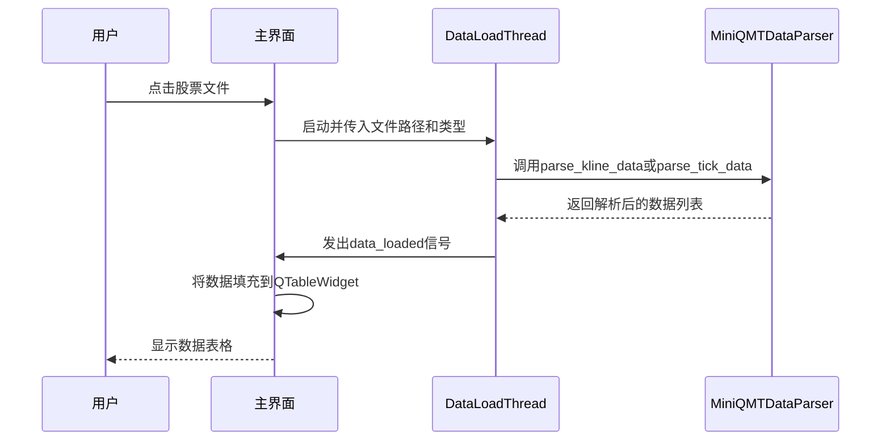
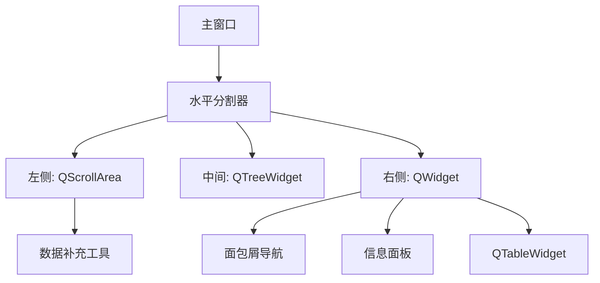
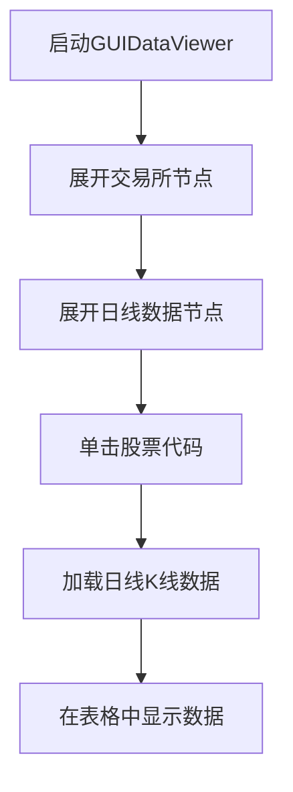

# 数据查看界面

<cite>
**本文档引用的文件**
- [GUIDataViewer.py](file://GUIDataViewer.py)
- [miniQMT_data_viewer.py](file://miniQMT_data_viewer.py)
- [miniQMT_data_parser.py](file://miniQMT_data_parser.py)
</cite>

## 目录
1. [本地数据浏览功能](#本地数据浏览功能)
2. [数据加载与展示](#数据加载与展示)
3. [股票代码筛选与时间范围选择](#股票代码筛选与时间范围选择)
4. [数据导出功能](#数据导出功能)
5. [与miniQMT_data_viewer.py的协作机制](#与miniqmt_data_viewepy的协作机制)
6. [界面控件布局](#界面控件布局)
7. [信号槽连接方式](#信号槽连接方式)
8. [数据缓存策略与性能优化](#数据缓存策略与性能优化)
9. [异常处理逻辑](#异常处理逻辑)
10. [用户操作流程示例](#用户操作流程示例)

## 本地数据浏览功能

`GUIDataViewer.py` 实现了本地数据浏览功能，允许用户查看和分析从miniQMT客户端导出的本地行情数据。该功能主要通过解析miniQMT的本地数据文件结构，将二进制或专有格式的数据转换为可读的表格形式进行展示。系统支持多种数据类型，包括K线数据（1分钟、5分钟、日线）和Tick数据。用户可以通过树形结构导航，逐层展开交易所（上交所、深交所）、数据周期和具体股票，最终查看特定股票在特定周期下的详细行情数据。

**Section sources**
- [GUIDataViewer.py](file://GUIDataViewer.py#L431-L469)
- [miniQMT_data_viewer.py](file://miniQMT_data_viewer.py#L348-L377)

## 数据加载与展示

数据加载与展示是`GUIDataViewer.py`的核心功能。系统通过`DataLoadThread`线程在后台异步加载数据，避免阻塞主界面。数据加载过程分为两个主要步骤：首先，`DataLoadThread`根据用户选择的数据类型（tick、1m、5m、1d）调用`MiniQMTDataParser`的相应解析方法；其次，解析后的数据通过`data_loaded`信号传递给主界面，并在`QTableWidget`中以表格形式展示。

对于K线数据，系统调用`parse_kline_data`方法，该方法利用`xtquant.xtdata.get_local_data` API获取数据，并将其转换为包含时间、开、高、低、收、成交量、成交额等字段的列表。对于Tick数据，系统调用`parse_tick_data`方法，解析出更详细的行情信息，包括买卖盘口（买一至买五价/量，卖一至卖五价/量）、成交总额、成交总量等。加载完成后，数据会自动填充到表格中，并根据字段类型进行格式化和样式设置。

**Diagram sources**
- [GUIDataViewer.py](file://GUIDataViewer.py#L402-L434)
- [miniQMT_data_parser.py](file://miniQMT_data_parser.py#L100-L300)

## 股票代码筛选与时间范围选择

系统提供了灵活的股票代码筛选和时间范围选择功能。在界面左侧的“数据补充工具”区域，用户可以通过勾选预定义的股票池（如沪深A股、创业板、科创板、沪深300等）或导入自定义的CSV文件来筛选股票。用户还可以手动添加单只股票代码。

对于时间范围选择，系统提供了“起始日期”和“结束日期”两个`QDateEdit`控件，用户可以通过日历弹窗选择日期范围。此功能主要用于数据补充操作，当用户需要为选中的股票列表补充特定时间段的历史数据时，会使用这两个控件指定的日期范围。

**Section sources**
- [GUIDataViewer.py](file://GUIDataViewer.py#L3196-L3995)

## 数据导出功能

尽管提供的代码片段中没有直接实现数据导出功能，但`GUIDataViewer.py`的界面设计和数据结构为数据导出奠定了基础。当前系统将数据加载到`QTableWidget`中，这是一个标准的PyQt表格控件，通常可以通过遍历其内容并将其写入CSV或Excel文件来实现导出。此外，系统已经集成了`pandas`库，这为数据导出提供了强大的支持。用户可以将`QTableWidget`中的数据转换为`pandas.DataFrame`，然后使用`DataFrame.to_csv()`或`DataFrame.to_excel()`方法轻松导出。

**Section sources**
- [GUIDataViewer.py](file://GUIDataViewer.py#L2397-L3196)

## 与miniQMT_data_viewer.py的协作机制

`GUIDataViewer.py`与`miniQMT_data_viewer.py`在功能上高度相似，它们都依赖于`miniQMT_data_parser.py`来解析数据，并使用相同的`LoadingDialog`、`DataLoadThread`等组件。它们的协作机制体现在它们共享了核心的数据解析逻辑和UI设计模式。

`miniQMT_data_parser.py`是两者共同的后端，负责与`xtquant`库交互，从miniQMT的`datadir`目录中读取和解析二进制数据文件。`GUIDataViewer.py`和`miniQMT_data_viewer.py`则作为前端，负责构建用户界面、处理用户交互，并调用`MiniQMTDataParser`的API来获取数据。这种设计实现了前后端分离，使得数据解析逻辑可以被多个不同的前端界面复用。

**Section sources**
- [miniQMT_data_parser.py](file://miniQMT_data_parser.py#L0-L50)
- [miniQMT_data_viewer.py](file://miniQMT_data_viewer.py#L348-L377)

## 界面控件布局

`GUIDataViewer.py`的界面采用三栏式布局，由一个`QSplitter`分割的三个区域组成：
1.  **左侧区域**：一个带有滚动条的`QScrollArea`，内部包含“数据补充工具”面板。该面板由多个`QGroupBox`组成，包括股票代码列表、周期类型、日期范围和补充数据按钮。
2.  **中间区域**：一个`QTreeWidget`，用于以树形结构展示数据目录，包括交易所、数据周期和股票文件。
3.  **右侧区域**：主要的数据展示区，包含一个面包屑导航栏、一个信息面板和一个`QTableWidget`，用于显示选中数据的详细内容。

这种布局清晰地分离了导航、控制和展示功能，使用户能够方便地浏览和分析数据。

**Diagram sources**
- [GUIDataViewer.py](file://GUIDataViewer.py#L799-L1598)

## 信号槽连接方式

系统广泛使用了PyQt的信号与槽（Signal & Slot）机制来实现组件间的通信。主要的信号槽连接包括：
- `DataLoadThread`的`data_loaded`信号连接到`GUIDataViewer`的`on_data_loaded`槽，用于接收加载完成的数据。
- `DataLoadThread`的`progress_updated`信号连接到`GUIDataViewer`的`on_progress_updated`槽，用于更新状态栏的进度信息。
- `DataLoadThread`的`error_occurred`信号连接到`GUIDataViewer`的`on_error_occurred`槽，用于处理加载过程中的错误。
- `QTreeWidget`的`itemClicked`信号连接到`on_tree_item_clicked`槽，用于响应用户在树形结构中的点击操作。
- `QTableWidget`的`itemClicked`信号连接到`on_file_clicked`槽，用于响应用户在文件列表中的点击操作。

这些连接确保了数据流和控制流的顺畅，实现了异步加载和用户交互。

**Section sources**
- [GUIDataViewer.py](file://GUIDataViewer.py#L402-L434)
- [GUIDataViewer.py](file://GUIDataViewer.py#L2397-L3196)

## 数据缓存策略与性能优化

系统采用了多种策略来优化性能和用户体验：
1.  **异步加载**：所有数据加载操作都在`DataLoadThread`后台线程中执行，防止主界面冻结。
2.  **懒加载**：树形结构中的数据文件列表和具体数据内容都是在用户点击时才加载，而不是一次性加载所有数据。
3.  **缓存**：系统使用`self.stock_names_cache`字典来缓存股票代码和名称的映射关系，避免重复读取文件。
4.  **样式优化**：通过`QTimer.singleShot(0, self.apply_scaled_styles)`在界面构建后统一应用样式表，避免了因局部样式设置导致的界面闪烁。
5.  **资源管理**：在启动新的数据加载线程前，会检查并终止任何正在运行的旧线程，防止资源泄漏。

**Section sources**
- [GUIDataViewer.py](file://GUIDataViewer.py#L431-L469)
- [GUIDataViewer.py](file://GUIDataViewer.py#L1774-L1810)

## 异常处理逻辑

系统在数据加载过程中实现了完善的异常处理。`DataLoadThread`的`run`方法被包裹在`try-except`块中，捕获所有可能的异常。当发生异常时，会通过`error_occurred`信号将错误信息传递给主界面，并在状态栏和信息标签中显示。错误信息包括异常的字符串描述和完整的堆栈跟踪，便于调试。此外，`MiniQMTDataParser`在解析数据时也会进行异常处理，如果无法解析数据，会返回空列表而不是抛出异常，保证了程序的稳定性。

**Section sources**
- [GUIDataViewer.py](file://GUIDataViewer.py#L402-L434)

## 用户操作流程示例

以下是如何查看某只股票的日线K线图的用户操作流程：

1.  **打开界面**：从主程序启动`GUIDataViewer`。
2.  **导航到数据**：在中间的树形控件中，展开“上交所”或“深交所”节点，然后展开“日线数据”节点。
3.  **选择股票**：在股票文件列表中，单击目标股票的代码（例如“600000”）。
4.  **查看数据**：系统会自动在右侧的表格中加载并显示该股票的所有日线K线数据，包括日期、开盘价、最高价、最低价、收盘价、成交量和成交额等信息。

**Diagram sources**
- [GUIDataViewer.py](file://GUIDataViewer.py#L2397-L3196)