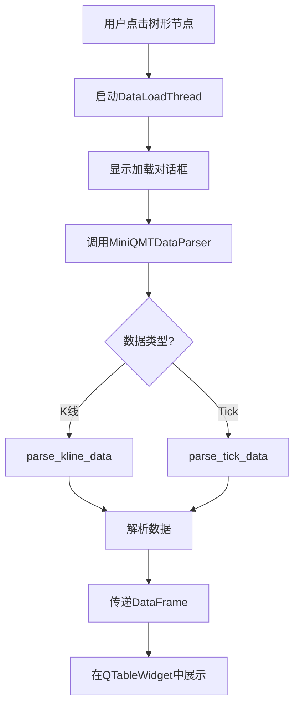
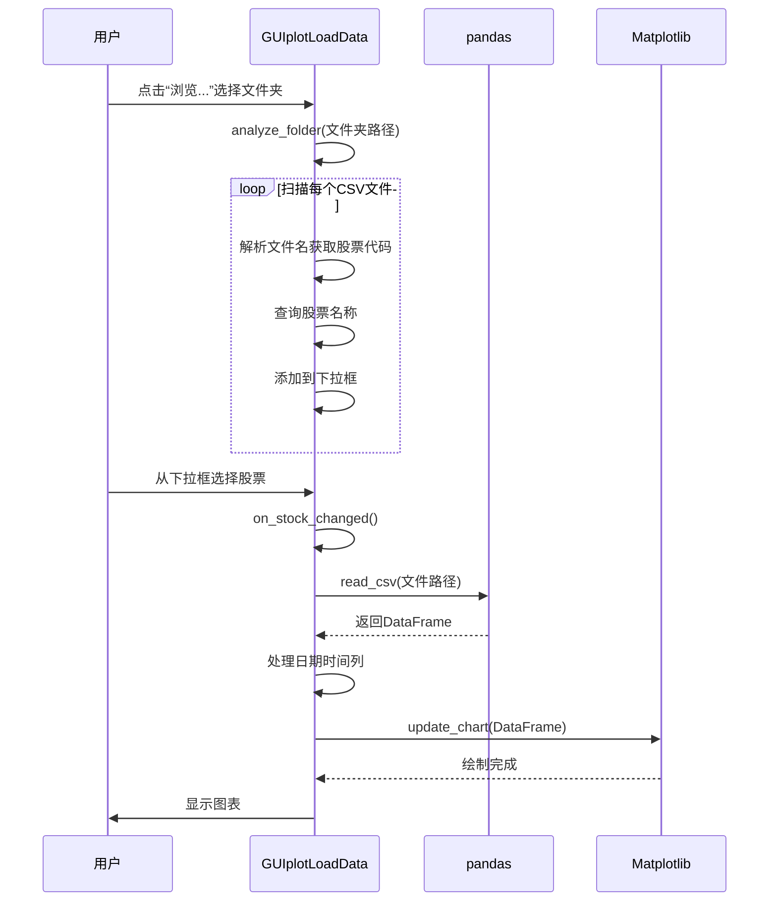

# 数据管理界面

<cite>
**本文档引用的文件**   
- [GUIDataViewer.py](file://GUIDataViewer.py)
- [GUIplotLoadData.py](file://GUIplotLoadData.py)
- [GUIScheduler.py](file://GUIScheduler.py)
- [khQTTools.py](file://khQTTools.py)
- [miniQMT_data_viewer.py](file://miniQMT_data_viewer.py)
- [khConfig.py](file://khConfig.py)
</cite>

## 目录
1. [简介](#简介)
2. [核心GUI组件功能](#核心gui组件功能)
3. [数据展示与查看](#数据展示与查看)
4. [数据加载流程](#数据加载流程)
5. [定时任务配置](#定时任务配置)
6. [数据获取与协同工作](#数据获取与协同工作)
7. [实际操作示例](#实际操作示例)
8. [配置保存机制](#配置保存机制)
9. [结论](#结论)

## 简介
本文档全面记录了看海量化交易系统中与数据管理相关的GUI组件的功能与使用方式。重点介绍`GUIDataViewer.py`、`GUIplotLoadData.py`和`GUIScheduler.py`三个核心界面，详细说明它们如何展示本地存储的行情数据、执行数据加载流程以及配置周期性数据补充任务。文档还解释了这些界面如何调用`khQTTools.py`和xtquant接口获取数据，并与`miniQMT_data_viewer.py`协同工作。通过提供实际操作示例和说明配置保存机制，旨在为用户提供一份详尽的操作指南。

## 核心GUI组件功能
看海量化交易系统提供了三个核心的GUI组件用于数据管理：`GUIDataViewer`、`GUIplotLoadData`和`GUIScheduler`。这些组件分别负责数据的查看、可视化和定时补充。

`GUIDataViewer`是一个二进制数据查看器，它允许用户浏览和查看存储在miniQMT客户端中的本地行情数据。用户可以通过树形结构导航到特定的股票和周期类型，查看K线和Tick数据。该组件还集成了数据补充功能，允许用户手动触发数据下载。

`GUIplotLoadData`是一个股票数据可视化工具，它提供了一个交互式的图表界面，用于展示和分析加载的CSV数据文件。用户可以选择数据文件夹，从下拉菜单中选择股票，并在图表中查看其价格走势。该工具支持多种图表交互功能，如图例点击显示/隐藏数据系列。

`GUIScheduler`是定时数据调度器，它提供了一个配置界面，用于设置周期性的数据补充任务。用户可以配置股票池、数据周期、时间范围和执行时间，系统将在指定时间自动运行数据补充任务，确保本地数据的及时更新。

**组件功能概览**
- **GUIDataViewer**: 数据浏览、查看、手动补充
- **GUIplotLoadData**: 数据可视化、图表分析
- **GUIScheduler**: 定时任务配置、自动数据补充

**Section sources**
- [GUIDataViewer.py](file://GUIDataViewer.py#L431-L469)
- [GUIplotLoadData.py](file://GUIplotLoadData.py#L30-L35)
- [GUIScheduler.py](file://GUIScheduler.py#L221-L262)

## 数据展示与查看
`GUIDataViewer`组件通过一个直观的树形结构来展示本地存储的行情数据。用户首先需要在主界面的设置中配置miniQMT路径，该路径指向miniQMT客户端的安装目录。一旦路径配置正确，`GUIDataViewer`会自动扫描`datadir`文件夹下的数据结构，并将其以树形控件的形式呈现。

数据的组织结构遵循“股票代码 -> 周期类型 -> 文件”的层级。用户可以展开树节点，选择特定的股票（如`000001.SZ`）和周期类型（如`1d`日线、`1m`分钟线、`tick`逐笔数据）。当用户点击一个数据文件时，系统会启动一个后台线程来加载数据。

数据加载过程由`DataLoadThread`类处理。该线程首先显示一个加载进度对话框，然后调用`MiniQMTDataParser`解析器来读取二进制数据文件。对于K线数据，解析器会读取`parse_kline_data`方法；对于Tick数据，则调用`parse_tick_data`方法。解析完成后，数据以`pandas.DataFrame`的形式传递给主界面，并在右侧的`QTableWidget`中以表格形式展示。

该组件支持多种文件格式，主要是miniQMT客户端生成的二进制数据文件。查看模式包括：
- **表格模式**：以可排序、可选择的表格形式展示原始数据。
- **面包屑导航**：显示当前数据的路径，方便用户了解数据来源。
- **信息面板**：显示所选数据的文件大小、条数等统计信息。

**Diagram sources **
- [GUIDataViewer.py](file://GUIDataViewer.py#L402-L434)
- [miniQMT_data_viewer.py](file://miniQMT_data_viewer.py#L220-L253)

**Section sources**
- [GUIDataViewer.py](file://GUIDataViewer.py#L1442-L1472)
- [miniQMT_data_viewer.py](file://miniQMT_data_viewer.py#L802-L832)

## 数据加载流程
`GUIplotLoadData`组件的数据加载流程始于用户选择一个包含CSV数据文件的文件夹。用户通过点击“浏览...”按钮，使用`QFileDialog`打开一个文件夹选择对话框。一旦用户选择了文件夹，`analyze_folder`方法会被调用，该方法会扫描文件夹内的所有`.csv`文件。

加载流程的关键步骤如下：
1.  **文件分析**：程序遍历文件夹，读取每个CSV文件的文件名。文件名通常遵循`{股票代码}_{周期类型}_{起始日期}_{结束日期}.csv`的命名规则。程序会解析这些信息，并建立文件名到股票代码的映射。
2.  **股票列表填充**：根据解析出的股票代码，程序会查询`全部股票_股票列表.csv`文件，获取对应的股票名称，并将`股票代码 - 股票名称`的组合填充到下拉选择框中。
3.  **数据加载**：当用户从下拉框中选择一只股票时，`on_stock_changed`方法被触发。该方法会根据当前选择的文件和文件夹路径，构建完整的文件路径。
4.  **数据读取与处理**：程序使用`pandas.read_csv`读取CSV文件。对于分钟级或Tick数据，如果数据包含日期和时间列，程序会将它们合并成一个`datetime`列，以便于后续的图表绘制。
5.  **图表更新**：数据加载完成后，`update_chart`方法会被调用，将数据绘制到`matplotlib`图表上。

在整个加载过程中，程序会通过`QStatusBar`和`QLabel`向用户反馈进度信息，例如“正在加载数据...”和“数据加载完成”。如果加载过程中发生错误，会弹出相应的错误对话框。

**Diagram sources **
- [GUIplotLoadData.py](file://GUIplotLoadData.py#L300-L380)
- [GUIplotLoadData.py](file://GUIplotLoadData.py#L500-L550)

## 定时任务配置
`GUIScheduler`组件提供了一个图形化界面，用于配置和管理周期性的数据补充任务。用户可以通过该界面设置任务的执行时间、目标股票池、数据周期和时间范围。

配置界面主要分为以下几个部分：
- **股票池选择**：用户可以通过复选框选择预定义的股票池，如“沪深A股”、“创业板”、“科创板”等。此外，还支持自定义股票文件列表。
- **周期类型选择**：用户可以选择需要补充的数据周期，包括“日线”、“1分钟线”、“5分钟线”和“逐笔数据”。
- **时间范围设置**：用户可以设置数据的起始日期和结束日期，格式为`YYYYMMDD`。
- **执行时间设置**：用户可以使用`QTimeEdit`控件设置任务的执行时间，精确到分钟。

当用户配置好所有参数并点击“开始定时补充”按钮后，系统会使用`schedule`库来安排任务。`ScheduledSupplementThread`线程会在指定的时间启动，并调用`supplement_history_data`函数来执行数据补充。任务的状态（如“等待执行”、“正在执行”）会实时显示在状态栏和日志文本框中。

该组件还提供了“