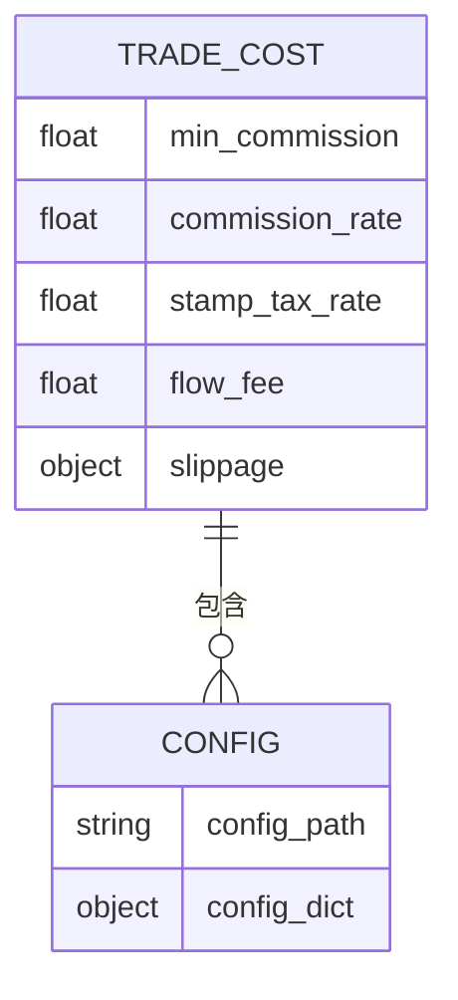
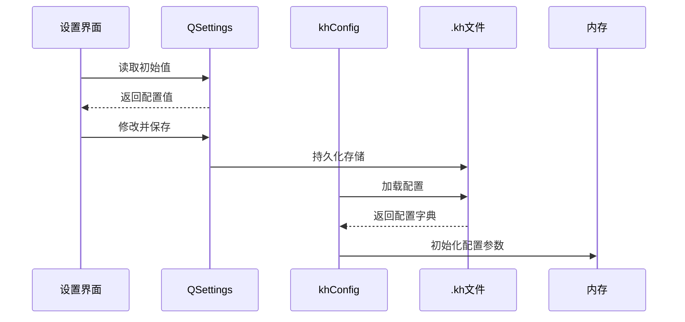
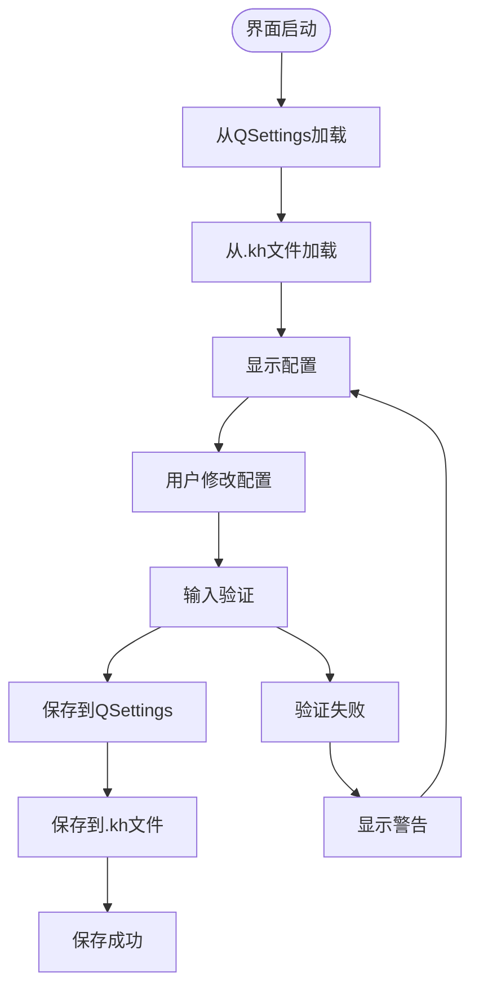

# 系统设置对话框

<cite>
**本文档引用文件**  
- [SettingsDialog.py](file://SettingsDialog.py)
- [khConfig.py](file://khConfig.py)
- [GUI.py](file://GUI.py)
- [khFrame.py](file://khFrame.py)
- [双均线精简_使用khMA函数.kh](file://strategies/双均线精简_使用khMA函数.kh)
</cite>

## 目录
1. [简介](#简介)
2. [配置项详解](#配置项详解)
3. [配置文件读写机制](#配置文件读写机制)
4. [配置错误案例与修复](#配置错误案例与修复)
5. [安全与路径建议](#安全与路径建议)
6. [推荐设置值](#推荐设置值)

## 简介
系统设置对话框是"看海量化交易平台"的核心配置界面，用于管理客户端路径、账户信息、交易参数等全局设置。该对话框通过`SettingsDialog.py`实现，与`.kh`工程配置文件和`khConfig.py`配置管理类协同工作，确保用户设置能够持久化并正确应用于回测与实盘交易。

**Section sources**
- [SettingsDialog.py](file://SettingsDialog.py#L1-L50)

## 配置项详解

### 基本参数设置
#### 无风险收益率
- **技术含义**：用于计算夏普比率、索提诺比率等风险调整后收益指标
- **影响范围**：回测绩效评估、策略优化目标函数
- **输入验证**：限定在0.0-1.0之间，支持小数点后6位精度
- **默认值**：0.03（即3%）

#### 延迟显示日志
- **技术含义**：控制策略运行期间日志的显示时机
- **影响范围**：系统性能、用户体验
- **启用效果**：日志在策略运行完成后统一显示，减少I/O开销，提升运行效率
- **默认状态**：关闭

#### 初始化行情数据
- **技术含义**：控制启动时是否自动连接并初始化行情数据
- **影响范围**：系统启动时间、资源占用
- **启用效果**：启动时自动下载所需历史数据，准备就绪状态更快
- **默认状态**：启用

#### 账户设置
- **账户名称**：标识交易账户的唯一ID，用于区分不同账户
- **账户类型**：支持STOCK（股票）、CREDIT（信用）、FUTURES（期货）三种类型，影响交易规则和风控参数

**Section sources**
- [SettingsDialog.py](file://SettingsDialog.py#L65-L180)

### 客户端设置
#### miniQMT客户端路径
- **技术含义**：指向QMT交易客户端主程序（.exe）的完整路径
- **影响范围**：实盘交易连接、API调用
- **验证机制**：保存时检查文件是否存在
- **默认值**：空

#### miniQMT数据路径
- **技术含义**：指向QMT用户数据目录（userdata_mini），包含账户配置、交易数据等
- **影响范围**：账户信息读取、交易指令执行
- **典型路径**：`D:\国金证券QMT交易端\userdata_mini`
- **默认值**：`D:\国金证券QMT交易端\userdata_mini`

**Section sources**
- [SettingsDialog.py](file://SettingsDialog.py#L270-L350)

### 交易成本参数
通过分析`.kh`配置文件，交易成本参数包括：
- **最低佣金**：单笔交易最低收费，防止小额交易成本过高
- **佣金费率**：按成交金额计算的佣金比例
- **印花税税率**：卖出股票时征收的税率
- **过户费**：A股交易的结算费用
- **滑点设置**：模拟实际交易价格与预期价格的偏差

**Diagram sources**
- [双均线精简_使用khMA函数.kh](file://strategies/双均线精简_使用khMA函数.kh#L15-L25)
- [khConfig.py](file://khConfig.py#L10-L20)

### 日志级别
系统通过Python logging模块实现多级日志：
- **INFO**：常规操作信息
- **WARNING**：潜在问题警告
- **ERROR**：错误信息
- **TRADE**：交易相关日志
- **DEBUG**：调试信息

日志级别影响系统输出的详细程度，对性能有一定影响。

**Section sources**
- [SettingsDialog.py](file://SettingsDialog.py#L500-L520)
- [khFrame.py](file://khFrame.py#L100-L120)

## 配置文件读写机制

### 配置同步流程

**Diagram sources**
- [SettingsDialog.py](file://SettingsDialog.py#L100-L150)
- [khConfig.py](file://khConfig.py#L10-L30)

### 双向同步实现
1. **读取过程**：
   - 系统启动时，`khConfig.py`从`.kh`文件加载JSON配置
   - `SettingsDialog.py`从`QSettings`读取持久化设置
   - 界面显示合并后的配置值

2. **写入过程**：
   - 用户在界面修改配置
   - 点击"保存设置"触发`save_settings()`方法
   - 配置同时写入`QSettings`和`.kh`文件
   - `khConfig.save_config()`确保文件持久化

**Diagram sources**
- [SettingsDialog.py](file://SettingsDialog.py#L350-L450)
- [khConfig.py](file://khConfig.py#L80-L100)

**Section sources**
- [SettingsDialog.py](file://SettingsDialog.py#L350-L450)
- [khConfig.py](file://khConfig.py#L80-L100)

## 配置错误案例与修复

### 典型错误案例
#### 案例1：客户端路径错误
- **现象**：无法连接QMT，交易功能失效
- **原因**：miniQMT客户端路径指向不存在的文件
- **修复方法**：使用"浏览..."按钮重新选择正确的`x64.exe`文件

#### 案例2：数据路径错误
- **现象**：账户信息读取失败，无法获取持仓
- **原因**：QMT数据路径未指向`userdata_mini`目录
- **修复方法**：确认路径包含`config.json`和`users`子目录

#### 案例3：配置文件损坏
- **现象**：启动时报JSON解析错误
- **原因**：.kh文件格式不正确或编码问题
- **修复方法**：使用文本编辑器检查JSON格式，确保UTF-8编码

#### 案例4：权限不足
- **现象**：保存设置失败
- **原因**：软件安装目录无写入权限
- **修复方法**：以管理员身份运行，或将配置文件保存到用户目录

**Section sources**
- [SettingsDialog.py](file://SettingsDialog.py#L400-L450)
- [khConfig.py](file://khConfig.py#L20-L40)

## 安全与路径建议

### 配置安全性
- **敏感信息保护**：账户密码等敏感信息不应明文存储
- **文件权限**：配置文件应设置适当的读写权限
- **备份机制**：定期备份重要配置文件
- **版本控制**：使用"配置另存为"保存不同版本的配置

### 路径正确性要求
- **绝对路径**：必须使用完整路径，避免相对路径导致的定位失败
- **字符编码**：路径不应包含中文或特殊字符，防止编码问题
- **目录存在性**：所有配置路径必须真实存在且可访问
- **权限验证**：确保软件有读写配置目录的权限

**Section sources**
- [SettingsDialog.py](file://SettingsDialog.py#L400-L450)
- [GUI.py](file://GUI.py#L2240-L2300)

## 推荐设置值
| 配置项 | 推荐值 | 说明 |
|--------|--------|------|
| 无风险收益率 | 0.03 | 3%年化收益率，符合当前市场环境 |
| 延迟显示日志 | 启用 | 提升回测性能，避免日志干扰 |
| 初始化行情数据 | 启用 | 确保数据连接快速建立 |
| miniQMT数据路径 | `D:\国金证券QMT交易端\userdata_mini` | 标准安装路径 |
| 账户类型 | STOCK | 股票交易最常用类型 |
| 最低佣金 | 5.0 | 券商常见最低收费标准 |
| 佣金费率 | 0.0001 | 万1佣金，市场常见水平 |
| 印花税税率 | 0.0005 | 卖出时征收的千分之0.5 |

**Section sources**
- [SettingsDialog.py](file://SettingsDialog.py#L100-L200)
- [双均线精简_使用khMA函数.kh](file://strategies/双均线精简_使用khMA函数.kh#L15-L30)