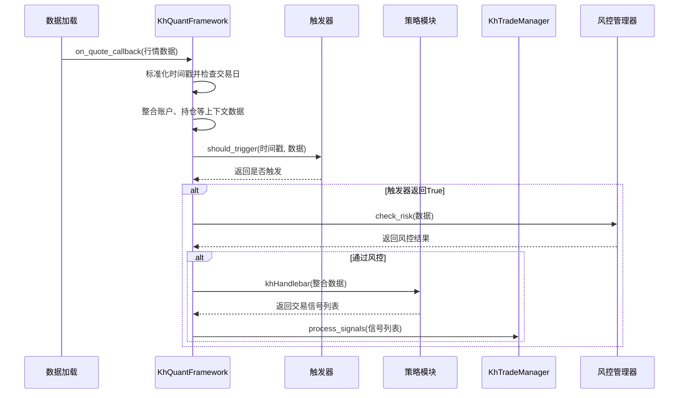
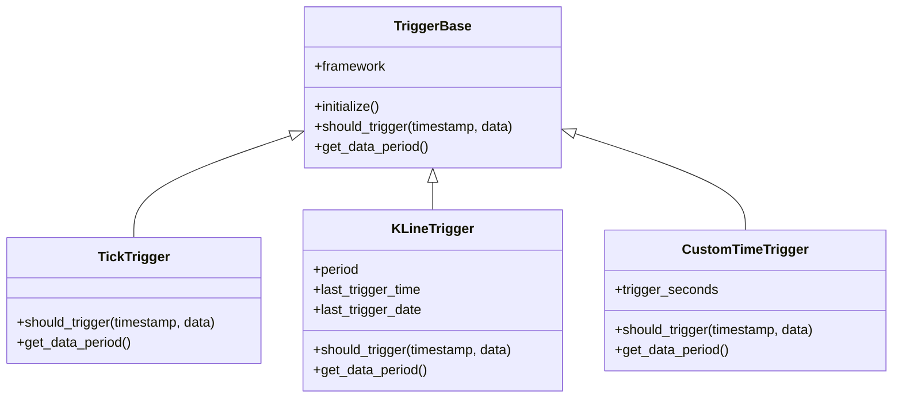

# 回测引擎

<cite>
**本文档引用的文件**   
- [khFrame.py](file://khFrame.py)
- [khTrade.py](file://khTrade.py)
- [khRisk.py](file://khRisk.py)
- [backtest_result_window.py](file://backtest_result_window.py)
- [khConfig.py](file://khConfig.py)
- [khQTTools.py](file://khQTTools.py)
- [strategies/双均线多股票_使用khMA函数.py](file://strategies/双均线多股票_使用khMA函数.py)
</cite>

## 目录
1. [引言](#引言)
2. [事件调度与执行流程](#事件调度与执行流程)
3. [三种触发模式实现原理](#三种触发模式实现原理)
4. [回测闭环流程](#回测闭环流程)
5. [资金与持仓模拟逻辑](#资金与持仓模拟逻辑)
6. [回测结果处理与可视化](#回测结果处理与可视化)
7. [回测精度与性能优化](#回测精度与性能优化)
8. [结论](#结论)

## 引言

本文档旨在深入剖析看海量化交易系统（KHQuant）中的回测引擎实现机制。该系统是一个基于Python和PyQt5开发的本地化量化交易研究平台，其核心优势在于为个人投资者提供了一个免费、开源且功能强大的回测环境。回测引擎作为系统的核心，负责模拟历史市场环境，验证策略的有效性。本文将重点分析`khFrame.py`文件中的事件调度与执行流程，详细阐述Tick、K线和自定义定时三种触发模式的实现原理，并解释回测过程中行情推送、策略响应、交易执行和风控检查的完整闭环。此外，文档还将描述回测结果的收集、计算与持久化过程，以及`backtest_result_window.py`如何将这些结果可视化，最终为用户提供全面的绩效评估。

**Section sources**
- [khFrame.py](file://khFrame.py#L0-L2679)
- [README.md](file://README.md#L0-L2210)

## 事件调度与执行流程

回测引擎的核心是`KhQuantFramework`类，它充当了整个回测过程的调度中心。该框架通过一个事件驱动的架构来协调数据流、策略执行和交易管理。其执行流程始于框架的初始化，此时会根据配置文件`khConfig.py`加载策略、创建交易管理器`KhTradeManager`和风控管理器`KhRiskManager`，并初始化一个虚拟账户以模拟资金和持仓。

整个流程的起点是行情数据的回调处理。当系统通过`xtdata`模块加载历史数据后，会触发`on_quote_callback`方法。此方法首先对时间戳进行标准化处理，然后检查当前日期是否为交易日。如果非交易日，则直接跳过策略调用。随后，框架会将当前时间信息、账户资产、持仓情况和股票池等上下文数据整合到一个名为`data_with_time`的数据字典中。接下来，最关键的一步是通过`TriggerFactory`创建的触发器来判断是否应该执行策略。只有当触发器的`should_trigger`方法返回`True`时，流程才会继续。在通过风控检查后，框架会调用策略模块的`khHandlebar`函数，并将整合好的数据字典作为参数传入。策略函数执行后返回的交易信号列表，将被传递给`KhTradeManager`进行后续的交易处理。

**Diagram sources**
- [khFrame.py](file://khFrame.py#L1000-L1500)
- [khTrade.py](file://khTrade.py#L100-L200)

**Section sources**
- [khFrame.py](file://khFrame.py#L1000-L1500)
- [khTrade.py](file://khTrade.py#L100-L200)

## 三种触发模式实现原理

回测引擎支持三种主要的触发模式，以满足不同策略的需求。这些模式通过继承自`TriggerBase`基类的特定触发器来实现，并由`TriggerFactory`根据配置动态创建。

### Tick触发模式

Tick触发模式是最频繁的触发方式，其对应的实现类为`TickTrigger`。该模式的实现原理极为简单，其`should_trigger`方法始终返回`True`。这意味着，每当系统加载到一个新的Tick数据点（在本系统中通常为3秒快照），回测引擎就会立即执行一次策略逻辑。这种模式适用于需要对市场微观结构进行精细分析的策略，例如高频交易或事件驱动策略。然而，由于其极高的执行频率，会显著增加计算负担，因此在实际应用中，对于中低频策略，通常不推荐使用此模式。

**Diagram sources**
- [khFrame.py](file://khFrame.py#L50-L150)

### K线触发模式

K线触发模式是量化回测中最常用的模式，其实现类为`KLineTrigger`。该模式的原理是在每个K线周期结束时触发一次策略。`KLineTrigger`在初始化时会接收一个`period`参数，如"1m"、"5m"或"1d"。在`should_trigger`方法中，它会根据当前时间来判断是否达到了一个新K线的开始。例如，对于1分钟K线，当`current_time.second == 0`时触发；对于5分钟K线，则在`current_time.minute % 5 == 0 and current_time.second == 0`时触发；对于日K线，则通过比较`current_date`与`last_trigger_date`来判断是否进入新的一天。这种方式能有效模拟实盘中按K线周期生成信号的逻辑，是趋势跟踪和大多数技术指标策略的理想选择。

**Section sources**
- [khFrame.py](file://khFrame.py#L150-L300)

### 自定义定时触发模式

自定义定时触发模式提供了最大的灵活性，其实现类为`CustomTimeTrigger`。该模式允许用户在配置文件中指定一个精确的时间点列表，如["09:30:00", "10:00:00", "14:30:00"]。在初始化时，`CustomTimeTrigger`会将这些时间字符串解析为从午夜开始的秒数，并进行排序。在`should_trigger`方法中，它会计算