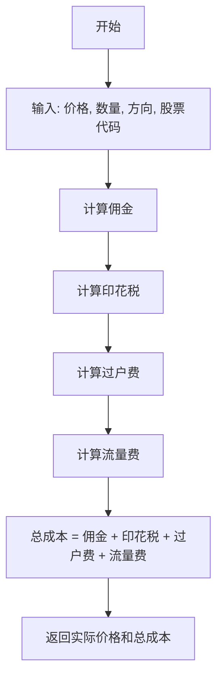
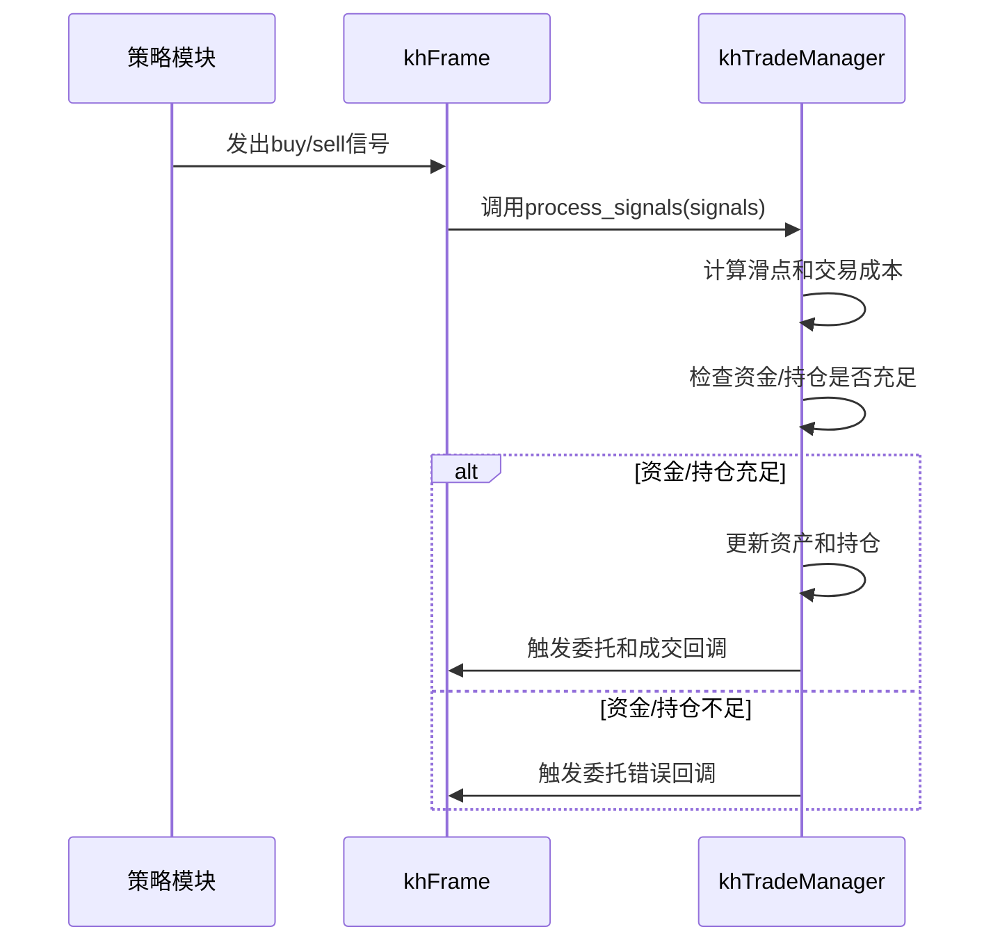

# 交易执行与订单模拟

<cite>
**本文档引用的文件**   
- [khTrade.py](file://khTrade.py)
- [khFrame.py](file://khFrame.py)
- [khConfig.py](file://khConfig.py)
</cite>

## 目录
1. [引言](#引言)
2. [订单撮合与成交价格确定](#订单撮合与成交价格确定)
3. [交易成本计算](#交易成本计算)
4. [交易执行流程](#交易执行流程)
5. [账户与持仓更新机制](#账户与持仓更新机制)
6. [一次买入操作的完整追踪](#一次买入操作的完整追踪)
7. [模拟精度影响因素](#模拟精度影响因素)
8. [结论](#结论)

## 引言
本文档深入解析`khTrade.py`模块中订单模拟的实现逻辑。该模块是量化交易框架的核心组件，负责处理策略发出的交易信号，执行订单模拟，并更新账户资金和持仓信息。文档将详细阐述限价单/市价单的撮合规则、成交价格的确定方法（包括滑点模型）、交易成本（佣金、印花税等）的计算方式，以及从信号触发到持仓更新的完整代码路径。

**Section sources**
- [khTrade.py](file://khTrade.py#L1-L559)
- [khFrame.py](file://khFrame.py#L0-L2678)

## 订单撮合与成交价格确定
在`khTrade.py`模块中，订单撮合逻辑主要在`KhTradeManager`类的`_place_order_backtest`方法中实现。该方法在回测模式下，假设所有订单都能立即全部成交。

### 撮合规则
- **限价单 (Limit Order)**：系统使用信号中的`price`作为委托价格。在回测中，假设订单能以该价格或更优的价格成交。
- **市价单 (Market Order)**：在当前实现中，市价单并未特殊处理，其行为与限价单类似，使用信号中的`price`作为参考。真正的市价单应以当前市场最优价格成交，但此逻辑未在代码中体现。
- **其他类型**：支持`best`(最优价)等类型，但具体实现逻辑未在代码中展开。

### 成交价格确定
成交价格的确定是订单模拟的关键，它不仅基于信号价格，还考虑了**滑点 (Slippage)** 模型。滑点的计算由`calculate_slippage`方法完成，支持两种模式：

1.  **Tick模式**：按最小变动价位（如A股为0.01元）的跳数计算。例如，`tick_count=2`表示买入时价格上浮0.02元，卖出时下浮0.02元。
2.  **Ratio模式**：按比例计算。例如，`ratio=0.001`表示0.1%的滑点，买入时价格上浮0.1%，卖出时下浮0.1%。

最终的成交价格通过`calculate_trade_cost`方法计算，该方法返回`actual_price`（考虑滑点后的价格）和`total_cost`（总交易成本）。

```mermaid
flowchart TD
A[原始信号价格] --> B{滑点类型}
B --> |tick| C[实际价格 = 价格 ± (最小变动价 × 跳数)]
B --> |ratio| D[实际价格 = 价格 × (1 ± 比例)]
C --> E[返回实际成交价格]
D --> E
```

**Diagram sources**
- [khTrade.py](file://khTrade.py#L100-L150)

**Section sources**
- [khTrade.py](file://khTrade.py#L80-L150)

## 交易成本计算
交易成本的计算是确保回测结果真实性的关键环节。`KhTradeManager`类在初始化时从配置文件中读取各项成本参数，并在`calculate_trade_cost`方法中进行综合计算。

### 成本构成
1.  **佣金 (Commission)**：
    *   计算公式：`price * volume * commission_rate`
    *   存在最低佣金限制（`min_commission`），若计算出的佣金低于此值，则按最低佣金收取。
2.  **印花税 (Stamp Tax)**：
    *   仅在**卖出**时收取。
    *   计算公式：`price * volume * stamp_tax_rate`
3.  **过户费 (Transfer Fee)**：
    *   仅对**沪市股票**（代码以`sh.`开头）收取。
    *   计算公式：`price * volume * 0.00001`（即成交金额的0.001%）。
4.  **流量费 (Flow Fee)**：
    *   每笔交易固定收取的费用。

### 成本计算流程


**Diagram sources**
- [khTrade.py](file://khTrade.py#L150-L250)

**Section sources**
- [khTrade.py](file://khTrade.py#L150-L250)

## 交易执行流程
当策略发出`buy`/`sell`指令后，`khFrame`框架会调用`khTrade`模块的`execute_order`（即`process_signals`）方法进行交易执行。整个流程如下：

1.  **信号处理**：`khFrame`的`on_quote_callback`方法在接收到行情数据并触发策略后，会调用策略的`khHandlebar`函数。
2.  **发送指令**：策略函数返回交易信号列表，`khFrame`随后调用`self.trade_mgr.process_signals(signals)`。
3.  **执行下单**：`process_signals`方法遍历每个信号，首先调用`calculate_trade_cost`计算实际成交价和总成本，然后调用`place_order`。
4.  **模式分发**：`place_order`根据运行模式（`live`, `simulate`, `backtest`）分发到不同的处理方法。在回测模式下，调用`_place_order_backtest`。
5.  **资金/持仓检查**：在`_place_order_backtest`中，会进行严格的检查：
    *   **买入**：检查可用现金是否足以支付`实际成交价 * 数量 + 总交易成本`。
    *   **卖出**：检查可用持仓数量是否足够。
6.  **执行交易**：如果检查通过，则执行资金和持仓的更新。



**Diagram sources**
- [khFrame.py](file://khFrame.py#L1500-L1600)
- [khTrade.py](file://khTrade.py#L250-L550)

**Section sources**
- [khFrame.py](file://khFrame.py#L1500-L1600)
- [khTrade.py](file://khTrade.py#L250-L550)

## 账户与持仓更新机制
交易执行的核心是更新`__account__`和`__positions__`两个字段。这两个字段在`KhTradeManager`实例化时被初始化为空字典，并在`khFrame`的`_init_virtual_account`方法中被赋予初始值。

### 交易前状态
- `__account__`：包含`cash`（可用现金）、`total_asset`（总资产）等字段。
- `__positions__`：一个以股票代码为键的字典，初始为空，表示无持仓。

### 买入操作更新过程
当执行一笔成功的买入交易时：
1.  **资金减少**：`__account__['cash']` 减少 `实际成交价 * 数量 + 总交易成本`。
2.  **持仓增加**：
    *   如果是新持仓，则在`__positions__`中创建新的股票条目。
    *   如果是已有持仓，则更新`volume`（总数量）、`can_use_volume`（可用数量）、`avg_price`（持仓均价）等字段。持仓均价按加权平均法计算：`(原持仓市值 + 本次买入金额) / (原持仓数量 + 本次买入数量)`。

### 卖出操作更新过程
当执行一笔成功的卖出交易时：
1.  **资金增加**：`__account__['cash']` 增加 `实际成交价 * 数量 - 总交易成本`。
2.  **持仓减少**：相应股票的`volume`和`can_use_volume`减少。如果持仓数量减至0，则从`__positions__`中删除该股票的记录。

**Section sources**
- [khTrade.py](file://khTrade.py#L400-L550)
- [khFrame.py](file://khFrame.py#L1200-L1300)

## 一次买入操作的完整追踪
以下是从信号触发到持仓更新的完整代码路径追踪：

1.  **信号生成**：策略在`khHandlebar`函数中生成一个买入信号，例如：`{"code": "sh.600000", "action": "buy", "price": 10.0, "volume": 1000}`。
2.  **信号传递**：`khFrame.on_quote_callback`接收到信号并调用`self.trade_mgr.process_signals(signals)`。
3.  **成本计算**：`process_signals`调用`calculate_trade_cost`。假设滑点为0.1%，则`actual_price=10.01`。计算佣金、印花税等，得到`total_cost`。
4.  **资金检查**：`_place_order_backtest`检查`__account__['cash']`是否大于`10.01*1000 + total_cost`。
5.  **执行交易**：资金检查通过后，执行：
    *   `__account__['cash'] -= required_cash`
    *   更新或创建`__positions__['sh.600000']`，设置`volume=1000`, `avg_price=10.01`等。
6.  **回调通知**：触发`on_stock_order`和`on_stock_trade`回调，通知GUI或其他模块交易已执行。

**Section sources**
- [khFrame.py](file://khFrame.py#L1550-L1600)
- [khTrade.py](file://khTrade.py#L250-L550)

## 模拟精度影响因素
尽管该模块实现了较为完整的交易模拟，但其精度受多种因素影响：

1.  **数据频率**：回测使用的数据频率（如1分钟、5分钟、Tick）直接影响信号的生成时机和价格。高频数据能更精确地模拟交易，但计算成本更高。
2.  **撮合延迟假设**：当前实现假设订单能立即成交（`ORDER_SUCCEEDED`），这忽略了实际交易中可能存在的网络延迟、交易所撮合延迟等问题。更精确的模拟应引入延迟模型。
3.  **市场冲击 (Market Impact)**：大额订单可能会对市场价格产生影响，但当前模型未考虑此因素。
4.  **滑点模型的准确性**：预设的滑点参数（如固定的跳数或比例）是理想化的，实际滑点会随市场流动性、波动性等因素动态变化。
5.  **信号生成时机**：`khFrame`中的`Trigger`机制（如`TickTrigger`, `KLineTrigger`）决定了策略的调用频率，这直接影响了交易执行的精确度。

**Section sources**
- [khFrame.py](file://khFrame.py#L300-L500)
- [khTrade.py](file://khTrade.py#L80-L150)

## 结论
`khTrade.py`模块提供了一个功能完整的订单模拟系统，涵盖了从信号处理、成本计算到账户更新的全流程。它通过`KhTradeManager`类实现了交易成本（佣金、印花税、过户费、流量费）和滑点的精确计算，并通过`process_signals`和`_place_order_backtest`方法确保了交易逻辑的正确执行。`khFrame`框架则负责协调行情数据、策略信号和交易执行，实现了`__account__`和`__positions__`的动态更新。然而，要获得更贴近实盘的回测结果，仍需考虑数据频率、撮合延迟、市场冲击等更复杂的因素。