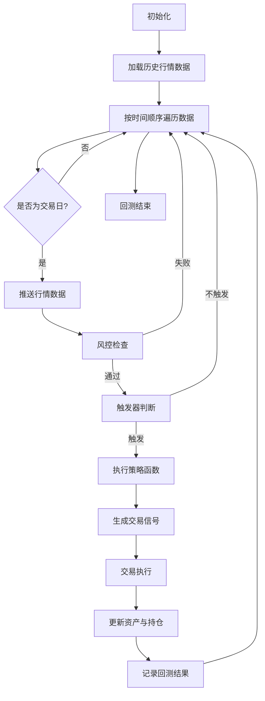
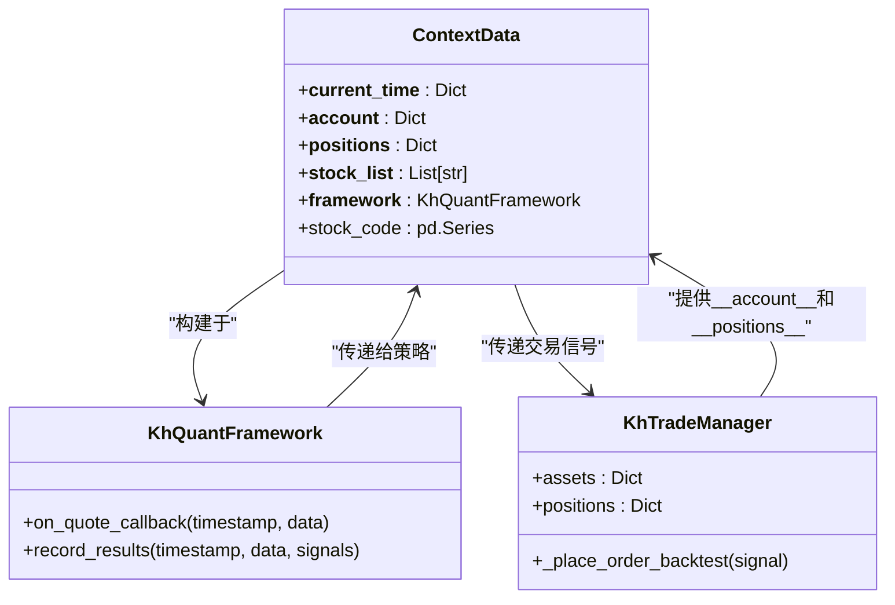
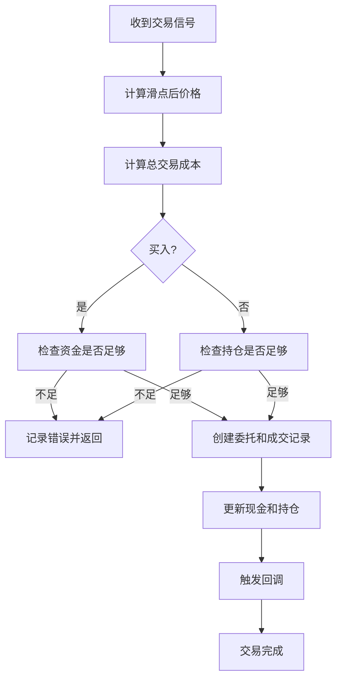

# 回测执行流程

<cite>
**本文档引用文件**   
- [khFrame.py](file://khFrame.py)
- [khTrade.py](file://khTrade.py)
- [khRisk.py](file://khRisk.py)
- [khQTTools.py](file://khQTTools.py)
- [khConfig.py](file://khConfig.py)
- [strategies/双均线精简_使用khMA函数.py](file://strategies/双均线精简_使用khMA函数.py)
</cite>

## 目录
1. [引言](#引言)
2. [核心执行流程概览](#核心执行流程概览)
3. [context对象数据传递机制](#context对象数据传递机制)
4. [订单模拟与成交撮合实现](#订单模拟与成交撮合实现)
5. [双均线策略实例分析](#双均线策略实例分析)
6. [潜在风险与规避方法](#潜在风险与规避方法)

## 引言
本文档旨在全面阐述回测引擎的核心执行流程。从行情数据推送开始，到策略信号生成、交易执行（`khTrade.py`）和风控检查（`khRisk.py`）的完整闭环。重点描述`context`对象在各模块间的数据传递机制，包括`__current_time__`、`__account__`、`__positions__`等关键字段的更新逻辑。详细说明订单模拟、成交撮合、手续费计算及持仓更新的具体实现。结合双均线策略实例，展示一次完整买卖流程的代码路径。同时分析潜在的逻辑漏洞风险点（如未来函数、滑点模型偏差）及其规避方法。

## 核心执行流程概览

回测引擎的核心执行流程是一个高度协调的事件驱动闭环，主要由`KhQuantFramework`类驱动，其核心流程如下：

1.  **初始化**：框架启动时，`KhQuantFramework`会初始化配置（`khConfig.py`）、交易管理器（`KhTradeManager` in `khTrade.py`）、风险管理器（`KhRiskManager` in `khRisk.py`）和工具类（`KhQuTools` in `khQTTools.py`）。同时，根据配置文件中的`stock_list`或`stock_pool`加载股票列表，并初始化虚拟账户的资产和持仓。

2.  **行情数据推送**：在`_run_backtest`方法中，系统会根据配置的周期（如`1d`, `1m`）批量加载历史行情数据。随后，系统会按时间顺序遍历所有数据点，并通过`on_quote_callback`方法将行情数据推送给策略。

3.  **风控检查**：在每次行情数据推送后，系统会调用`KhRiskManager.check_risk`方法进行风控检查。该方法会依次调用`_check_position`、`_check_order`和`_check_loss`等子方法，只有通过所有检查，才会继续执行后续流程。

4.  **触发器判断**：`TriggerFactory`根据配置创建相应的触发器（如`TickTrigger`, `KLineTrigger`）。`on_quote_callback`会调用触发器的`should_trigger`方法，判断当前时间点是否满足策略执行条件。

5.  **策略信号生成**：当风控通过且触发器判定为真时，框架会调用用户定义的策略主函数`khHandlebar(data)`。策略函数接收包含行情、时间、账户、持仓等信息的`data`字典，进行逻辑计算，并返回一个交易信号列表。

6.  **交易执行**：框架将策略生成的信号列表传递给`KhTradeManager.process_signals`方法。交易管理器负责处理这些信号，执行资金/持仓检查、计算交易成本、更新资产和持仓，并触发相应的回调。

7.  **结果记录**：在每个交易日结束时，`record_results`方法会被调用，用于记录当日的总资产、收益率等统计数据，为后续的绩效分析提供数据支持。

**Diagram sources**
- [khFrame.py](file://khFrame.py#L1800-L2600)
- [khRisk.py](file://khRisk.py#L15-L35)
- [khTrade.py](file://khTrade.py#L150-L250)

## context对象数据传递机制

`context`对象（在代码中体现为`data`字典）是连接策略、交易、风控等模块的核心数据载体。它在`on_quote_callback`方法中被构建，并在各模块间传递，确保了数据的一致性和实时性。

### 关键字段的构建与更新

`context`对象的关键字段在`on_quote_callback`和`record_results`等方法中被动态构建和更新。

1.  **`__current_time__`**:
    *   **来源**：从行情数据的`timestamp`字段解析而来。
    *   **构建**：在`on_quote_callback`中，系统会将原始时间戳转换为包含`timestamp`、`datetime`、`date`和`time`的字典。
    *   **更新**：该字段在每次行情数据推送时都会被更新，代表当前回测的精确时间点。
    *   **用途**：供策略判断交易时机，是避免“未来函数”的关键。

2.  **`__account__`**:
    *   **来源**：`KhTradeManager.assets`字典。
    *   **构建**：在`on_quote_callback`中，直接将`trade_mgr.assets`的引用赋值给`data["__account__"]`。
    *   **更新**：在`KhTradeManager._place_order_backtest`方法中，每次成功交易后，会立即更新`assets`中的`cash`（现金）和`total_asset`（总资产）等字段。`record_results`方法会在每日结束时，根据最新的持仓市值重新计算`total_asset`。
    *   **用途**：策略通过此字段获取可用资金，用于计算最大可买入股数。

3.  **`__positions__`**:
    *   **来源**：`KhTradeManager.positions`字典。
    *   **构建**：在`on_quote_callback`中，直接将`trade_mgr.positions`的引用赋值给`data["__positions__"]`。
    *   **更新**：在`KhTradeManager._place_order_backtest`方法中，买入时会创建或更新持仓的`volume`（数量）、`avg_price`（均价）、`market_value`（市值）；卖出时会减少相应数量，清仓时会删除持仓记录。`record_results`方法会在每日结束时，根据最新的收盘价更新所有持仓的`current_price`（当前价）和`market_value`。
    *   **用途**：策略通过此字段检查是否已持有某股票，以及当前的持仓成本和盈亏。

**Diagram sources**
- [khFrame.py](file://khFrame.py#L1000-L1200)
- [khFrame.py](file://khFrame.py#L2400-L2600)
- [khTrade.py](file://khTrade.py#L300-L500)

**Section sources**
- [khFrame.py](file://khFrame.py#L950-L1250)
- [khTrade.py](file://khTrade.py#L250-L550)

## 订单模拟与成交撮合实现

交易执行的核心逻辑在`khTrade.py`的`KhTradeManager`类中实现，其过程高度模拟了真实交易的流程。

### 交易成本与滑点计算

在执行任何交易前，系统会精确计算交易成本，确保回测结果的准确性。

*   **滑点计算 (`calculate_slippage`)**：支持两种模式。
    *   **tick模式**：按最小变动价（如0.01元）和跳数（如2跳）计算，买入时价格上浮，卖出时下浮。
    *   **ratio模式**：按比例计算，买入时价格上浮`ratio/2`，卖出时下浮`ratio/2`。
*   **交易成本计算 (`calculate_trade_cost`)**：总成本包括：
    *   **佣金**：按成交金额和`commission_rate`计算，有`min_commission`最低限制。
    *   **印花税**：仅在卖出时收取，按成交金额和`stamp_tax_rate`计算。
    *   **过户费**：仅对沪市股票（`sh.`开头）收取，按成交金额的0.001%计算。
    *   **流量费**：每笔交易固定收取`flow_fee`。

### 订单处理与成交撮合

`_place_order_backtest`方法是回测模式下单的核心。

1.  **资金/持仓检查**：
    *   **买入**：计算所需总资金（`actual_price * volume + trade_cost`），检查`assets["cash"]`是否足够。
    *   **卖出**：检查`positions[stock_code]["can_use_volume"]`（可用数量）是否足够。
    *   若检查失败，会记录错误日志并立即返回，不执行后续操作。

2.  **创建委托与成交**：
    *   系统会创建一个`order`字典，状态为`ORDER_SUCCEEDED`，表示回测中假设立即成交。
    *   同时创建一个`trade`字典，记录实际成交价格（已考虑滑点）和成交金额。

3.  **更新账户与持仓**：
    *   **买入**：
        *   `assets["cash"]` 减少所需总资金。
        *   若为新持仓，创建`positions`条目，`avg_price`为实际成交价。
        *   若为加仓，按加权平均法更新`avg_price`。
    *   **卖出**：
        *   `assets["cash"]` 增加（成交金额 - 交易成本）。
        *   减少`positions`中的`volume`和`can_use_volume`。
        *   若持仓清零，则删除该股票的`positions`条目。

4.  **触发回调**：执行完成后，会触发`on_stock_order`、`on_stock_trade`、`on_stock_asset`和`on_stock_position`等回调，用于更新GUI界面或进行其他逻辑处理。

**Diagram sources**
- [khTrade.py](file://khTrade.py#L250-L550)

## 双均线策略实例分析

以`strategies/双均线精简_使用khMA函数.py`为例，分析一次完整的买卖流程。

1.  **策略初始化**：`init`函数为空，无特殊初始化逻辑。
2.  **信号生成**：
    *   策略通过`khGet(data, "first_stock")`获取第一只股票代码。
    *   通过`khMA(stock_code, 5)`和`khMA(stock_code, 20)`计算5日和20日移动平均线。
    *   通过`khHas(data, stock_code)`检查是否已持仓。
    *   当短期均线金叉长期均线且无持仓时，调用`generate_signal`生成买入信号。
3.  **交易执行**：
    *   `generate