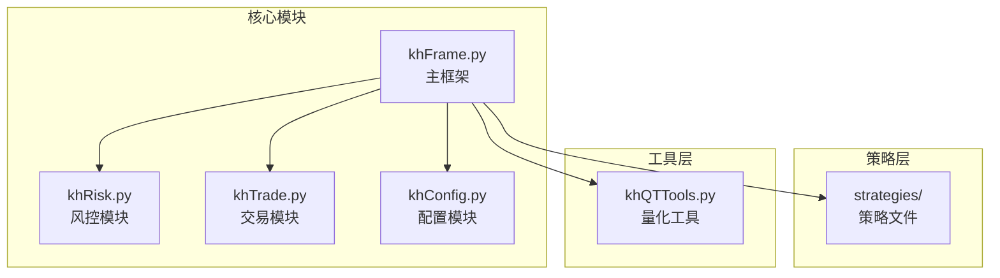
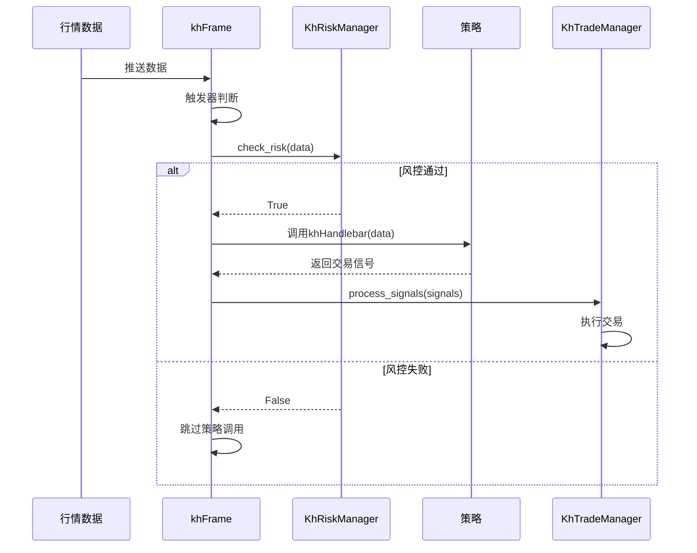
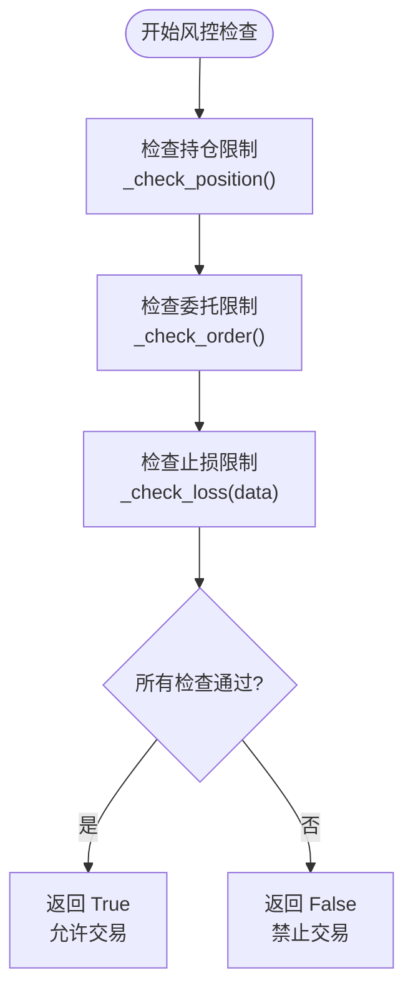
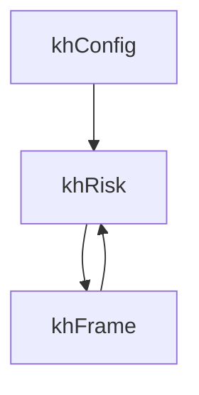

# 风控检查与执行

<cite>
**本文档引用的文件**   
- [khRisk.py](file://khRisk.py)
- [khFrame.py](file://khFrame.py)
- [khConfig.py](file://khConfig.py)
- [khTrade.py](file://khTrade.py)
- [strategies/双均线多股票_使用khMA函数.py](file://strategies/双均线多股票_使用khMA函数.py)
</cite>

## 目录
1. [引言](#引言)
2. [项目结构](#项目结构)
3. [核心组件](#核心组件)
4. [架构概述](#架构概述)
5. [详细组件分析](#详细组件分析)
6. [依赖分析](#依赖分析)
7. [性能考虑](#性能考虑)
8. [故障排除指南](#故障排除指南)
9. [结论](#结论)

## 引言
本文档系统阐述了`khRisk.py`模块在回测流程中的核心作用，包括持仓检查、止损止盈触发、最大持仓股数限制等风控规则的实现机制。详细说明了在每次交易执行前，`khFrame`如何调用`khRisk`模块进行合规性校验，以及风控失败时的处理流程（如取消订单）。深入描述了`context`中与风控相关的状态字段（如`__positions__`、`__current_time__`）如何被读取和判断。通过一个基于动态止损的策略示例，展示了风控逻辑如何介入并影响最终的交易结果。最后，列出了常见的风控配置错误及其调试方法，为策略开发者提供全面的风控实践指导。

## 项目结构
本项目采用模块化设计，核心功能由多个独立的Python模块构成。`khFrame.py`作为主框架，负责协调数据流、策略执行和模块间的通信。`khRisk.py`是专门的风控模块，封装了所有风险检查逻辑。`khTrade.py`负责处理交易信号和资产更新。`khConfig.py`管理全局配置。策略文件位于`strategies`目录下，通过`khFrame`加载执行。这种结构确保了风控逻辑的独立性和可复用性。



**图示来源**
- [khFrame.py](file://khFrame.py#L1-L2679)
- [khRisk.py](file://khRisk.py#L1-L50)
- [khTrade.py](file://khTrade.py#L1-L560)
- [khConfig.py](file://khConfig.py#L1-L104)

**本节来源**
- [khFrame.py](file://khFrame.py#L1-L2679)
- [project_structure](file://project_structure)

## 核心组件

`khRisk.KhRiskManager`类是整个风控系统的核心。它在初始化时从`khConfig`加载风控参数，如`position_limit`（持仓比例限制）、`order_limit`（单笔委托数量限制）和`loss_limit`（止损比例限制）。其`check_risk`方法作为统一的入口，按顺序调用`_check_position`、`_check_order`和`_check_loss`等私有方法进行具体的检查。只有当所有检查都通过时，才允许交易信号进入执行阶段。

**本节来源**
- [khRisk.py](file://khRisk.py#L1-L50)
- [khConfig.py](file://khConfig.py#L1-L104)

## 架构概述

整个回测流程的架构清晰地展示了风控模块的集成位置。`khFrame`在接收到行情数据后，首先通过`Trigger`判断是否触发策略，然后立即调用`KhRiskManager`的`check_risk`方法进行风控检查。只有风控通过，才会将包含`__positions__`和`__current_time__`等上下文信息的数据包传递给策略函数`khHandlebar`。策略生成的交易信号在被`KhTradeManager`执行前，会再次受到风控的约束。



**图示来源**
- [khFrame.py](file://khFrame.py#L714)
- [khRisk.py](file://khRisk.py#L15-L35)
- [khTrade.py](file://khTrade.py#L100-L110)

## 详细组件分析

### 风控检查流程分析

`KhRiskManager`的`check_risk`方法是风控流程的总控。它接收一个包含当前行情和上下文信息的字典`data`，并按顺序执行三个关键检查。

#### 持仓与委托检查


**图示来源**
- [khRisk.py](file://khRisk.py#L15-L35)

**本节来源**
- [khRisk.py](file://khRisk.py#L15-L50)

### 动态止损策略示例

以下是一个基于动态止损的策略示例，它展示了风控逻辑如何与策略协同工作。

```python
def khHandlebar(data: Dict) -> List[Dict]:
    signals = []
    stock_list = khGet(data, "stocks")
    current_time_str = khGet(data, "date_num")
    
    for stock_code in stock_list:
        current_price = khPrice(data, stock_code, "close")
        # 假设我们有一个动态计算的止损价
        stop_loss_price = calculate_dynamic_stop_loss(stock_code, current_time_str)
        
        has_position = khHas(data, stock_code)
        
        # 如果当前价格跌破动态止损价且持有该股票，则卖出
        if current_price <= stop_loss_price and has_position:
            signals.extend(generate_signal(data, stock_code, current_price, 1, 'sell', f"{stock_code} 触发动态止损"))
    
    return signals
```
在该策略中，当`current_price`低于`stop_loss_price`时，会生成卖出信号。这个信号在被`KhTradeManager`执行前，会经过`KhRiskManager`的`_check_loss`方法验证。如果`_check_loss`的实现逻辑与策略的止损逻辑一致，就能确保交易的合规性。

**本节来源**
- [strategies/双均线多股票_使用khMA函数.py](file://strategies/双均线多股票_使用khMA函数.py#L1-L32)
- [khRisk.py](file://khRisk.py#L47-L50)

## 依赖分析

`khRisk`模块的正常运行依赖于`khConfig`模块提供配置参数，并被`khFrame`模块所调用。`khFrame`在初始化时创建`KhRiskManager`的实例，并在每次行情触发时调用其`check_risk`方法。`khRisk`本身不直接依赖`khTrade`或策略模块，它只负责返回一个布尔值，这种松耦合的设计提高了系统的稳定性和可维护性。



**图示来源**
- [khFrame.py](file://khFrame.py#L1798)
- [khRisk.py](file://khRisk.py#L1-L14)
- [khConfig.py](file://khConfig.py#L1-L104)

**本节来源**
- [khFrame.py](file://khFrame.py#L1798)
- [khRisk.py](file://khRisk.py#L1-L50)
- [khConfig.py](file://khConfig.py#L1-L104)

## 性能考虑

风控检查作为回测流程中的一个环节，其性能至关重要。`KhRiskManager`的设计非常轻量，`check_risk`方法中的检查逻辑（如`_check_position`和`_check_order`）目前返回`True`，表明其检查逻辑是高效的。在实际实现中，应确保`_check_loss`等方法的计算复杂度较低，避免成为回测的性能瓶颈。由于风控检查在每次行情触发时都会执行，因此应尽量减少不必要的计算和I/O操作。

## 故障排除指南

当策略的交易信号未按预期执行时，应首先检查风控配置。

**常见风控配置错误及调试方法：**

| 错误类型 | 可能原因 | 调试方法 |
| :--- | :--- | :--- |
| 交易信号被无故取消 | `position_limit`设置过低 | 检查`config.json`中`risk.position_limit`的值，确认其是否小于策略的最大持仓比例。 |
| 买入信号无法执行 | `order_limit`设置过小 | 检查`config.json`中`risk.order_limit`的值，确认其是否小于单笔交易的股数。 |
| 止损未触发 | `loss_limit`配置错误或`_check_loss`逻辑未实现 | 检查`config.json`中`risk.loss_limit`的值，并确认`khRisk.py`中的`_check_loss`方法是否已正确实现止损逻辑。 |
| 回测日志中出现“风控检查失败” | 风控模块返回`False` | 在`khFrame.py`的`on_quote_callback`方法中，查找`if not self.risk_mgr.check_risk(data_with_time):`的调用，确认`data_with_time`的内容是否正确。 |

**本节来源**
- [khConfig.py](file://khConfig.py#L90-L93)
- [khRisk.py](file://khRisk.py#L15-L35)
- [khFrame.py](file://khFrame.py#L714)

## 结论

`khRisk.py`模块通过`KhRiskManager`类为回测系统提供了关键的风险控制能力。它与`khFrame`框架紧密集成，在策略执行前进行合规性校验，有效防止了超限交易。通过分析`context`中的`__positions__`和`__current_time__`等状态，风控模块能够做出基于当前市场和账户状况的决策。尽管当前的检查逻辑是框架性的，但其设计为实现复杂的风控规则（如动态止损、最大回撤控制）提供了坚实的基础。开发者应正确配置`khConfig`中的参数，并根据需要完善`khRisk`中的检查方法，以确保策略在受控的环境中运行。