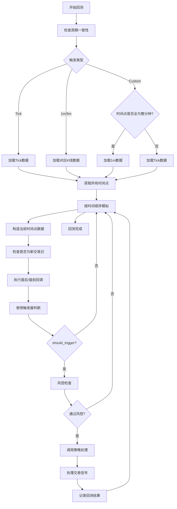

# 回测触发机制

<cite>
**Referenced Files in This Document**   
- [khFrame.py](file://khFrame.py)
- [khConfig.py](file://khConfig.py)
- [khTrade.py](file://khTrade.py)
- [khQTTools.py](file://khQTTools.py)
</cite>

## 目录
1. [引言](#引言)
2. [触发器类型详解](#触发器类型详解)
3. [触发器创建流程](#触发器创建流程)
4. [事件调度与执行顺序](#事件调度与执行顺序)
5. [适用场景与选择依据](#适用场景与选择依据)
6. [精度控制与时间对齐](#精度控制与时间对齐)
7. [多股票多周期事件合并](#多股票多周期事件合并)
8. [常见问题排查](#常见问题排查)
9. [性能优化建议](#性能优化建议)
10. [附录](#附录)

## 引言
本文档深入解析`khFrame.py`中实现的三种回测触发机制：Tick触发、K线触发和自定义定时触发。详细说明每种触发器的创建流程、事件调度逻辑以及在回测循环中的执行顺序。结合代码示例解释不同触发模式的适用场景，例如Tick级高频策略与日线策略的选择依据。文档涵盖触发精度控制、时间对齐机制、以及多股票多周期下的事件合并策略。同时提供常见问题排查指南，如触发器未按预期执行、时间戳错位等，并给出性能优化建议。

## 触发器类型详解

### Tick触发器
Tick触发器是`TriggerBase`的子类，实现每个Tick都触发策略的逻辑。其`should_trigger`方法直接返回`True`，表示每个Tick数据到达时都应触发策略执行。该触发器适用于需要最高频率响应的高频交易策略，能够捕捉到市场最细微的价格变动。

**Section sources**
- [khFrame.py](file://khFrame.py#L55-L67)

### K线触发器
K线触发器在K线形成时触发策略。根据配置的周期（如"1m", "5m", "1d"），在相应的时间点判断是否触发。对于1分钟K线，在每分钟的开始（秒数为0）时触发；对于5分钟K线，在每5分钟的开始（分钟数能被5整除且秒数为0）时触发；对于日K线，则在每个交易日的开始时触发。

**Section sources**
- [khFrame.py](file://khFrame.py#L69-L131)

### 自定义定时触发器
自定义定时触发器允许用户指定精确的时间点列表（如["09:30:00", "09:45:00"]）来触发策略。系统会将这些时间字符串解析为从午夜开始的秒数，并在当前时间接近任一触发时间点（允许5秒误差）时返回`True`。该触发器为定时交易策略（如开盘集合竞价、收盘前交易）提供了精确的控制能力。

**Section sources**
- [khFrame.py](file://khFrame.py#L133-L201)

## 触发器创建流程
触发器的创建由`TriggerFactory`工厂类负责。在`KhQuantFramework`初始化时，会调用`TriggerFactory.create_trigger`方法，根据配置文件中的`backtest.trigger.type`字段来决定创建哪种触发器实例。如果配置为"tick"，则创建`TickTrigger`；如果为"1m"、"5m"或"1d"，则创建对应周期的`KLineTrigger`；如果为"custom"，则会读取`custom_times`列表并创建`CustomTimeTrigger`。若配置无效，则默认使用Tick触发。

```mermaid
sequenceDiagram
participant Framework as KhQuantFramework
participant Factory as TriggerFactory
participant Config as 配置文件
participant Trigger as 触发器实例
Framework->>Config : 读取配置
Config-->>Framework : 返回配置字典
Framework->>Factory : create_trigger(框架, 配置)
Factory->>Factory : 解析trigger.type
alt type为tick
Factory->>Trigger : 创建TickTrigger
elif type为1m/5m/1d
Factory->>Trigger : 创建KLineTrigger(周期)
elif type为custom
Factory->>Trigger : 创建CustomTimeTrigger(时间列表)
else
Factory->>Trigger : 创建默认TickTrigger
end
Factory-->>Framework : 返回触发器实例
Framework->>Framework : 存储为self.trigger
```

**Diagram sources**
- [khFrame.py](file://khFrame.py#L203-L253)
- [khFrame.py](file://khFrame.py#L464-L480)

## 事件调度与执行顺序
在回测模式`_run_backtest`中，事件调度遵循严格的顺序。首先，系统会检查数据周期与触发周期的一致性，避免因配置不匹配导致的性能或精度问题。然后，根据触发器类型加载相应周期的历史数据（如Tick、1m、5m等）。对于自定义定时触发，系统会智能判断：如果所有时间点都是整分钟，则使用1分钟K线数据；否则使用Tick数据以保证精度。



**Diagram sources**
- [khFrame.py](file://khFrame.py#L1324-L1350)
- [khFrame.py](file://khFrame.py#L1418-L1456)
- [khFrame.py](file://khFrame.py#L1688-L1810)

## 适用场景与选择依据
选择合适的触发模式对策略性能至关重要。**Tick触发**适用于高频交易策略，如做市商、套利策略，需要对市场每一笔成交做出反应。**K线触发**适用于技术分析策略，如双均线、RSI等，这些策略依赖于K线的开盘、最高、最低、收盘价进行计算，通常在K线闭合时执行交易决策。**自定义定时触发**则适用于有特定时间要求的策略，例如在开盘集合竞价时下单、在收盘前平仓，或执行每小时一次的再平衡操作。

选择依据主要基于策略的交易频率和数据需求。高频策略应选择Tick触发以确保不遗漏任何市场机会；中低频的技术分析策略应选择对应的K线周期触发以减少不必要的计算开销；而有固定时间点执行需求的策略则应选择自定义定时触发。

## 精度控制与时间对齐
系统通过多种机制确保触发精度和时间对齐。首先，`_check_period_consistency`方法会检查配置的数据周期与触发周期是否匹配，若不匹配会弹出警告，防止因数据精度不足导致的策略执行异常。其次，对于K线触发，系统在判断时会考虑K线闭合的实际情况，例如在1分钟K线触发时，会允许在57秒后触发，以应对数据延迟。对于自定义定时触发，系统会根据时间点的特性智能选择底层数据源（1m或tick），确保在非整分钟时间点也能获得精确的市场数据。

## 多股票多周期下的事件合并策略
在多股票多周期的回测中，系统采用事件合并策略来高效处理。首先，系统会为所有股票加载指定周期的历史数据，并提取所有时间点。然后，将这些时间点去重并排序，形成一个全局的、按时间顺序排列的事件队列。在回测循环中，系统按此队列顺序模拟，为每个时间点构建包含所有股票数据的视图。通过`historical_data_ref`、`time_field_cache`和`time_idx_cache`等缓存机制，系统能够快速定位每个股票在特定时间点的数据，避免了重复的数据查找和转换，极大地提升了回测效率。

## 常见问题排查

### 触发器未按预期执行
- **检查配置**：确认`config.json`中的`backtest.trigger.type`配置正确。
- **检查周期匹配**：确保`data.kline_period`与触发类型一致，避免因周期不匹配导致的警告或跳过。
- **检查时间点**：对于自定义触发，确认`custom_times`中的时间点格式正确（HH:MM:SS）。
- **检查交易日**：策略只在交易日执行，非交易日（周末、节假日）不会触发。

### 时间戳错位
- **检查数据源**：确认加载的数据时间戳精度（秒级或毫秒级）与系统处理逻辑一致。
- **检查时间转换**：系统会自动处理不同精度的时间戳，但需确保数据源本身的时间戳是准确的。
- **检查时区**：确保所有时间戳都基于同一时区（通常为北京时间）。

**Section sources**
- [khFrame.py](file://khFrame.py#L1324-L1350)
- [khFrame.py](file://khFrame.py#L1688-L1810)
- [khFrame.py](file://khFrame.py#L2400-L2678)

## 性能优化建议
1. **选择合适的触发模式**：避免使用过高的数据精度。例如，一个日线策略应使用"1d"触发，而非"tick"触发，以大幅减少计算量。
2. **利用智能数据适配**：对于自定义定时触发，尽量将时间点设置为整分钟，以便系统自动使用1分钟K线数据，减少数据量。
3. **减少股票数量**：在不影响策略效果的前提下，尽量减少回测的股票数量。
4. **优化策略逻辑**：确保`khHandlebar`函数内部的计算逻辑高效，避免不必要的循环和复杂计算。
5. **利用缓存**：系统已内置多种缓存（如`_cached_benchmark_close`、`daily_price_cache`），确保在多日回测中能有效复用数据。

## 附录
- **配置文件示例**：
```json
{
  "backtest": {
    "trigger": {
      "type": "custom",
      "custom_times": ["09:30:00", "10:00:00", "11:00:00"]
    }
  }
}
```
- **触发器工厂源码**：[khFrame.py](file://khFrame.py#L203-L253)
- **回测主循环源码**：[khFrame.py](file://khFrame.py#L1324-L2678)