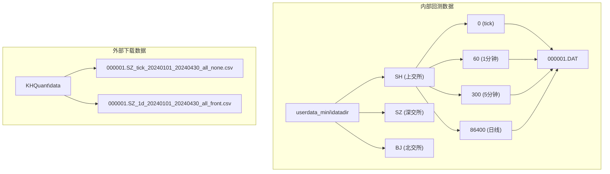
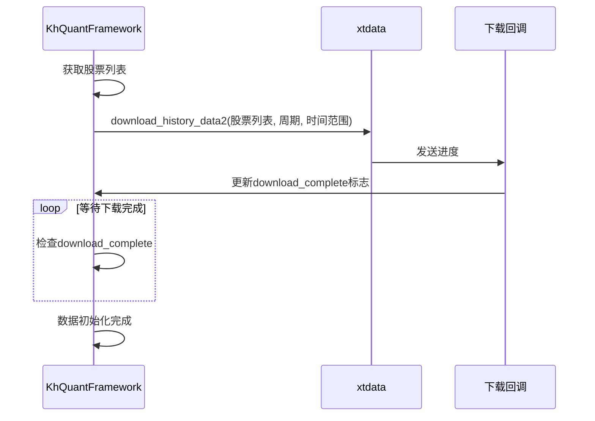

# 数据存储

<cite>
**Referenced Files in This Document**   
- [khFrame.py](file://khFrame.py)
- [khConfig.py](file://khConfig.py)
- [khQTTools.py](file://khQTTools.py)
- [GUI.py](file://GUI.py)
- [GUIDataViewer.py](file://GUIDataViewer.py)
- [miniQMT_data_viewer.py](file://miniQMT_data_viewer.py)
- [miniQMT_data_parser.py](file://miniQMT_data_parser.py)
- [README.md](file://README.md)
</cite>

## 目录
1. [本地数据存储结构设计](#本地数据存储结构设计)
2. [数据写入协调与一致性保障](#数据写入协调与一致性保障)
3. [数据版本管理与元数据记录](#数据版本管理与元数据记录)
4. [存储空间优化建议](#存储空间优化建议)
5. [用户手动管理数据文件](#用户手动管理数据文件)

## 本地数据存储结构设计

本系统采用双轨制的本地数据存储策略，根据数据用途和访问方式的不同，将数据分别存储于两个独立的目录结构中，以实现功能分离和性能优化。

### 文件组织方式

系统根据数据的来源和用途，将数据分为两大类进行组织：

1.  **内部回测数据 (MiniQMT datadir)**：
    *   **路径**: 位于用户指定的 `miniQMT` 客户端路径下的 `userdata_mini\datadir` 目录中。
    *   **组织方式**: 采用严格的分层目录结构，按**交易所**和**周期**进行分类。
        *   **第一级**: 交易所代码，如 `SH` (上交所)、`SZ` (深交所)、`BJ` (北交所)。
        *   **第二级**: 数据周期，以秒数表示，如 `0` (tick数据)、`60` (1分钟数据)、`300` (5分钟数据)、`86400` (日线数据)。
    *   **示例路径**: `D:\国金证券QMT交易端\userdata_mini\datadir\SH\60\000001.DAT`

2.  **外部下载数据 (CSV文件)**：
    *   **路径**: 默认存储在用户文档目录下的 `KHQuant\data` 文件夹中（Windows系统），或用户自定义的路径。
    *   **组织方式**: 采用扁平化的单文件存储模式，每个文件包含一个股票在特定周期、时间段和日期范围内的所有数据。
    *   **示例路径**: `C:\Users\用户名\Documents\KHQuant\data\000001.SZ_1d_20240101_20240430_all_front.csv`

**Diagram sources**
- [README.md](file://README.md#L1227-L1255)
- [GUI.py](file://GUI.py#L3716-L3749)

### 存储格式与目录布局

两种数据存储方式在格式和布局上存在显著差异：

*   **内部回测数据 (DAT文件)**:
    *   **存储格式**: 采用专有的二进制 `.DAT` 格式。这种格式由 `xtquant` 库定义，旨在实现最高效的读写性能，是回测引擎直接访问的数据源。
    *   **目录布局**: 如上所述，为树状分层结构。每个 `.DAT` 文件通常对应一个股票在特定周期下的所有历史数据。例如，`SH/60/000001.DAT` 文件存储了上证A股 `000001` 在1分钟周期下的所有历史K线数据。

*   **外部下载数据 (CSV文件)**:
    *   **存储格式**: 采用标准的 `.csv` 文本格式。这种格式具有良好的通用性和可读性，便于用户使用Excel、Python Pandas等外部工具进行分析和处理。
    *   **目录布局**: 所有文件都存储在同一个根目录下，通过文件名来区分不同的数据集。文件名本身包含了所有必要的元数据信息。

**Section sources**
- [README.md](file://README.md#L1227-L1255)
- [README.md](file://README.md#L1192-L1207)
- [GUI.py](file://GUI.py#L3716-L3749)

## 数据写入协调与一致性保障

系统通过 `khFrame.py` 中的 `KhQuantFramework` 类协调数据的初始化和加载过程，但数据的写入操作主要由底层的 `xtquant` 库和 `khQTTools.py` 模块负责。系统通过多线程和任务队列机制来保障多任务并发时的数据一致性。

### khFrame.py 的数据协调角色

`khFrame.py` 并不直接执行数据写入，而是作为框架协调者，通过调用 `xtdata` 模块的API来触发数据下载和加载。其核心协调逻辑体现在 `init_data` 方法中：

1.  **获取股票列表**: 通过 `get_stock_list()` 方法从配置中获取待下载的股票代码列表。
2.  **触发批量下载**: 调用 `xtdata.download_history_data2()` 函数，并传入股票列表、周期、起止时间等参数，启动数据下载任务。
3.  **进度监控与等待**: 通过一个回调函数 (`download_progress`) 监控下载进度，并在一个循环中等待下载完成 (`while not download_complete`)，确保数据加载完毕后才继续执行后续的策略回测。

**Diagram sources**
- [khFrame.py](file://khFrame.py#L460-L490)

### 多任务并发写入的处理策略

当用户在GUI界面中同时执行多个数据操作（如“数据补充”和“数据下载”）时，系统通过以下策略确保一致性：

1.  **多线程隔离**: 系统为每个耗时的数据任务（如数据补充、数据下载、数据清洗）创建独立的后台线程或进程。
    *   **数据补充**: 在 `GUIDataViewer.py` 和 `miniQMT_data_viewer.py` 中，`SupplementThread` 类使用 `QThread` 在后台执行 `supplement_history_data` 函数。
    *   **数据下载**: 在 `GUI.py` 中，`DownloadThread` 类使用 `multiprocessing.Process` 在独立进程中执行 `download_and_store_data` 函数，以避免GIL限制。
2.  **任务队列与互斥锁**: 每个线程内部通过互斥锁 (`QMutex`) 保护其运行状态，防止被外部信号（如用户点击“停止”按钮）在不安全的时刻中断。
3.  **原子性操作**: 对于单个数据文件的写入，系统采用“先下载到内存，再一次性写入磁盘”的模式。在 `khQTTools.py` 的 `download_and_store_data` 函数中，数据被完整下载并处理后，才通过 `df.to_csv(file_path)` 写入文件，这保证了单个文件写入的原子性。
4.  **中断安全**: 每个任务都实现了安全的中断机制。例如，`DownloadThread` 的 `stop()` 方法会设置一个停止标志，并等待后台进程安全退出，避免了数据损坏。

**Section sources**
- [khFrame.py](file://khFrame.py#L460-L490)
- [khQTTools.py](file://khQTTools.py#L635-L665)
- [GUI.py](file://GUI.py#L832-L867)
- [GUIDataViewer.py](file://GUIDataViewer.py#L1491-L1520)

## 数据版本管理与元数据记录

本系统本身不提供复杂的版本控制系统，但通过文件命名规则和元数据字段来记录数据的关键信息，实现了基础的版本和来源追踪。

### 文件命名规则

对于外部下载的CSV文件，系统采用了一套详细的命名规则，将所有元数据信息编码在文件名中：

*   **格式**: `{股票代码}_{周期类型}_{起始日期}_{结束日期}_{时间段}_{复权方式}.csv`
*   **示例**: `000001.SZ_1d_20240101_20240430_all_front.csv`
*   **各部分含义**:
    *   `000001.SZ`: 股票代码
    *   `1d`: 数据周期 (日线)
    *   `20240101`: 起始日期
    *   `20240430`: 结束日期
    *   `all`: 时间段 (全天)
    *   `front`: 复权方式 (前复权)

此命名规则使得用户无需打开文件即可了解其内容和来源。

### 元数据记录

除了文件名，系统还在数据内部和外部记录了更多信息：

1.  **文件内元数据**: CSV文件本身包含 `time` (时间戳)、`open` (开盘价)、`high` (最高价)、`low` (最低价)、`close` (收盘价)、`volume` (成交量) 等核心字段。`time` 字段直接记录了数据的更新时间点。
2.  **文件系统元数据**: 操作系统会自动记录文件的 `创建时间` 和 `修改时间`。用户可以通过文件管理器查看这些信息，以判断数据的更新时间。
3.  **日志记录**: 系统在运行时会生成详细的日志文件 (`app.log`)，记录每一次数据下载、补充和清洗操作的开始时间、结束时间、处理的股票列表和结果。这些日志是追溯数据来源和操作历史的重要依据。

**Section sources**
- [README.md](file://README.md#L1354-L1381)
- [khQTTools.py](file://khQTTools.py#L611-L636)
- [GUI.py](file://GUI.py#L3165-L3195)

## 存储空间优化建议

为了有效管理本地存储空间，建议采取以下优化策略：

### 数据压缩

*   **推荐方案**: 将生成的 `.csv` 文件压缩为 `.zip` 或 `.7z` 格式。CSV文件是纯文本，压缩率通常很高，可以节省大量空间。
*   **自动化**: 可以编写一个简单的脚本，在数据下载完成后自动将指定目录下的所有CSV文件打包压缩，并删除原始文件。

### 过期清理策略

1.  **定期清理旧数据**:
    *   **内部数据**: `xtquant` 库会自动管理 `datadir` 中