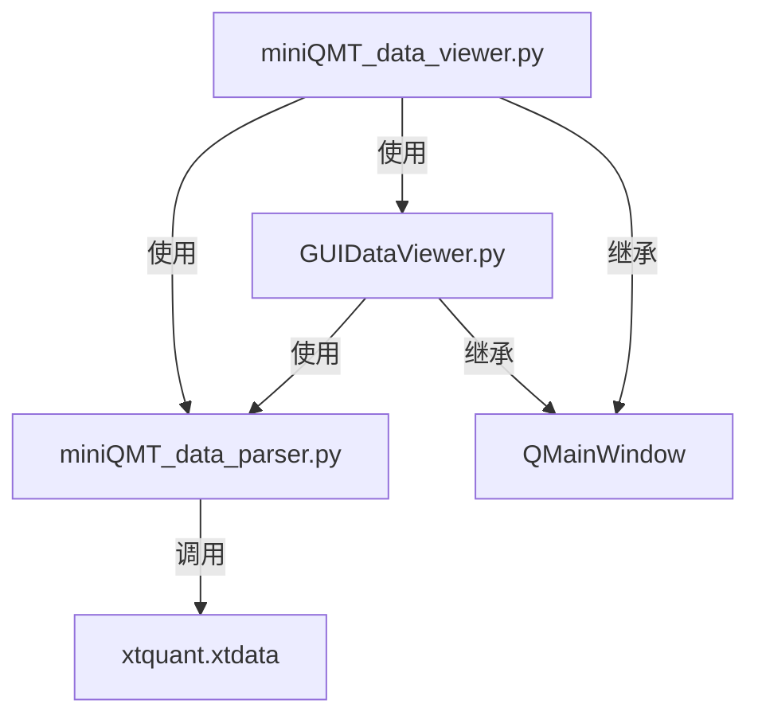
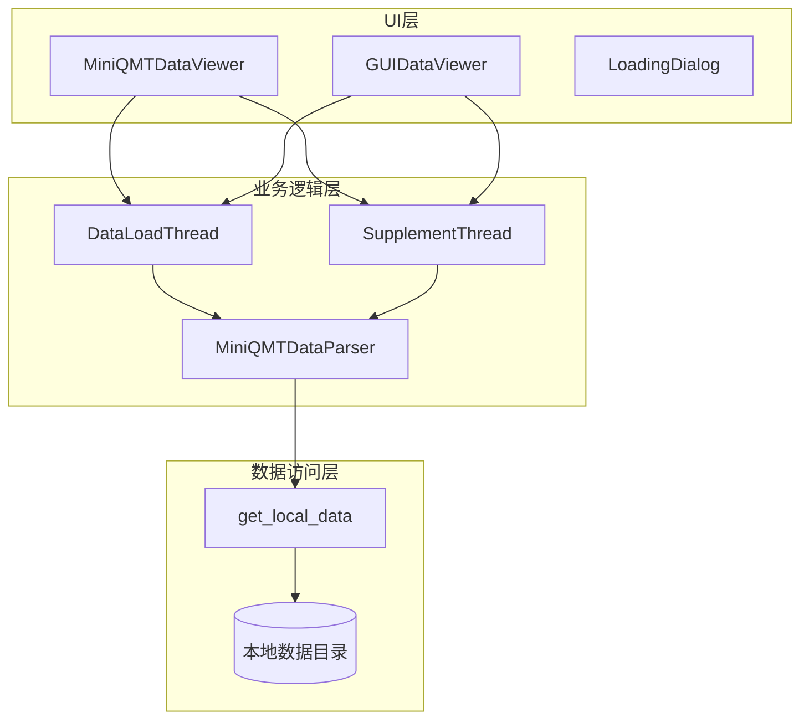
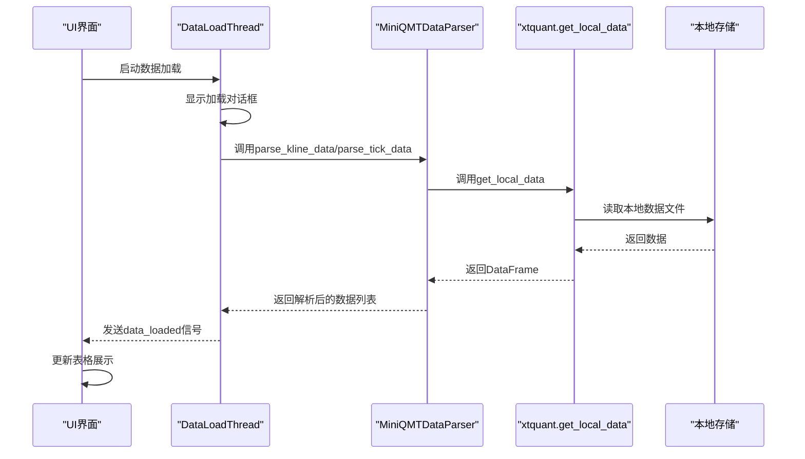
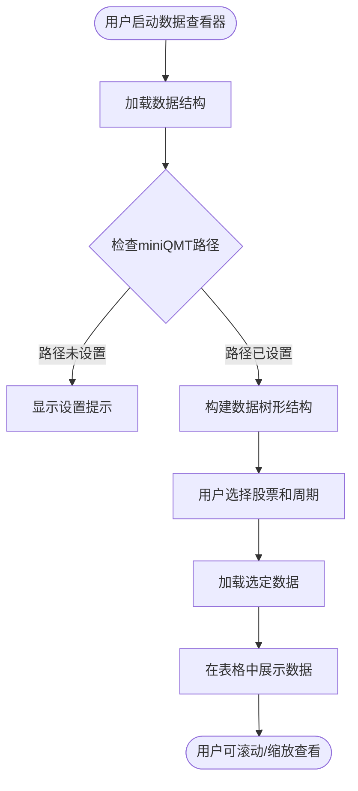
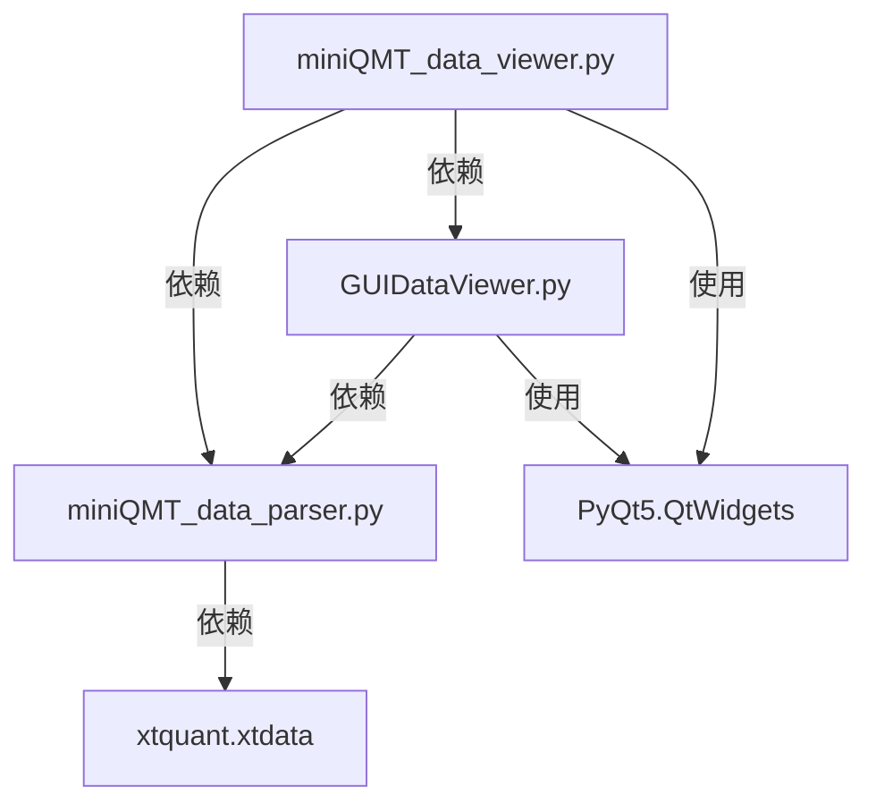

# 数据查看

<cite>
**本文档引用的文件**   
- [miniQMT_data_viewer.py](file://miniQMT_data_viewer.py)
- [GUIDataViewer.py](file://GUIDataViewer.py)
- [miniQMT_data_parser.py](file://miniQMT_data_parser.py)
</cite>

## 目录
1. [简介](#简介)
2. [项目结构](#项目结构)
3. [核心组件](#核心组件)
4. [架构概述](#架构概述)
5. [详细组件分析](#详细组件分析)
6. [依赖分析](#依赖分析)
7. [性能考虑](#性能考虑)
8. [故障排除指南](#故障排除指南)
9. [结论](#结论)

## 简介
本文档全面介绍 `miniQMT_data_viewer.py` 和 `GUIDataViewer.py` 联合实现的本地数据浏览功能。该功能允许用户通过图形界面查看特定股票的历史K线、成交量、指标值等信息，并支持时间序列的滚动与缩放操作。文档将详细说明查询条件设置（股票代码、时间范围、周期）、数据表格展示与导出能力，以及后端查询引擎如何高效检索本地存储的大规模数据集。同时，还将描述前端如何通过异步加载避免界面卡顿，并提供使用示例和性能调优建议。

## 项目结构
本项目是一个基于Python和PyQt5的量化交易数据分析工具，主要包含数据查看、策略回测和系统设置等功能模块。核心数据查看功能由 `miniQMT_data_viewer.py` 和 `GUIDataViewer.py` 两个文件联合实现，它们共享相同的UI组件和数据处理逻辑，但针对不同的数据源和使用场景进行了定制化开发。

**图表来源**
- [miniQMT_data_viewer.py](file://miniQMT_data_viewer.py)
- [GUIDataViewer.py](file://GUIDataViewer.py)
- [miniQMT_data_parser.py](file://miniQMT_data_parser.py)

**章节来源**
- [miniQMT_data_viewer.py](file://miniQMT_data_viewer.py)
- [GUIDataViewer.py](file://GUIDataViewer.py)

## 核心组件
`miniQMT_data_viewer.py` 和 `GUIDataViewer.py` 的核心组件包括数据加载线程（DataLoadThread）、数据补充线程（SupplementThread）、数据解析器（MiniQMTDataParser）以及主窗口（MiniQMTDataViewer/GUIDataViewer）。这些组件协同工作，实现了从本地文件系统加载、解析、展示和补充金融数据的完整流程。

**章节来源**
- [miniQMT_data_viewer.py](file://miniQMT_data_viewer.py#L1-L100)
- [GUIDataViewer.py](file://GUIDataViewer.py#L1-L100)

## 架构概述
系统采用分层架构，分为UI层、业务逻辑层和数据访问层。UI层负责用户交互和数据展示，业务逻辑层处理数据加载、解析和补充等核心功能，数据访问层则通过 `xtquant.xtdata.get_local_data` 接口与本地数据存储进行交互。整个系统通过多线程机制实现异步操作，确保界面响应性。

**图表来源**
- [miniQMT_data_viewer.py](file://miniQMT_data_viewer.py#L1-L50)
- [GUIDataViewer.py](file://GUIDataViewer.py#L1-L50)
- [miniQMT_data_parser.py](file://miniQMT_data_parser.py#L1-L50)

## 详细组件分析

### 数据加载与解析
系统通过 `DataLoadThread` 线程异步加载数据，避免阻塞UI。`MiniQMTDataParser` 负责解析K线和Tick数据，利用 `xtquant.xtdata.get_local_data` 接口高效检索本地存储的大规模数据集。

#### 数据加载流程

**图表来源**
- [miniQMT_data_viewer.py](file://miniQMT_data_viewer.py#L200-L250)
- [GUIDataViewer.py](file://GUIDataViewer.py#L400-L430)
- [miniQMT_data_parser.py](file://miniQMT_data_parser.py#L500-L600)

### 查询条件设置与数据展示
用户可以通过GUI界面设置股票代码、时间范围和周期等查询条件。系统支持1分钟、5分钟和日线等不同周期的K线数据，以及Tick数据的查看。数据以表格形式展示，支持排序和导出。

#### 查询与展示流程

**图表来源**
- [miniQMT_data_viewer.py](file://miniQMT_data_viewer.py#L800-L830)
- [GUIDataViewer.py](file://GUIDataViewer.py#L1440-L1470)

## 依赖分析
系统主要依赖于 `xtquant` 库来访问miniQMT的本地数据存储。`miniQMT_data_parser.py` 是核心的数据解析模块，被 `miniQMT_data_viewer.py` 和 `GUIDataViewer.py` 共同依赖。两个查看器模块共享大部分UI组件和业务逻辑，但根据具体需求进行了差异化实现。

**图表来源**
- [miniQMT_data_viewer.py](file://miniQMT_data_viewer.py)
- [GUIDataViewer.py](file://GUIDataViewer.py)
- [miniQMT_data_parser.py](file://miniQMT_data_parser.py)

**章节来源**
- [miniQMT_data_viewer.py](file://miniQMT_data_viewer.py#L1-L50)
- [GUIDataViewer.py](file://GUIDataViewer.py#L1-L50)
- [miniQMT_data_parser.py](file://miniQMT_data_parser.py#L1-L50)

## 性能考虑
为提高性能，系统在多个层面进行了优化。首先，通过多线程实现异步加载，确保UI流畅。其次，`MiniQMTDataParser` 在解析数据时会进行详细的日志记录和错误处理，保证数据加载的稳定性。此外，系统还实现了数据缓存机制，减少重复解析的开销。

**章节来源**
- [miniQMT_data_viewer.py](file://miniQMT_data_viewer.py#L220-L250)
- [GUIDataViewer.py](file://GUIDataViewer.py#L400-L430)
- [miniQMT_data_parser.py](file://miniQMT_data_parser.py#L1-L50)

## 故障排除指南
当用户遇到数据加载失败或界面卡顿等问题时，可参考以下步骤进行排查：
1. 确认miniQMT路径已正确设置。
2. 检查本地数据目录是否存在且可访问。
3. 查看日志文件以获取详细的错误信息。
4. 确保 `xtquant` 库已正确安装。

**章节来源**
- [miniQMT_data_viewer.py](file://miniQMT_data_viewer.py#L800-L830)
- [GUIDataViewer.py](file://GUIDataViewer.py#L1440-L1470)

## 结论
`miniQMT_data_viewer.py` 和 `GUIDataViewer.py` 联合实现了一个功能强大且用户友好的本地数据浏览工具。通过合理的架构设计和性能优化，系统能够高效地处理大规模金融数据，并提供流畅的用户体验。未来可进一步增强数据导出功能和图表可视化能力，以满足更复杂的分析需求。