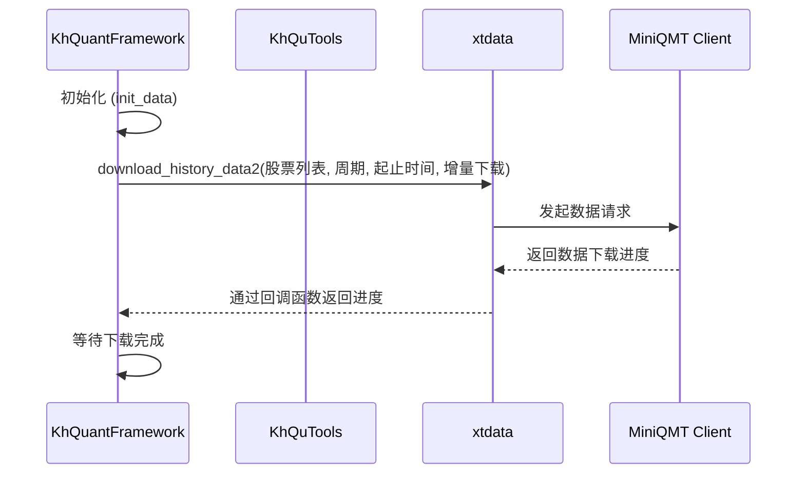
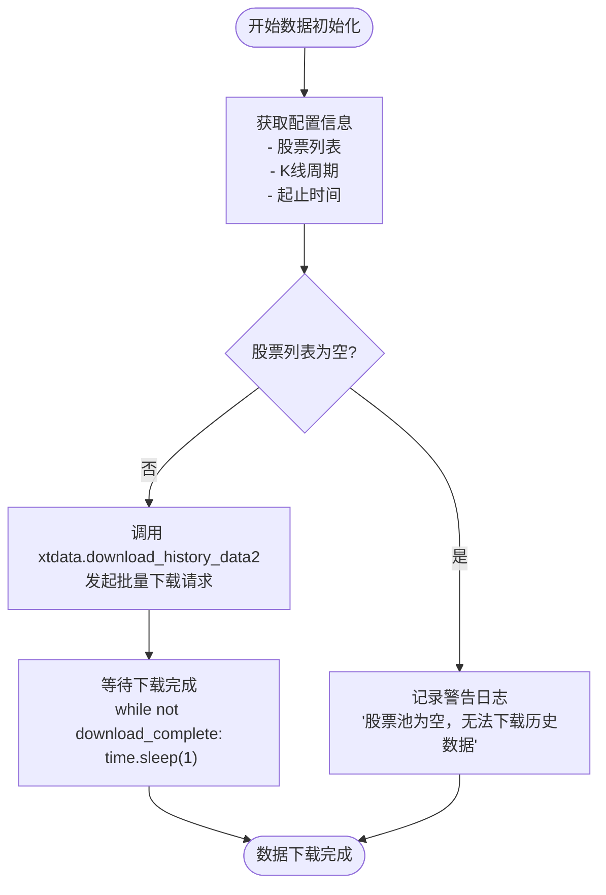

# 数据获取

<cite>
**本文档引用的文件**   
- [khFrame.py](file://khFrame.py)
- [khQTTools.py](file://khQTTools.py)
- [miniQMT_data_parser.py](file://miniQMT_data_parser.py)
- [khConfig.py](file://khConfig.py)
- [khTrade.py](file://khTrade.py)
</cite>

## 目录
1. [系统数据获取机制](#系统数据获取机制)
2. [khFrame.py中的数据下载流程](#khframepy中的数据下载流程)
3. [khQTTools.py中的高层数据接口](#khqttoolspy中的高层数据接口)
4. [异常处理策略](#异常处理策略)
5. [代码示例与性能优化](#代码示例与性能优化)

## 系统数据获取机制

本系统通过`xtquant`库与MiniQMT客户端进行交互，实现原始行情数据的获取。核心机制包括Tick数据和K线数据的请求与频率控制。

系统通过`xtdata.download_history_data2`函数批量下载历史数据，支持增量下载模式。数据请求的频率由`KhQuantFramework`类中的触发器（Trigger）机制控制。系统实现了多种触发器，包括`TickTrigger`（每个Tick触发）、`KLineTrigger`（K线形成时触发）和`CustomTimeTrigger`（自定义时间点触发），以满足不同策略的需求。

数据获取过程首先通过`KhConfig`类加载配置文件，获取股票列表、回测时间范围等参数。随后，`KhQuantFramework`的`init_data`方法调用`xtdata.download_history_data2`，根据配置的K线周期（`kline_period`）、起止时间（`backtest_start`, `backtest_end`）和股票列表，向MiniQMT客户端发起数据下载请求。

**Diagram sources**
- [khFrame.py](file://khFrame.py#L644-L808)
- [khConfig.py](file://khConfig.py#L0-L104)

**Section sources**
- [khFrame.py](file://khFrame.py#L644-L808)
- [khConfig.py](file://khConfig.py#L0-L104)

## khFrame.py中的数据下载流程

`khFrame.py`文件中的`KhQuantFramework`类负责管理整个数据下载流程。其核心方法`init_data`是数据下载的触发逻辑入口。

该流程的触发逻辑如下：当`KhQuantFramework`实例化并进入回测模式时，`init_data`方法被调用。此方法首先从`KhConfig`配置中获取股票列表（`stock_codes`）、K线周期（`kline_period`）和回测的起止时间（`backtest_start`, `backtest_end`）。如果股票列表为空，则记录警告并返回。随后，系统调用`xtdata.download_history_data2`函数，传入这些参数，并设置`incrementally=True`以启用增量下载，避免重复下载已存在的数据。

为了监控下载进度，系统定义了一个`download_progress`回调函数，该函数会实时更新下载状态。`init_data`方法会进入一个循环，持续检查`download_complete`标志，直到下载完成才退出，确保后续策略执行时所需的历史数据已准备就绪。

**Diagram sources**
- [khFrame.py](file://khFrame.py#L644-L808)

**Section sources**
- [khFrame.py](file://khFrame.py#L644-L808)

## khQTTools.py中的高层数据接口

`khQTTools.py`文件提供了高层数据获取接口，其中最核心的是`khHistory`函数，它封装了`xtquant`库的复杂调用，为策略开发者提供了简洁易用的API。

### `get_price` 和 `get_history_kline` 接口

虽然代码中未直接定义`get_price`和`get_history_kline`函数，但`khHistory`函数完全承担了这些功能。`khHistory`是获取历史K线数据的主要接口。

**参数配置：**
- `symbol_list`: 股票代码列表或单个代码字符串，格式