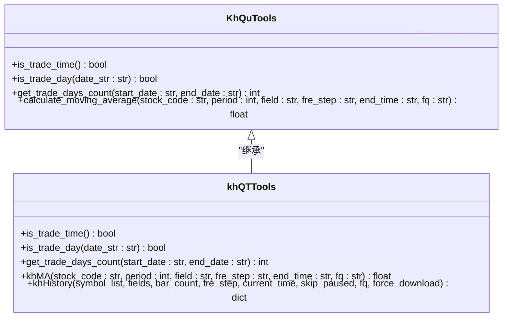

# 数据解析

<cite>
**本文档引用的文件**
- [miniQMT_data_parser.py](file://miniQMT_data_parser.py)
- [khQTTools.py](file://khQTTools.py)
</cite>

## 目录
1. [简介](#简介)
2. [核心数据解析流程](#核心数据解析流程)
3. [K线数据解析机制](#k线数据解析机制)
4. [Tick数据解析机制](#tick数据解析机制)
5. [时间戳对齐与格式化](#时间戳对齐与格式化)
6. [特殊事件识别与标记](#特殊事件识别与标记)
7. [复权因子处理](#复权因子处理)
8. [数据完整性验证](#数据完整性验证)
9. [常见解析错误与排查](#常见解析错误与排查)
10. [总结](#总结)

## 简介
本文档深入解析`miniQMT_data_parser.py`模块如何将从MiniQMT获取的原始数据转换为系统内部统一的pandas DataFrame格式。该解析器利用`xtquant.xtdata.get_local_data`接口处理本地数据，实现了对tick数据和K线数据的高效解析。文档详细说明了字段映射、时间戳对齐、复权因子处理等关键步骤，以及对不同周期K线数据的处理逻辑。同时，结合`khQTTools.py`中的辅助函数，展示了如何验证解析结果的完整性与一致性，并提供了常见解析错误的排查方法和修复建议。

## 核心数据解析流程
`MiniQMTDataParser`类是数据解析的核心组件，负责将原始二进制或结构化数据转换为标准的pandas DataFrame。解析流程始于从文件路径中提取股票代码和日期信息，然后构造完整的股票代码（如`000001.SZ`），并调用`get_local_data`接口获取原始数据。获取的数据根据其结构分为两种格式进行处理：一种是`{stock_code: DataFrame}`格式，另一种是`{field: DataFrame}`格式。解析器会根据数据的实际结构选择相应的处理方法，最终将数据转换为包含标准字段（如时间、开盘价、最高价、最低价、收盘价、成交量、成交额等）的列表，确保数据格式的统一性和一致性。

**Section sources**
- [miniQMT_data_parser.py](file://miniQMT_data_parser.py#L22-L1273)

## K线数据解析机制
K线数据的解析通过`parse_kline_data`方法实现，支持1分钟、5分钟和日线等多种周期类型。解析过程首先从文件路径中提取股票代码，然后构造完整的股票代码，并调用`get_local_data`接口获取指定周期的K线数据。获取的数据可能以两种不同的字典格式返回，解析器会根据数据结构选择相应的处理方法。

对于`{stock_code: DataFrame}`格式，解析器直接从字典中获取对应股票的DataFrame，然后遍历每一行数据，提取开、高、低、收、成交量、成交额等字段，并进行时间戳转换和格式化。对于`{field: DataFrame}`格式，解析器会遍历所有可用的字段（如open、high、low、close等），从每个字段的DataFrame中提取对应股票的数据，并按时间索引进行重组，最终生成统一格式的数据列表。

```mermaid
flowchart TD
Start([开始解析K线数据]) --> ExtractCode["从文件路径提取股票代码"]
ExtractCode --> ConstructCode["构造完整股票代码"]
ConstructCode --> GetData["调用get_local_data获取数据"]
GetData --> CheckFormat["检查数据格式"]
CheckFormat --> |格式1: {stock_code: DataFrame}| ProcessFormat1["处理格式1数据"]
CheckFormat --> |格式2: {field: DataFrame}| ProcessFormat2["处理格式2数据"]
ProcessFormat1 --> ExtractFields["提取开高低收等字段"]
ProcessFormat2 --> ExtractFields
ExtractFields --> FormatTime["格式化时间戳"]
FormatTime --> BuildRecord["构建标准数据记录"]
BuildRecord --> End([返回解析结果])
```

**Diagram sources**
- [miniQMT_data_parser.py](file://miniQMT_data_parser.py#L548-L879)

**Section sources**
- [miniQMT_data_parser.py](file://miniQMT_data_parser.py#L548-L879)

## Tick数据解析机制
Tick数据的解析通过`parse_tick_data`方法实现，主要处理逐笔交易数据。解析过程首先从文件路径中提取股票代码和日期信息，然后构造完整的股票代码，并设置时间范围（通常为当天），调用`get_local_data`接口获取tick数据。获取的数据以`{stock_code: DataFrame}`格式返回，解析器会遍历DataFrame的每一行，提取最新价、开盘价、最高价、最低价、前收盘价、成交总额、成交总量、证券状态、持仓量、前结算、委卖价、委买价、委卖量、委买量、成交笔数等字段。

特别地，对于买卖盘口数据（买一价至买五价、卖一价至卖五价等），解析器会检查`bidPrice`、`askPrice`、`bidVol`、`askVol`等列是否存在，并根据数据类型（列表或数组）提取相应的值，确保盘口数据的完整性和准确性。最终，所有字段被整合到一个标准的数据记录中，形成统一的输出格式。

**Section sources**
- [miniQMT_data_parser.py](file://miniQMT_data_parser.py#L29-L332)

## 时间戳对齐与格式化
时间戳的对齐与格式化是数据解析中的关键步骤，确保了时间数据的准确性和一致性。解析器在处理时间戳时，会根据数据的来源和格式进行多种转换。对于包含`time`列的数据，解析器会尝试将时间戳（通常为毫秒或秒级时间戳）转换为北京时间的`datetime`对象，并格式化为`YYYY-MM-DD HH:MM:SS`或`YYYY-MM-DD`格式。对于没有`time`列的数据，解析器会尝试从索引中解析时间。

在处理tick数据时，解析器会优先从`time`列获取时间值，如果不存在，则使用索引作为时间值。对于纯数字格式的时间戳，解析器会根据其长度和数值范围判断其格式（如14位日期时间格式、13位毫秒时间戳、10位秒时间戳等），并进行相应的转换。此外，解析器还会处理时区信息，确保时间戳转换为本地时间（Asia/Shanghai），避免因时区差异导致的时间错误。

**Section sources**
- [miniQMT_data_parser.py](file://miniQMT_data_parser.py#L100-L180)

## 特殊事件识别与标记
解析器通过`khQTTools.py`中的辅助函数来识别和标记特殊事件，如停牌、除权除息等。`is_trade_day`函数用于判断指定日期是否为交易日，它结合了工作日和法定节假日的判断，确保数据处理的准确性。`get_trade_days_count`函数用于计算指定日期范围内的交易日天数，这对于回测和数据分析至关重要。

在K线数据解析过程中，`suspendFlag`字段被用来标记停牌状态，解析器会将其作为`停牌标记`字段输出。对于除权除息事件，虽然解析器本身不直接处理，但可以通过`khHistory`函数获取复权后的数据，从而间接处理除权除息的影响。`khMA`函数在计算移动平均线时，会结合`is_trade_time`函数判断是否为交易时间，确保计算的准确性。



**Diagram sources**
- [khQTTools.py](file://khQTTools.py#L86-L276)

**Section sources**
- [khQTTools.py](file://khQTTools.py#L86-L276)

## 复权因子处理
复权因子的处理主要通过`khQTTools.py`中的`khHistory`函数实现。该函数在获取历史数据时，可以通过`fq`参数指定复权方式（'pre'前复权、'post'后复权、'none'不复权）。`khMA`函数在计算移动平均线时，也会传递复权方式参数，确保计算基于正确的价格数据。`khHistory`函数内部会根据复权方式调用`xtdata.get_market_data_ex`接口，获取复权后的数据，从而保证了数据分析的准确性。

**Section sources**
- [khQTTools.py](file://khQTTools.py#L2155-L2424)

## 数据完整性验证
数据完整性验证是确保解析结果准确性的关键环节。`miniQMT_data_parser.py`中的`get_real_record_count`方法通过文件大小估算记录数量，为数据完整性提供了初步验证。`khQTTools.py`中的`khHistory`函数在获取数据后，会检查数据是否为空，并根据`skip_paused`参数过滤停牌数据，确保数据的连续性和有效性。

此外，`khMA`函数在计算移动平均线前，会检查数据量是否足够，如果数据量不足，则抛出异常，防止基于不完整数据进行计算。这些验证机制共同确保了数据解析的完整性和一致性，为后续的分析和回测提供了可靠的数据基础。

**Section sources**
