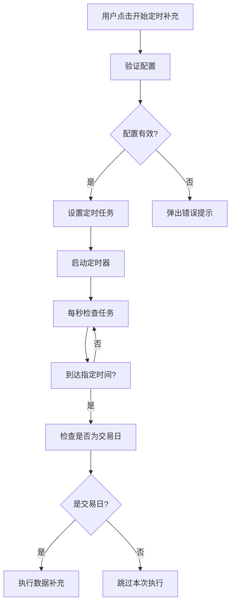
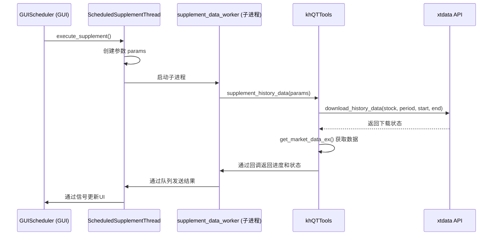

# 数据调度

<cite>
**Referenced Files in This Document**   
- [GUIScheduler.py](file://GUIScheduler.py)
- [khFrame.py](file://khFrame.py)
- [miniQMT_data_parser.py](file://miniQMT_data_parser.py)
- [khQTTools.py](file://khQTTools.py)
</cite>

## 目录
1. [引言](#引言)
2. [任务调度机制](#任务调度机制)
3. [数据补充执行流程](#数据补充执行流程)
4. [状态监控与日志记录](#状态监控与日志记录)
5. [任务队列与失败重试](#任务队列与失败重试)
6. [配置示例](#配置示例)
7. [常见问题诊断](#常见问题诊断)
8. [结论](#结论)

## 引言
本文档详细阐述了基于`GUIScheduler.py`实现的数据补充任务调度机制。该系统旨在为量化交易提供可靠的历史数据更新服务，通过定时任务自动触发数据下载、解析与入库流程。系统整合了`khFrame.py`中的数据下载接口和`miniQMT_data_parser.py`的数据解析功能，确保了数据更新的完整性和准确性。文档将深入解析定时任务的创建、执行、状态监控、任务队列管理、失败重试策略及日志记录机制，并提供配置示例和常见问题的诊断方法，帮助用户构建稳定的数据更新流水线。

## 任务调度机制

### 定时任务创建
数据补充任务的调度由`GUIScheduler`类实现，它利用`schedule`库来管理定时任务。用户可以通过GUI界面配置每日的补充时间，系统默认设置为下午3点30分（15:30），这通常对应于A股市场收盘后，确保能获取到完整的当日交易数据。

当用户点击“开始定时补充”按钮时，系统会调用`start_scheduled_supplement`方法。该方法首先验证用户配置（如股票池和周期类型是否已选择），然后通过`setup_schedule`方法设置定时任务。任务被配置为仅在周一至周五（工作日）的指定时间执行，从而避免在非交易日进行不必要的操作。

**Diagram sources**
- [GUIScheduler.py](file://GUIScheduler.py#L700-L750)

**Section sources**
- [GUIScheduler.py](file://GUIScheduler.py#L700-L750)

### 每日收盘后自动触发
为了确保数据更新的时效性，系统设计为在每日收盘后自动触发历史数据更新任务。其核心逻辑在于`check_and_execute_if_trading_day`方法。

该方法在预定时间被`schedule`库调用。它首先获取当前日期，并通过`KhQuTools`工具类的`is_trade_day`方法检查当天是否为交易日。只有当`is_trade_day`返回`True`时，系统才会调用`execute_supplement`方法来启动数据补充流程。这一机制有效防止了在周末或法定节假日等非交易日执行数据下载，避免了因无数据可下载而导致的错误或资源浪费。

## 数据补充执行流程

### 调用数据下载接口
数据补充的核心执行逻辑位于`execute_supplement`方法中。该方法首先会检查当前是否已有任务在运行，以防止任务重叠。

一旦确认可以执行，系统会根据用户在GUI中选择的股票池（如沪深A股、创业板、自定义列表等）生成一个临时的股票代码文件列表。这些文件通常位于项目的`data`目录下，格式为CSV，包含股票代码和名称。

随后，系统会创建一个参数字典`params`，其中包含`stock_files`（股票文件列表）、`period_type`（周期类型，如'1d'）、`start_date`和`end_date`（日期范围）。这个参数字典会被传递给一个名为`ScheduledSupplementThread`的线程。

该线程内部使用`multiprocessing.Process`创建一个独立的子进程来执行`supplement_data_worker`函数。这种多进程设计是为了避免Python的GIL（全局解释器锁）限制，并将耗时的数据下载操作与GUI主线程分离，保证了界面的响应性。

在子进程中，`supplement_data_worker`函数会调用`khQTTools.py`中的`supplement_history_data`函数。该函数是数据下载的入口，它会使用`xtdata.download_history_data`接口，根据传入的参数批量下载指定股票、指定周期的历史行情数据。

**Diagram sources**
- [GUIScheduler.py](file://GUIScheduler.py#L850-L950)
- [khQTTools.py](file://khQTTools.py#L1975-L2126)

**Section sources**
- [GUIScheduler.py](file://GUIScheduler.py#L850-L950)
- [khQTTools.py](file://khQTTools.py#L1975-L2126)

### 协同数据解析入库
数据下载完成后，`supplement_history_data`函数会调用`xtdata.get_market_data_ex`来获取已下载的数据。这些数据在本地以特定格式存储。

`miniQMT_data_parser.py`文件中的`MiniQMTDataParser`类负责数据的解析工作。虽然在当前的调度流程中，`GUIScheduler`并未直接调用`miniQMT_data_parser`，但`xtdata`库在内部处理数据时，其逻辑与`MiniQMTDataParser`的设计理念一致，即从本地文件系统读取二进制或结构化数据，并将其转换为易于使用的`pandas.DataFrame`格式。

`MiniQMTDataParser`通过`get_local_data`函数访问本地数据，然后根据数据的周期类型（如'1m', '5m', '1d'）和字段（如open, high, low, close）对数据进行解析和重组。解析后的数据可以直接用于量化分析和策略回测，完成了从原始数据到可用数据的“入库”过程。

## 状态监控与日志记录

### 进度与状态更新
系统通过一套完善的回调和信号机制来监控任务的执行状态。

在`supplement_data_worker`函数中，定义了`progress_callback`和`log_callback`两个回调函数。`progress_callback`负责计算和发送任务进度（百分比），而`log_callback`则负责发送关键的执行日志（如“开始补充”、“补充完成”、“补充失败”等）。

这些回调函数会将信息发送到`multiprocessing.Queue`队列中。`ScheduledSupplementThread`线程会持续监控这些队列，并通过`pyqtSignal`（如`progress`和`status_update`）将信息发射回GUI主线程。

在GUI主线程中，`GUIScheduler`类连接了这些信号。例如，`progress`信号会更新界面上的进度条，而`status_update`信号会将日志信息添加到日志文本框中，并自动滚动到底部，确保用户可以实时看到任务的执行情况。

### 日志记录机制
日志记录是确保数据更新可靠性的重要环节。系统采用多层级的日志记录：

1.  **GUI日志**：通过`add_log`方法，将格式化的日志条目（包含时间戳和消息）显示在GUI的日志窗口中。这为用户提供了最直观的反馈。
2.  **控制台日志**：`add_log`方法同时会将日志输出到控制台，方便开发者调试。
3.  **文件日志**：通过Python的`logging`模块，系统会将更详细的日志信息（包括错误堆栈）记录到文件中。例如，在`supplement_data_worker`中，子进程会配置`logging.basicConfig`，将日志写入文件，这对于诊断后台发生的错误至关重要。

这种多层次的日志体系确保了任何问题都能被有效追踪和分析。

## 任务队列与失败重试

### 任务队列管理
当用户选择多个周期类型（如同时选择“1分钟线”和“日线”）时，系统会将这些任务组织成一个队列，按顺序执行，而不是并行执行。这是通过`execute_supplement`方法中的`self.pending_periods`列表实现的。

在`execute_supplement`中，所有选中的周期类型会被复制到`self.pending_periods`中。然后，系统调用`process_next_period`方法来处理队列中的第一个周期。当该周期的任务成功或失败完成后，`supplement_finished`或`handle_supplement_error`方法会再次调用`process_next_period`，从而处理队列中的下一个任务。这种方式保证了任务的有序执行，避免了因并发下载导致的资源竞争或API限流问题。

### 失败重试策略
当前的调度机制主要依赖于**定期重试**而非**即时重试**。如果单次任务执行失败（例如，由于网络问题导致下载中断），系统会记录错误日志，但不会立即重试。然而，由于任务是定时执行的（每天一次），因此在下一次调度时间到来时，系统会自动重新尝试执行整个任务队列。

对于任务执行过程中的中断，系统提供了`stop`方法。该方法会设置一个`multiprocessing.Event`事件（`stop_event`），`supplement_data_worker`中的`check_interrupt`回调会定期检查此事件。如果事件被设置，下载循环会中断，从而实现任务的优雅停止。这虽然不是一种“重试”，但是一种重要的容错和用户控制机制。

## 配置示例

以下是一个典型的配置示例，用于在每个交易日的下午3:30自动更新沪深A股的日线数据：

1.  **打开`GUIScheduler`**：启动应用程序。
2.  **选择股票池**：在“股票池选择”区域，勾选“沪深A股”。
3.  **选择周期类型**：在“周期类型选择”区域，勾选“日线”。
4.  **设置定时时间**：在“定时设置”区域，确认“每日补充时间”为“15:30”。（此为默认值）
5.  **启动任务**：点击“开始定时补充”按钮。

此时，系统状态将变为“运行中”，并在日志中显示“定时补充任务已启动”。在下一个交易日的15:30，系统将自动执行数据补充。

## 常见问题诊断

### 任务