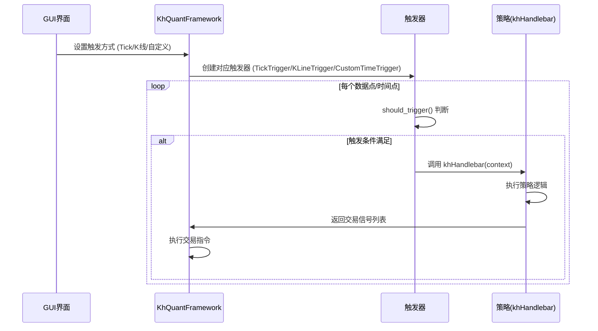

# 策略开发核心概念

<cite>
**本文档引用的文件**   
- [khFrame.py](file://khFrame.py)
- [khQuantImport.py](file://khQuantImport.py)
- [README.md](file://README.md)
</cite>

## 目录
1. [context对象结构与核心变量](#context对象结构与核心变量)
2. [事件驱动模型与执行流程](#事件驱动模型与执行流程)
3. [复权数据处理](#复权数据处理)
4. [执行上下文管理与变量生命周期](#执行上下文管理与变量生命周期)
5. [新手常见误区与性能优化](#新手常见误区与性能优化)

## context对象结构与核心变量

在量化策略开发中，`context` 对象是策略与框架之间进行数据交换的核心载体。它是一个字典（Dict）结构，在策略的每个回调函数（如 `khHandlebar`）被调用时，由框架自动填充并作为参数传递给策略。`context` 对象包含了策略在当前时间点执行所需的所有信息，其结构清晰，主要包含以下内置变量：

*   **`__current_time__`**: 该字典包含了策略当前执行点的精确时间信息，是实现择时逻辑的基础。
    *   `timestamp`: 一个整数形式的Unix时间戳。
    *   `datetime`: 格式为 "YYYY-MM-DD HH:MM:SS" 的日期时间字符串，最常用。
    *   `date`: 格式为 "YYYY-MM-DD" 的日期字符串。
    *   `time`: 格式为 "HH:MM:SS" 的时间字符串。

*   **`__account__`**: 该字典提供了账户资金的实时快照，是进行仓位管理和风险控制的依据。
    *   `cash`: 当前可用于交易的现金。
    *   `market_value`: 所有持仓按当前市价计算的总市值。
    *   `total_asset`: 总资产，即 `cash` + `market_value`。
    *   `frozen_cash`: 因挂单而冻结的资金。

*   **`__positions__`**: 该字典包含了当前的持仓信息，其结构为 `{股票代码: 持仓详情}`。通过它可以方便地检查特定持仓、获取持仓成本价和盈亏情况。
    *   `volume`: 持仓数量。
    *   `avg_price`: 持仓成本价。
    *   `current_price`: 当前市价。
    *   `profit_ratio`: 持仓盈亏率。

*   **`__framework__`**: 该对象是框架核心类（`KhQuantFramework`）的实例，持有本次运行的所有配置信息和功能接口。当其他上下文参数不包含所需信息时，可以通过此对象进行访问。

*   **`[股票代码]`**: 以股票代码（如`'000001.SZ'`）为键，值为一个Pandas Series对象，包含了该股票在当前时间点的所有行情字段（如`open`, `high`, `low`, `close`, `volume`等）。

**Section sources**
- [README.md](file://README.md#L1653-L1713)

## 事件驱动模型与执行流程

量化策略的执行是基于事件驱动模型的。框架根据用户在GUI界面上设置的“触发方式”，在特定的时机调用策略的回调函数。主要的触发方式有三种，它们对策略逻辑的影响显著不同：

*   **Tick触发**: 这种方式下，每个Tick数据到达时都会触发策略的 `khHandlebar` 函数。它提供了最高的灵活性，但数据量巨大，对策略的计算效率要求较高。适用于需要对市场微观结构进行精细分析的策略。

*   **K线触发**: 这种方式在每个K线周期（如1分钟、5分钟）形成时触发策略。它通过 `KLineTrigger` 类实现，其 `should_trigger` 方法会根据当前时间判断是否到了新的K线开始时刻。这种方式数据量小，回测速度快，特别适合中长期趋势跟踪和技术分析策略。其运行机制确保了策略逻辑在K线结束后才执行，避免了未来函数的泄露。

*   **自定义定时触发**: 这种方式允许用户指定精确的时间点（如"09:30:00", "15:00:00"）来触发策略。它为定时交易策略（如开盘集合竞价、收盘前交易）提供了精确的控制能力。需要注意的是，自定义触发仅负责“触发”策略运行，**不会自动向 `khHandlebar` 函数传入当时的数据**，策略需要在函数内部自行调用 `khHistory` 等接口来获取所需的历史数据。

**Diagram sources**
- [khFrame.py](file://khFrame.py#L50-L101)
- [README.md](file://README.md#L897-L924)

## 复权数据处理

复权是处理股票因分红、送股、配股等除权除息（XD）事件导致股价出现“跳空”缺口的关键步骤。它通过调整历史股价，使价格走势保持连续性，从而确保技术指标和策略逻辑的准确性。在策略中正确使用复权数据至关重要，否则会导致未来函数泄露，即策略在回测中使用了未来才能知道的复权信息。

*   **前复权**: 以当前价格为基准，调整历史价格。这种方式能更准确地反映股票的长期涨跌幅和收益情况，是策略回测中最常用的复权方式。
*   **后复权**: 以历史价格为基准，调整当前价格。这种方式能反映股票的真实价值增长。
*   **不复权**: 不进行任何调整，K线图能真实反映股价历史的除权信息。

在 `khQuant` 框架中，推荐在策略内部使用 `khQTTools` 模块提供的 `khHistory` 函数来获取复权数据。该函数允许在调用时指定 `fq` 参数（如 `'pre'` 代表前复权），从而确保获取的数据是基于历史信息正确复权的，避免了未来函数问题。

**Section sources**
- [README.md](file://README.md#L1013-L1054)

## 执行上下文管理与变量生命周期

`khFrame.py` 文件中的 `KhQuantFramework` 类是整个框架的核心，负责管理策略的执行上下文。它通过 `on_quote_callback` 方法接收行情数据，并根据触发器的判断来决定是否调用策略。

`khQuantImport.py` 文件则提供了一个统一的导入模块，通过 `from khQuantImport import *` 一行代码即可导入策略开发所需的所有常用模块和工具。它不仅封装了 `khQTTools` 和 `MyTT` 等库，还提供了 `StrategyContext` 类和 `khGet`, `khPrice`, `khBuy`, `khSell` 等便捷函数，极大地简化了策略代码的编写。

变量的生命周期与作用域紧密相关。在策略文件中，全局变量（如在 `init` 函数中定义的 `g` 字典）的生命周期贯穿整个回测过程，可用于在不同时间点的 `khHandlebar` 调用之间传递和缓存数据。而 `context` 对象中的数据是瞬时的，每次 `khHandlebar` 调用时都会被框架更新为当前时间点的最新状态。`khQuantImport` 中的便捷函数（如 `khBuy`）利用了 `context` 对象，将复杂的信号生成逻辑封装起来，使策略代码更加简洁和可读。

**Section sources**
- [khFrame.py](file://khFrame.py#L0-L54)
- [khQuantImport.py](file://khQuantImport.py#L0-L47)

## 新手常见误区与性能优化

新手在开发策略时，常见的误区包括直接修改 `context` 对象内部的结构（如 `__positions__` 或 `__account__`），这可能会破坏框架的内部状态管理，导致不可预知的错误。正确的做法是通过返回标准的交易信号列表来让框架处理交易，而不是直接篡改数据。

性能优化是策略开发中的重要环节。以下是一些关键建议：
*   **减少高频计算**: 对于计算量大的指标（如均线、RSI），应避免在每个 `khHandlebar` 调用中都重新计算。可以利用全局变量在 `init` 函数或 `khPreMarket` 函数中预计算并缓存结果，在 `khHandlebar` 中直接使用。
*   **合理使用缓存**: `KhQuantFramework` 类内部使用了 `daily_price_cache` 等缓存机制来存储日线数据，避免重复加载。开发者也可以在策略中实现自己的缓存逻辑。
*   **优化数据字段**: 在GUI配置中，仅勾选策略实际需要的数据字段，可以减少内存占用和数据读取时间。
*   **避免不必要的日志输出**: 过多的 `print` 或 `logging` 语句会严重拖慢回测速度，尤其是在Tick触发模式下。

**Section sources**
- [README.md](file://README.md#L2147-L2183)
- [khFrame.py](file://khFrame.py#L478-L506)