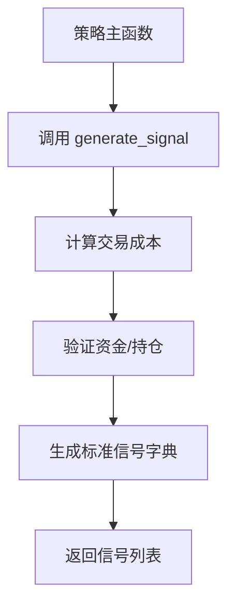

# 策略示例解析

<cite>
**本文档引用的文件**   
- [RSI策略.py](file://strategies/RSI策略.py)
- [双均线多股票_使用MA函数.py](file://strategies/双均线多股票_使用MA函数.py)
- [双均线多股票_使用khMA函数.py](file://strategies/双均线多股票_使用khMA函数.py)
- [双均线精简_使用khMA函数.py](file://strategies/双均线精简_使用khMA函数.py)
- [MyTT.py](file://MyTT.py)
- [khQTTools.py](file://khQTTools.py)
- [khQuantImport.py](file://khQuantImport.py)
</cite>

## 目录
1. [引言](#引言)
2. [RSI策略分析](#rsi策略分析)
3. [双均线策略系列分析](#双均线策略系列分析)
4. [核心组件与最佳实践](#核心组件与最佳实践)
5. [总结](#总结)

## 引言
本文档旨在深入分析看海量化交易系统（KHQuant）中提供的四个策略示例文件。通过对这些示例的逐个解析，揭示其背后的设计思路与实现细节，为用户自定义策略提供可复用的模板和最佳实践指导。分析将涵盖RSI策略的超买超卖信号生成逻辑，以及双均线策略中不同均线函数在多股票并行计算中的性能差异，并特别指出“双均线精简版”如何通过简化逻辑提升执行效率。

## RSI策略分析
本节分析`strategies/RSI策略.py`文件，该策略利用相对强弱指标（RSI）来生成买卖信号。

### 设计思路与实现细节
该策略的核心设计思路是基于RSI指标的超买超卖条件进行交易。RSI（Relative Strength Index）是一种衡量市场动量的震荡指标，其值在0到100之间波动。通常认为，RSI低于30表示市场处于超卖状态，是潜在的买入机会；RSI高于70表示市场处于超买状态，是潜在的卖出机会。

在实现上，策略通过`khHandlebar`主函数执行。首先，函数遍历股票池中的每只股票，使用`khHistory`函数拉取过去60个交易日的收盘价数据。随后，调用`MyTT`库中的`RSI`函数，以14日为周期计算RSI值。策略通过比较前一日与当日的RSI值来判断其交叉情况。

**Section sources**
- [RSI策略.py](file://strategies/RSI策略.py#L1-L25)

### 信号生成与下单逻辑
信号生成逻辑遵循以下规则：
1.  **买入信号**：当RSI从前一日的30以下上穿至当日的30以上，且当前无持仓时，生成买入信号。
2.  **卖出信号**：当RSI从前一日的70以上下穿至当日的70以下，且当前有持仓时，生成卖出信号。

一旦满足条件，策略会调用`generate_signal`函数来创建具体的交易指令。该函数会指定交易的股票代码、价格（使用当日开盘价）、仓位（买入时为0.5仓，卖出时为全仓）以及交易原因。整个流程清晰地展示了从数据获取、指标计算到信号生成的完整链条。

**Section sources**
- [RSI策略.py](file://strategies/RSI策略.py#L15-L25)
- [MyTT.py](file://MyTT.py#L585-L590)

## 双均线策略系列分析
本节分析`strategies`目录下的三个双均线策略文件，对比它们在实现逻辑和性能上的差异。

### 标准双均线策略（使用MA函数）
`双均线多股票_使用MA函数.py`文件展示了最基础的双均线策略实现。其核心逻辑是计算短期（5日）和长期（20日）的简单移动平均线（MA），并根据它们的交叉关系进行交易。

在实现上，该策略需要显式地分两步操作：首先使用`khHistory`函数获取历史收盘价数据，然后将这些数据传递给`MyTT`库的`MA`函数进行计算。这种分离的模式虽然直观，但在处理多只股票时，需要为每只股票重复执行数据拉取和计算两个步骤，这在性能上存在优化空间。

**Section sources**
- [双均线多股票_使用MA函数.py](file://strategies/双均线多股票_使用MA函数.py#L1-L35)

### 增强双均线策略（使用khMA函数）
`双均线多股票_使用khMA函数.py`文件引入了`khMA`函数，这是对标准`MA`函数的增强。`khMA`函数的显著优势在于它将行情获取和移动平均计算封装在了一个内部函数中。

通过`khMA(stock_code, 5, end_time=current_date_str)`这样的调用，策略可以一步到位地获得指定股票在指定日期的5日均线值。这种封装极大地简化了代码，减少了冗余的数据拉取操作。对于多股票并行计算的场景，`khMA`函数通过内部优化，能够更高效地管理数据请求，从而在性能上优于需要显式调用`khHistory`再计算`MA`的版本。

**Section sources**
- [双均线多股票_使用khMA函数.py](file://strategies/双均线多股票_使用khMA函数.py#L1-L32)
- [khQTTools.py](file://khQTTools.py#L1000-L1050)

### 双均线精简版
`双均线精简_使用khMA函数.py`文件展示了如何通过简化逻辑来提升执行效率。与前两个策略处理多只股票不同，该策略专注于单只股票的交易。

其精简之处体现在：
1.  **股票池简化**：不再遍历一个股票列表，而是直接通过`khGet(data, "first_stock")`获取股票池中的第一只股票进行操作。
2.  **信号列表优化**：在生成信号时，直接将`generate_signal`函数的返回值赋给`signals`变量，而不是使用`extend`方法。由于该策略在每个周期内最多只生成一个买入或卖出信号，这种直接赋值的方式比操作列表更高效。

这种“精简版”策略通过减少循环和列表操作，显著降低了计算开销，特别适合于对执行速度要求较高的场景。

**Section sources**
- [双均线精简_使用khMA函数.py](file://strategies/双均线精简_使用khMA函数.py#L1-L30)

## 核心组件与最佳实践
本节总结各策略示例中体现的最佳实践模式，这些模式可作为用户自定义策略的模板。

### 模块化信号函数
所有策略都依赖于`generate_signal`函数来生成标准化的交易信号。该函数被定义在`khQTTools.py`中，并通过`khQuantImport.py`被统一导入。这种模块化的设计将信号生成的复杂逻辑（如计算最大可买入数量、处理交易成本等）与策略核心逻辑分离，使得策略代码更加简洁和易于维护。

**Diagram sources**
- [khQTTools.py](file://khQTTools.py#L500-L700)
- [khQuantImport.py](file://khQuantImport.py#L400-L500)

### 异常处理与日志记录
策略代码中体现了良好的异常处理机制。例如，在`khMA`函数中，会检查数据量是否充足，若不足则抛出`ValueError`。在`generate_signal`函数中，会对价格、股数等关键参数进行有效性检查，并在出现问题时记录日志。同时，通过`logging`模块进行详细的日志记录，有助于在策略运行出错时快速定位问题。

**Section sources**
- [khQTTools.py](file://khQTTools.py#L1020-L1030)
- [khQTTools.py](file://khQTTools.py#L550-L600)

### 策略初始化与主函数
所有策略都遵循相同的函数结构：一个`init`函数用于初始化（在这些示例中为空），以及一个`khHandlebar`函数作为主策略函数。`khHandlebar`函数接收一个包含市场数据、账户信息和时间信息的`data`字典，并返回一个交易信号列表。这种标准化的接口设计保证了策略的可移植性，使其可以在回测、模拟和实盘环境中无缝切换。

**Section sources**
- [RSI策略.py](file://strategies/RSI策略.py#L10-L12)
- [双均线多股票_使用MA函数.py](file://strategies/双均线多股票_使用MA函数.py#L10-L12)

## 总结
通过对四个策略示例的分析，我们可以总结出以下几点：
1.  **RSI策略**有效地利用了超买超卖原理，通过比较RSI值的交叉来生成交易信号。
2.  **双均线策略**展示了从基础实现到性能优化的演进。`khMA`函数通过封装行情获取和计算，显著提升了多股票并行计算的效率。
3.  **双均线精简版**通过简化股票池处理和信号生成逻辑，进一步优化了执行效率，体现了“少即是多”的设计哲学。
4.  **最佳实践**包括使用模块化的信号函数、完善的异常处理与日志记录，以及遵循标准化的策略接口。这些模式共同构成了一个健壮、高效且易于维护的量化策略开发框架，为用户提供了强大的可复用模板。