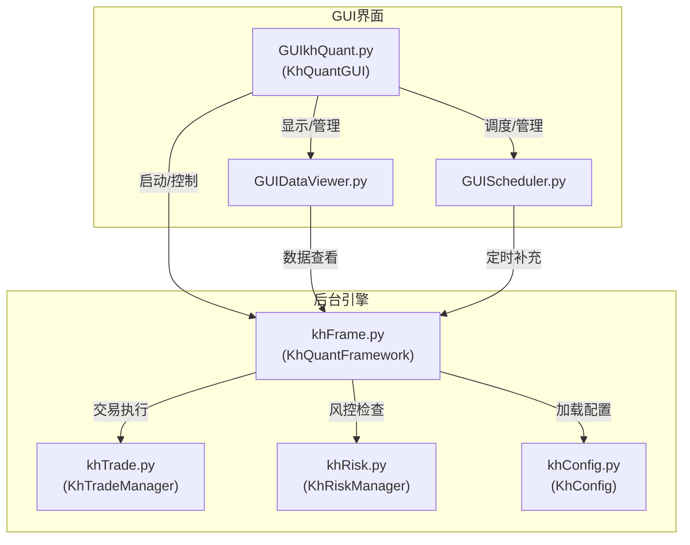

# GUI集成与主控制器 (GUIkhQuant)

<cite>
**Referenced Files in This Document**   
- [GUIkhQuant.py](file://GUIkhQuant.py)
- [khFrame.py](file://khFrame.py)
- [khConfig.py](file://khConfig.py)
- [khTrade.py](file://khTrade.py)
- [khRisk.py](file://khRisk.py)
- [khQTTools.py](file://khQTTools.py)
- [GUI.py](file://GUI.py)
- [GUIDataViewer.py](file://GUIDataViewer.py)
- [GUIScheduler.py](file://GUIScheduler.py)
- [backtest_result_window.py](file://backtest_result_window.py)
</cite>

## 目录
1. [引言](#引言)
2. [项目结构](#项目结构)
3. [核心组件](#核心组件)
4. [架构概述](#架构概述)
5. [详细组件分析](#详细组件分析)
6. [依赖分析](#依赖分析)
7. [性能考虑](#性能考虑)
8. [故障排除指南](#故障排除指南)
9. [结论](#结论)
10. [附录](#附录) (如有必要)

## 引言
GUIkhQuant.py是看海量化回测系统的核心主控制器，它作为整个应用的中枢，负责协调PyQt5 GUI界面与后台量化引擎之间的交互。该模块不仅承担着应用程序的初始化和生命周期管理，还实现了用户操作与后台计算任务的无缝集成。通过精心设计的信号与槽机制，GUIkhQuant.py确保了用户界面的响应性，同时在后台线程中安全地执行耗时的回测计算。本文档将深入分析其作为主控制器的角色，详细阐述其如何组织和协调各个GUI模块，管理用户会话状态，并确保系统在异常处理、日志记录和线程安全方面的健壮性。

## 项目结构
GUIkhQuant.py作为主控制器，其设计与整个项目的模块化结构紧密相关。项目采用清晰的分层架构，将GUI界面、后台引擎和数据管理功能分离。`GUI.py`、`GUIDataViewer.py`和`GUIScheduler.py`等模块负责各自独立的GUI功能，而`khFrame.py`、`khTrade.py`和`khRisk.py`则构成了后台量化引擎的核心。主控制器GUIkhQuant.py通过导入这些模块，将它们整合成一个统一的应用程序。这种结构使得系统易于维护和扩展，每个模块可以独立开发和测试，而主控制器则负责它们之间的通信和协调。

**Diagram sources**
- [GUIkhQuant.py](file://GUIkhQuant.py#L1-L5000)
- [GUI.py](file://GUI.py#L1-L3887)
- [khFrame.py](file://khFrame.py#L1-L2679)

**Section sources**
- [GUIkhQuant.py](file://GUIkhQuant.py#L1-L5000)
- [GUI.py](file://GUI.py#L1-L3887)
- [khFrame.py](file://khFrame.py#L1-L2679)

## 核心组件
GUIkhQuant.py的核心是`KhQuantGUI`类，它继承自`QMainWindow`，是整个应用程序的主窗口。该类在初始化时，会创建并配置所有必要的UI组件，如按钮、标签、表格和菜单。它通过`init_ui`方法构建用户界面，并通过`init_config`方法加载系统配置。`KhQuantGUI`类还负责管理一个`StrategyThread`实例，该实例在独立线程中运行回测任务，从而避免阻塞GUI线程。此外，它还集成了`GUILogHandler`，这是一个自定义的日志处理器，能够将后台引擎的日志信息实时显示在GUI的运行日志表格中，为用户提供即时的反馈。

**Section sources**
- [GUIkhQuant.py](file://GUIkhQuant.py#L1-L5000)

## 架构概述
GUIkhQuant.py的架构设计体现了MVC（Model-View-Controller）模式的思想。`KhQuantGUI`类扮演控制器（Controller）的角色，负责处理用户输入和更新视图。PyQt5的各类小部件（Widgets）构成了视图（View），而`khFrame`模块则代表了模型（Model），它包含了量化交易的核心逻辑和数据。主控制器通过信号（Signal）和槽（Slot）机制与视图和模型进行通信。当用户点击“开始回测”按钮时，GUI发出一个信号，该信号被`KhQuantGUI`中的槽函数捕获，进而启动后台的`StrategyThread`。这种松耦合的设计保证了系统的灵活性和可维护性。

**Diagram sources**
- [GUIkhQuant.py](file://GUIkhQuant.py#L1-L5000)
- [khFrame.py](file://khFrame.py#L1-L2679)
- [GUIDataViewer.py](file://GUIDataViewer.py#L1-L4260)
- [GUIScheduler.py](file://GUIScheduler.py#L1-L1855)

## 详细组件分析

### 主控制器与后台引擎的集成
GUIkhQuant.py通过`StrategyThread`类实现与后台引擎的无缝集成。`