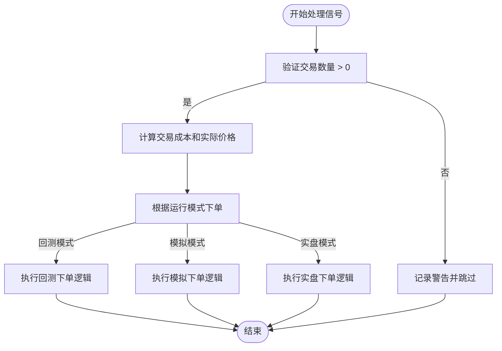
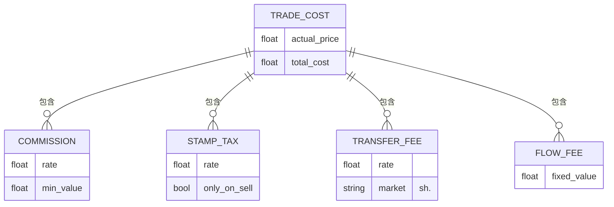
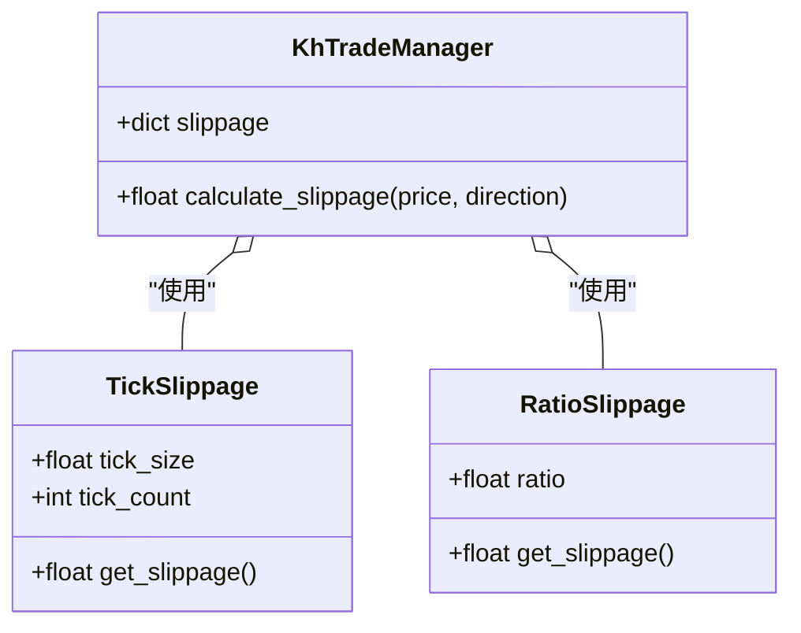
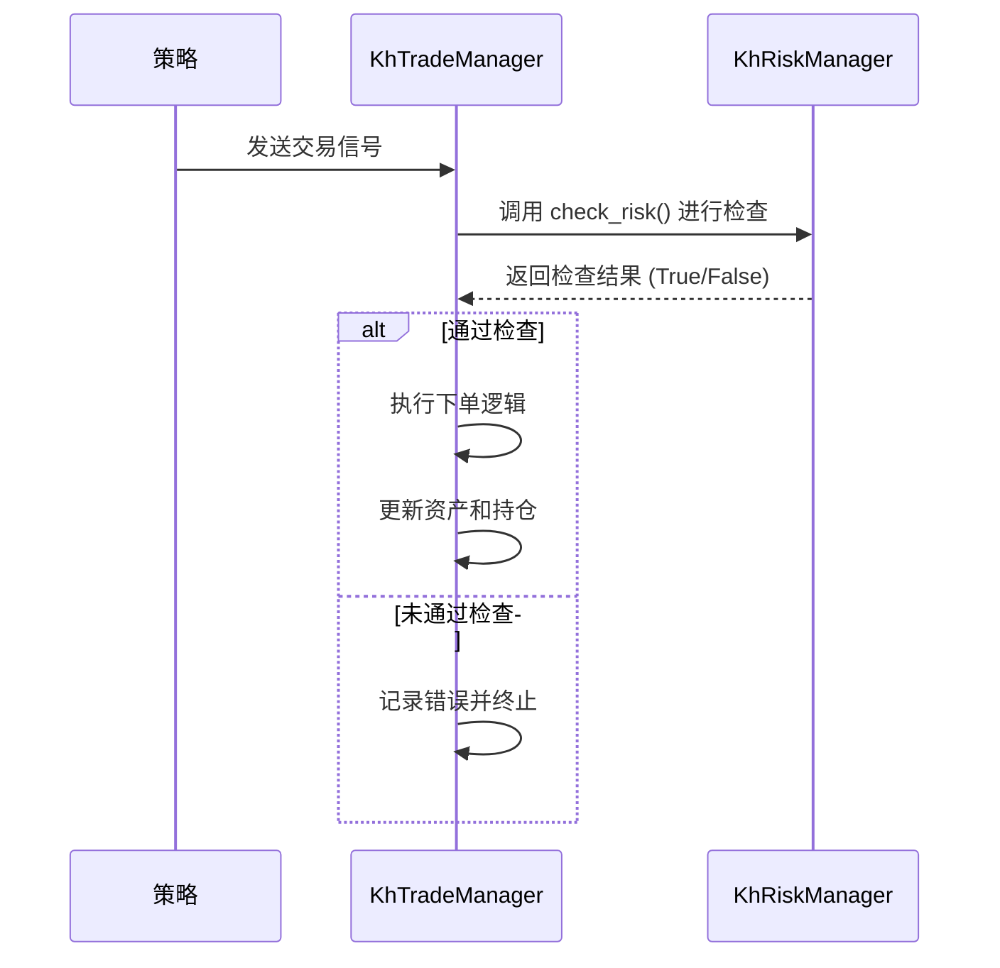

# 交易执行模块 (khTrade)

<cite>
**本文档引用文件**  
- [khTrade.py](file://khTrade.py)
- [khRisk.py](file://khRisk.py)
- [khConfig.py](file://khConfig.py)
</cite>

## 目录
1. [简介](#简介)
2. [交易信号处理流程](#交易信号处理流程)
3. [交易成本计算](#交易成本计算)
4. [滑点模型与撮合规则](#滑点模型与撮合规则)
5. [账户与持仓管理](#账户与持仓管理)
6. [回测场景下的特殊规则处理](#回测场景下的特殊规则处理)
7. [与风控模块的交互](#与风控模块的交互)
8. [高频交易性能考量与优化建议](#高频交易性能考量与优化建议)

## 简介
`khTrade.py` 是 OSkhQuant 量化框架中的核心交易执行模块，其主要职责是接收来自策略的买卖信号，并根据预设的交易规则和成本模型，模拟实际的交易执行过程。该模块通过 `KhTradeManager` 类实现，负责订单生成、成交模拟、交易成本计算以及资产和持仓的实时更新。它支持实盘、模拟和回测三种运行模式，并通过回调机制与框架的其他部分（如GUI、风控）进行通信，确保交易逻辑的完整性和可追溯性。

**Section sources**
- [khTrade.py](file://khTrade.py#L8-L559)

## 交易信号处理流程
交易信号是策略与交易执行模块之间的唯一通信方式。`KhTradeManager` 通过 `process_signals` 方法接收一个交易信号列表，并对每个信号进行处理。处理流程如下：首先，检查交易数量是否有效（大于0），无效则忽略并记录警告；其次，调用 `calculate_trade_cost` 计算考虑滑点后的实际成交价格和总交易成本，并将这些信息附加到信号中；最后，根据当前的运行模式（`run_mode`）调用相应的下单方法（`_place_order_live`, `_place_order_simulate`, 或 `_place_order_backtest`）。在回测模式下，系统假设所有订单都能立即全部成交，从而简化了撮合逻辑。

**Diagram sources**
- [khTrade.py](file://khTrade.py#L130-L157)
- [khTrade.py](file://khTrade.py#L159-L171)

## 交易成本计算
`KhTradeManager` 模块精确地模拟了A股市场中的各项交易成本，确保回测结果的准确性。总交易成本由佣金、印花税、过户费和流量费四部分构成。

- **佣金 (Commission)**：根据 `commission_rate`（佣金比例）和成交金额计算，但设有 `min_commission`（最低佣金）限制，即单笔交易佣金不足最低标准时，按最低标准收取。
- **印花税 (Stamp Tax)**：仅在卖出时收取，税率为 `stamp_tax_rate`，买入时不收取。
- **过户费 (Transfer Fee)**：仅对沪市股票（代码以 "sh." 开头）收取，费率为成交金额的万分之一。
- **流量费 (Flow Fee)**：每笔交易固定收取的费用，由 `flow_fee` 参数设定。

所有成本的计算均基于考虑了滑点后的实际成交价格。`calculate_trade_cost` 方法是成本计算的核心，它整合了上述所有费用，并返回实际成交价格和总成本。

**Diagram sources**
- [khTrade.py](file://khTrade.py#L30-L57)
- [khTrade.py](file://khTrade.py#L60-L127)
- [khTrade.py](file://khTrade.py#L129-L157)

## 滑点模型与撮合规则
为了更真实地模拟市场环境，`KhTradeManager` 实现了两种滑点模型：**Tick模式** 和 **Ratio模式**。

- **Tick模式**：基于最小变动价位（`tick_size`，A股为0.01元）进行计算。通过 `tick_count` 参数指定跳数，例如 `tick_count=2` 表示买入时价格上浮0.02元，卖出时下浮0.02元。
- **Ratio模式**：基于成交金额的比例进行计算。系统采用**双边滑点**模型，用户设定的 `ratio` 值被视为买卖双边的总滑点。在计算时，系统会将此比例除以2后应用。例如，设定 `ratio=0.001`（0.1%），则买入时价格上浮0.05%，卖出时下浮0.05%。

`calculate_slippage` 方法负责根据当前的滑点类型和交易方向，计算出最终的实际成交价格。无论哪种模式，结果都会四舍五入到小数点后两位，以符合A股的报价规则。

**Diagram sources**
- [khTrade.py](file://khTrade.py#L30-L57)
- [khTrade.py](file://khTrade.py#L59-L89)

## 账户与持仓管理
`KhTradeManager` 通过几个核心字典来管理交易状态：
- `__assets__` (`self.assets`): 管理账户资产，核心字段是 `"cash"`（可用现金）。在回测中，买入时现金减少额为 `实际成交金额 + 总交易成本`，卖出时现金增加额为 `实际成交金额 - 总交易成本`。
- `__positions__` (`self.positions`): 管理持仓信息，以股票代码为键。每个持仓对象包含 `volume`（总持仓量）、`can_use_volume`（可用持仓量）、`avg_price`（持仓均价）、`market_value`（市值）等关键字段。

**变更机制**：
- **买入**：若为新建仓位，则创建新的持仓记录，`volume` 和 `can_use_volume` 均为买入数量。若为加仓，则更新 `volume` 和 `can_use_volume`，并根据加权平均法重新计算 `avg_price`。
- **卖出**：减少 `volume` 和 `can_use_volume`。当 `volume` 减至0时，从 `positions` 字典中删除该股票的记录。
- **T+1规则**：在A股市场，买入的股票当天不可卖出。该模块通过 `can_use_volume` 字段来实现此规则，新买入的股份 `can_use_volume` 为0，T+1日后才可使用。

**Section sources**
- [khTrade.py](file://khTrade.py#L15-L17)
- [khTrade.py](file://khTrade.py#L355-L458)

## 回测场景下的特殊规则处理
本模块在回测场景下对不同交易品种的特殊规则进行了处理：
- **股票与ETF**：对于沪市股票（`sh.`），在计算交易成本时会加入过户费。对于深市股票（`sz.`）和ETF，不收取过户费。
- **交易单位**：虽然代码中未直接体现，但根据 `README.md` 中的交易信号说明，交易数量 `volume` 必须是100的整数倍，这符合A股的交易单位要求。
- **T+1交易制度**：如上所述，通过 `can_use_volume` 字段严格模拟了买入股份当日不可卖出的规则，确保回测逻辑与实盘一致。

**Section sources**
- [khTrade.py](file://khTrade.py#L104-L112)
- [README.md](file://README.md#L1889-L1903)

## 与风控模块的交互
`KhTradeManager` 与 `khRisk.py` 中的 `KhRiskManager` 类协同工作，确保交易指令在风控规则允许的范围内执行。虽然 `khTrade.py` 的代码中没有直接调用 `KhRiskManager` 的示例，但其设计是通过 `callback` 对象进行交互的。`KhRiskManager` 会从配置中读取 `position_limit`（持仓限制）、`order_limit`（委托限制）和 `loss_limit`（止损限制）等参数，并通过 `check_risk` 方法进行综合风控检查。`KhTradeManager` 在接收到交易信号后，应通过回调机制请求风控检查，只有在风控检查通过后，才执行后续的下单逻辑。这种设计实现了交易执行与风险管理的解耦。

**Diagram sources**
- [khTrade.py](file://khTrade.py#L11)
- [khRisk.py](file://khRisk.py#L6-L25)

## 高频交易性能考量与优化建议
在高频交易场景下，`KhTradeManager` 的性能至关重要。当前实现中，`_place_order_backtest` 方法在处理单个信号时包含了完整的资金/持仓检查、成本计算、资产更新和回调触发，这在处理大量信号时可能成为性能瓶颈。

**优化建议**：
1.  **批量处理**：可以扩展 `process_signals` 方法，使其在一次调用中完成所有信号的检查和计算，最后统一更新资产和持仓状态，减少重复的字典操作和回调调用。
2.  **减少日志输出**：在高频回测中，频繁的 `print` 和 `log_message` 调用会显著拖慢速度。建议在非调试模式下关闭或降低日志级别。
3.  **数据结构优化**：对于超大规模的股票池，可以考虑使用更高效的数据结构（如NumPy数组）来存储和计算持仓与资产，而不是使用嵌套字典。
4.  **异步回调**：将回调（如 `on_stock_order`, `on_stock_trade`）改为异步处理，避免阻塞主交易逻辑。

**Section sources**
- [khTrade.py](file://khTrade.py#L355-L458)