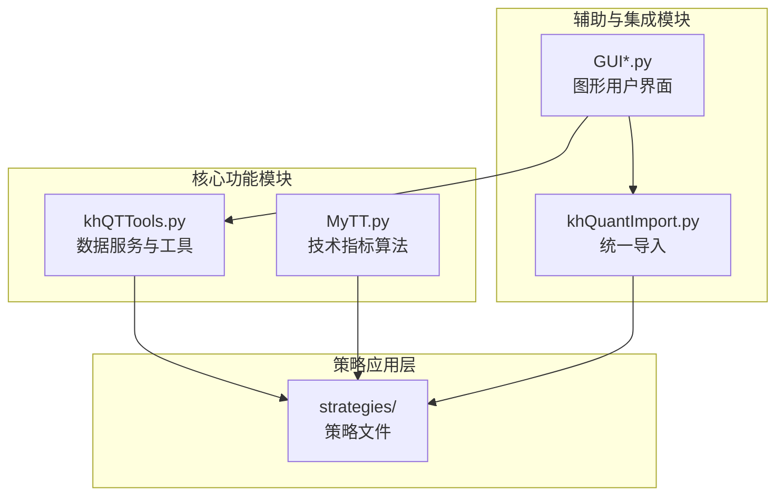
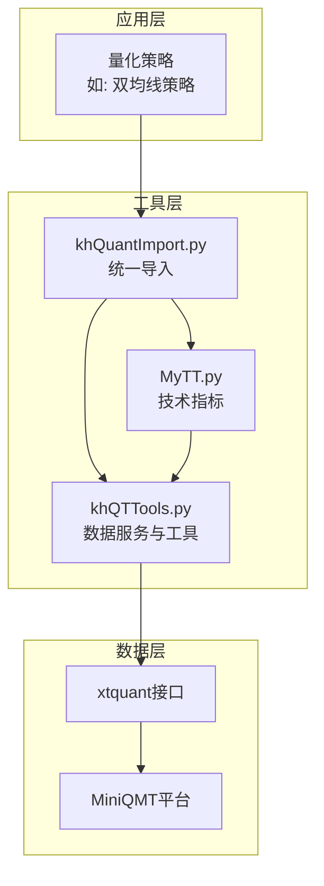
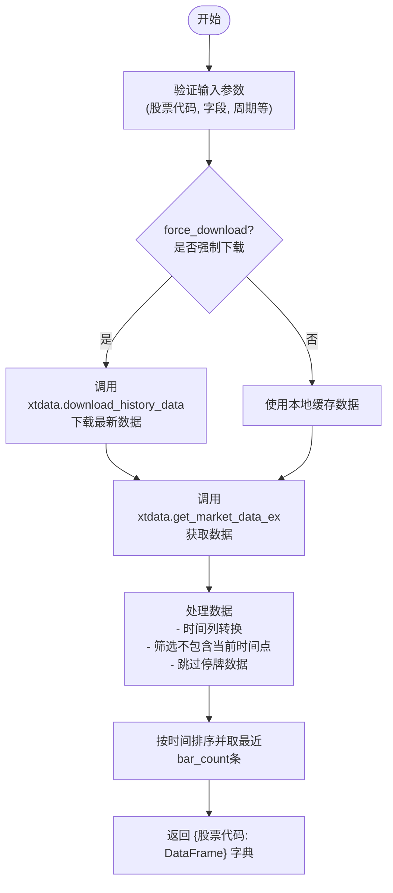
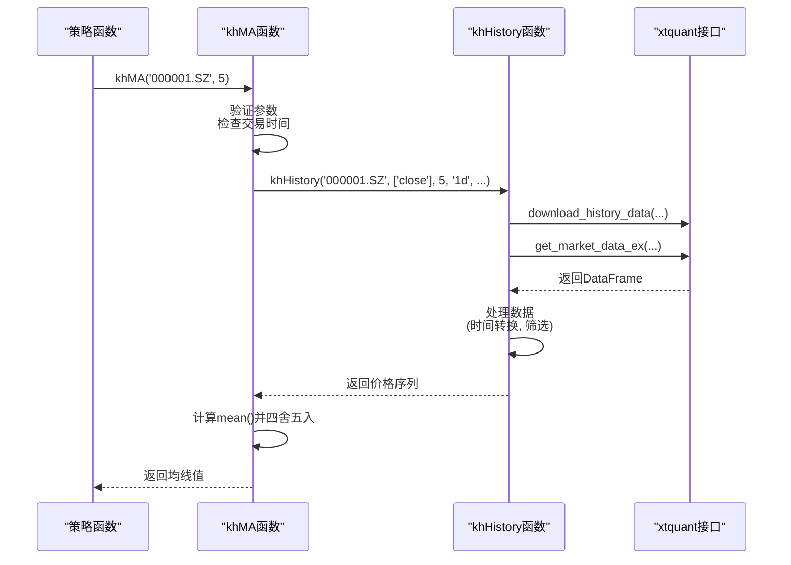
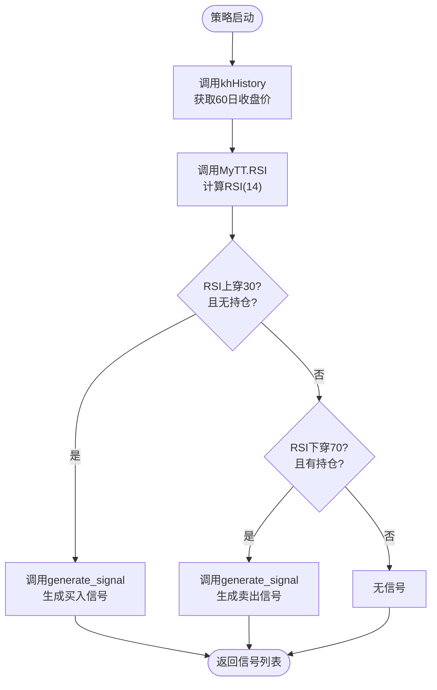
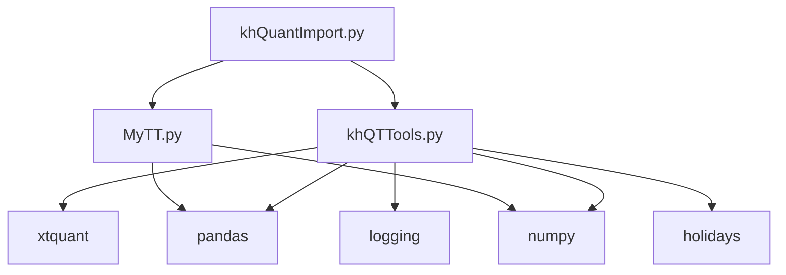

# 数据工具与指标计算 (khQTTools)

<cite>
**本文档引用的文件**   
- [khQTTools.py](file://khQTTools.py)
- [MyTT.py](file://MyTT.py)
- [strategies/双均线多股票_使用MA函数.py](file://strategies/双均线多股票_使用MA函数.py)
- [strategies/双均线多股票_使用khMA函数.py](file://strategies/双均线多股票_使用khMA函数.py)
- [strategies/双均线精简_使用khMA函数.py](file://strategies/双均线精简_使用khMA函数.py)
- [strategies/RSI策略.py](file://strategies/RSI策略.py)
- [khQuantImport.py](file://khQuantImport.py)
</cite>

## 目录
1. [简介](#简介)
2. [项目结构](#项目结构)
3. [核心组件](#核心组件)
4. [架构概述](#架构概述)
5. [详细组件分析](#详细组件分析)
6. [依赖分析](#依赖分析)
7. [性能考量](#性能考量)
8. [故障排除指南](#故障排除指南)
9. [结论](#结论)

## 简介
`khQTTools.py` 是一个为量化策略开发设计的综合性工具模块，它封装了从MiniQMT平台获取实时与历史数据、进行技术指标计算、生成交易信号以及管理数据缓存等一系列核心功能。该模块旨在为策略开发者提供一个高效、稳定且易于使用的开发环境。其核心功能围绕`khHistory`函数构建，该函数通过`xtquant`接口与MiniQMT进行交互，实现了对股票、指数等金融数据的获取。在此基础上，模块进一步封装了如`khMA`等移动平均函数，极大地简化了策略编写。同时，它与`MyTT.py`中的技术指标库紧密结合，允许开发者直接调用复杂的指标算法。此外，模块还提供了数据缓存、复权处理和异常数据过滤等机制，确保了数据的准确性和策略回测的可靠性。

## 项目结构
本项目是一个基于MiniQMT的量化交易框架，其结构清晰，功能模块化。核心的量化工具和指标计算功能由`khQTTools.py`和`MyTT.py`提供。`khQTTools.py`负责数据服务和基础工具，而`MyTT.py`则专注于技术指标的算法实现。多个位于`strategies`目录下的策略文件（如“双均线”和“RSI”策略）作为实际应用示例，展示了如何调用这些工具和指标。`khQuantImport.py`文件提供了一个统一的导入入口，使得在策略中可以方便地一次性导入所有所需工具和函数。GUI相关的文件（如`GUI.py`）则负责提供图形化界面，用于策略的配置和管理。

**图表来源**
- [khQTTools.py](file://khQTTools.py#L0-L2745)
- [MyTT.py](file://MyTT.py#L0-L623)
- [strategies/双均线多股票_使用khMA函数.py](file://strategies/双均线多股票_使用khMA函数.py#L0-L32)

## 核心组件
`khQTTools.py`的核心组件包括数据获取、技术指标计算和交易信号生成三大功能。数据获取功能主要通过`khHistory`函数实现，它能够从MiniQMT获取指定股票、字段、周期和时间范围的历史数据，并进行格式化处理。技术指标计算方面，模块不仅直接集成了`MyTT.py`中的丰富指标，还通过`khMA`等函数对常用指标进行了二次封装，使其更易于在策略中调用。交易信号生成则通过`generate_signal`函数完成，该函数根据交易逻辑生成标准化的信号字典，供交易系统执行。这些组件共同构成了一个完整的策略开发工具链。

**组件来源**
- [khQTTools.py](file://khQTTools.py#L0-L2745)
- [MyTT.py](file://MyTT.py#L0-L623)

## 架构概述
该系统的架构可以分为数据层、工具层和应用层。数据层由MiniQMT平台提供，通过`xtquant`接口暴露数据。工具层以`khQTTools.py`为核心，它作为数据层与应用层之间的桥梁，负责数据的请求、处理和缓存。`khQTTools.py`内部又分为数据服务模块（如`khHistory`）和工具函数模块（如`khMA`、`generate_signal`）。`MyTT.py`作为独立的指标算法库，被工具层调用。应用层由具体的量化策略构成，这些策略通过`khQuantImport.py`导入所需的所有工具和函数，并利用它们来实现交易逻辑。

**图表来源**
- [khQTTools.py](file://khQTTools.py#L0-L2745)
- [MyTT.py](file://MyTT.py#L0-L623)
- [khQuantImport.py](file://khQuantImport.py#L0-L520)

## 详细组件分析

### 数据获取与缓存机制分析
`khHistory`函数是数据服务的核心，它通过`xtquant.get_market_data_ex`从MiniQMT获取数据。该函数的关键特性是其“不包含当前时间点”的设计，这对于回测场景至关重要，可以避免未来函数问题。它支持多种频率（日线、分钟线、tick）和复权方式（前复权、后复权）。为了提高性能，函数实现了数据缓存机制，通过`force_download`参数控制是否强制下载最新数据。当`force_download=False`时，函数会优先使用本地缓存的数据，这在回测中能显著提升速度。此外，`download_and_store_data`和`supplement_history_data`函数提供了批量下载和补充历史数据的能力，支持进度回调和中断检查，适合处理大规模数据。

#### 数据获取流程图

**图表来源**
- [khQTTools.py](file://khQTTools.py#L2400-L2745)

**组件来源**
- [khQTTools.py](file://khQTTools.py#L2400-L2745)

### 移动平均函数实现逻辑分析
`khQTTools.py`提供了两种移动平均的实现方式：`khMA`和`MA`。`khMA`是一个独立的封装函数，它将数据获取和计算合二为一。其内部调用`khHistory`获取指定周期的收盘价，然后计算算术平均值。这种设计极大地简化了策略代码，开发者只需一行`khMA(stock_code, 5)`即可得到5日均线，无需关心数据获取的细节。而`MA`函数则来自`MyTT.py`，它是一个纯粹的计算函数，需要开发者先准备好价格序列。`khMA`的实现逻辑中包含了对交易时间的判断（仅对日内频率），并在计算前对价格进行四舍五入处理，确保了计算的严谨性。

#### 移动平均函数调用序列图

**图表来源**
- [khQTTools.py](file://khQTTools.py#L1200-L1300)
- [khQTTools.py](file://khQTTools.py#L2400-L2745)

**组件来源**
- [khQTTools.py](file://khQTTools.py#L1200-L1300)

### 技术指标与交易信号集成分析
`MyTT.py`库提供了丰富的技术指标实现，如MACD、KDJ、RSI等。这些函数的实现基于`pandas`和`numpy`，利用滚动窗口和指数加权平均等方法高效计算。在策略中，开发者可以像使用`MA`一样直接调用`RSI`等函数。`generate_signal`函数是连接指标计算与交易执行的桥梁。它接收由指标生成的交易逻辑（如金叉、死叉），结合账户和持仓信息，生成符合系统要求的标准化信号。该函数内部调用了`calculate_max_buy_volume`来计算最大可买入股数，考虑了交易成本和滑点，确保了信号的可执行性。

#### RSI策略工作流程

**图表来源**
- [MyTT.py](file://MyTT.py#L0-L623)
- [strategies/RSI策略.py](file://strategies/RSI策略.py#L0-L25)

**组件来源**
- [MyTT.py](file://MyTT.py#L0-L623)
- [strategies/RSI策略.py](file://strategies/RSI策略.py#L0-L25)

## 依赖分析
`khQTTools.py`模块的依赖关系清晰。其核心依赖是`xtquant`库，用于与MiniQMT平台进行数据交互。它依赖`pandas`和`numpy`进行数据处理和计算。`logging`模块用于记录运行日志。`holidays`库用于判断中国法定节假日，以确定交易日。`khQTTools.py`与`MyTT.py`是松耦合关系，`MyTT.py`作为一个独立的指标库，可以被`khQTTools.py`或任何其他策略直接导入使用。`khQuantImport.py`则依赖于`khQTTools.py`和`MyTT.py`，并将它们的公共接口统一导出，简化了策略的导入操作。

**图表来源**
- [khQTTools.py](file://khQTTools.py#L0-L50)
- [MyTT.py](file://MyTT.py#L0-L10)
- [khQuantImport.py](file://khQuantImport.py#L0-L50)

## 性能考量
在性能方面，`khQTTools.py`的设计充分考虑了效率。`khHistory`函数的`force_download`参数是性能优化的关键。在回测场景下，应将其设置为`False`，以避免重复下载数据，从而大幅提升回测速度。对于需要最新数据的实盘场景，则应设置为`True`。`khMA`函数虽然方便，但由于每次调用都会触发一次`khHistory`，在需要