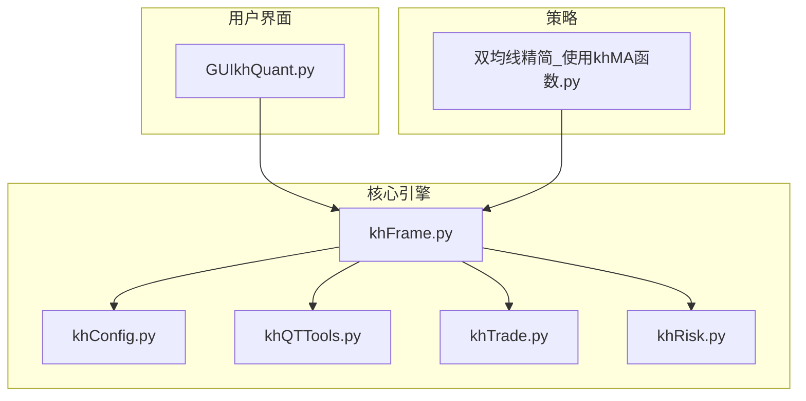
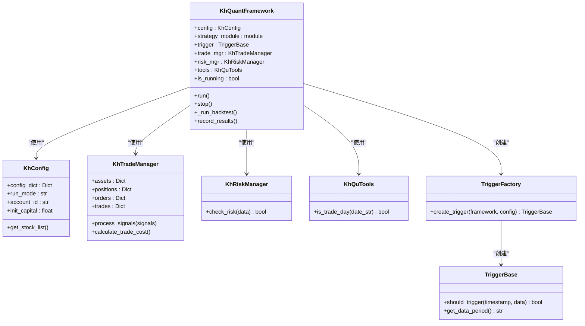
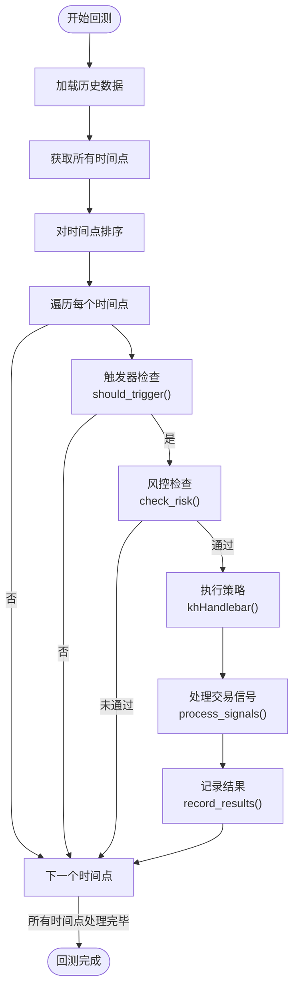
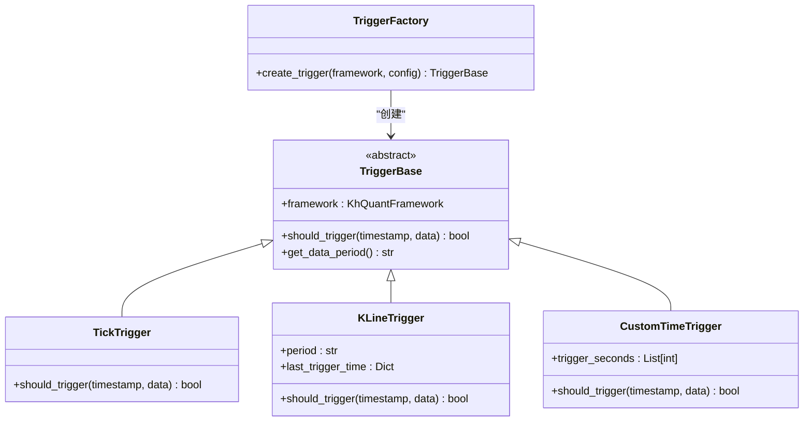
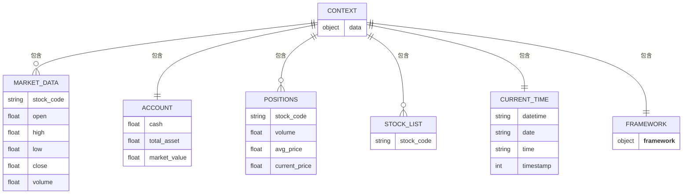

# 核心引擎 (khFrame)

<cite>
**Referenced Files in This Document**   
- [khFrame.py](file://khFrame.py)
- [GUIkhQuant.py](file://GUIkhQuant.py)
- [khConfig.py](file://khConfig.py)
- [khQTTools.py](file://khQTTools.py)
- [khTrade.py](file://khTrade.py)
- [khRisk.py](file://khRisk.py)
- [khQuantImport.py](file://khQuantImport.py)
- [strategies/双均线精简_使用khMA函数.py](file://strategies/双均线精简_使用khMA函数.py)
</cite>

## 目录
1. [引言](#引言)
2. [项目结构与核心组件](#项目结构与核心组件)
3. [核心引擎架构](#核心引擎架构)
4. [事件循环与策略执行](#事件循环与策略执行)
5. [触发器工厂与时间管理](#触发器工厂与时间管理)
6. [上下文对象与状态传递](#上下文对象与状态传递)
7. [生命周期管理](#生命周期管理)
8. [与GUI的集成](#与gui的集成)
9. [性能优化建议](#性能优化建议)
10. [结论](#结论)

## 引言

`khFrame.py` 是 OSkhQuant 量化框架的核心引擎，负责驱动整个策略回测流程。它作为系统的中枢，协调数据加载、信号生成、交易执行与结果记录等关键环节。本文档将深入分析其内部机制，详细阐述其如何通过事件循环驱动策略执行，管理时间序列数据流，并与 `GUIkhQuant.py` 等模块协同工作。

**Section sources**
- [khFrame.py](file://khFrame.py#L0-L2679)

## 项目结构与核心组件

OSkhQuant 项目采用模块化设计，各组件职责分明。核心引擎 `khFrame.py` 位于架构中心，依赖于配置管理 (`khConfig.py`)、工具集 (`khQTTools.py`)、交易管理 (`khTrade.py`) 和风险管理 (`khRisk.py`) 等模块。用户策略位于 `strategies` 目录下，而 `GUIkhQuant.py` 则作为主界面，负责与用户交互并调用核心引擎。



**Diagram sources**
- [GUIkhQuant.py](file://GUIkhQuant.py#L0-L799)
- [khFrame.py](file://khFrame.py#L0-L2679)
- [khConfig.py](file://khConfig.py#L0-L104)
- [khQTTools.py](file://khQTTools.py#L0-L799)
- [khTrade.py](file://khTrade.py#L0-L559)
- [khRisk.py](file://khRisk.py#L0-L50)
- [strategies/双均线精简_使用khMA函数.py](file://strategies/双均线精简_使用khMA函数.py#L0-L30)

**Section sources**
- [GUIkhQuant.py](file://GUIkhQuant.py#L0-L799)
- [khFrame.py](file://khFrame.py#L0-L2679)
- [khConfig.py](file://khConfig.py#L0-L104)
- [khQTTools.py](file://khQTTools.py#L0-L799)
- [khTrade.py](file://khTrade.py#L0-L559)
- [khRisk.py](file://khRisk.py#L0-L50)
- [strategies/双均线精简_使用khMA函数.py](file://strategies/双均线精简_使用khMA函数.py#L0-L30)

## 核心引擎架构

`KhQuantFramework` 类是 `khFrame.py` 的核心，它封装了策略回测所需的所有功能。其架构设计遵循低耦合、高内聚的原则，通过依赖注入的方式整合了配置、交易、风控和工具等模块。



**Diagram sources**
- [khFrame.py](file://khFrame.py#L464-L2678)
- [khConfig.py](file://khConfig.py#L0-L104)
- [khTrade.py](file://khTrade.py#L0-L559)
- [khRisk.py](file://khRisk.py#L0-L50)
- [khQTTools.py](file://khQTTools.py#L0-L799)

**Section sources**
- [khFrame.py](file://khFrame.py#L464-L2678)
- [khConfig.py](file://khConfig.py#L0-L104)
- [khTrade.py](file://khTrade.py#L0-L559)
- [khRisk.py](file://khRisk.py#L0-L50)
- [khQTTools.py](file://khQTTools.py#L0-L799)

## 事件循环与策略执行

核心引擎通过一个事件循环来驱动策略执行。该循环在 `_run_backtest` 方法中实现，它首先加载所有历史数据，然后按时间顺序遍历每一个数据点（如Tick或K线），并根据触发器的判断来决定是否执行策略。



**Diagram sources**
- [khFrame.py](file://khFrame.py#L464-L2678)

**Section sources**
- [khFrame.py](file://khFrame.py#L464-L2678)

## 触发器工厂与时间管理

`TriggerFactory` 是一个关键的工厂类，它根据配置文件中的设置，创建不同类型的触发器实例。这些触发器决定了策略执行的频率和时机。



**Diagram sources**
- [khFrame.py](file://khFrame.py#L0-L799)

**Section sources**
- [khFrame.py](file://khFrame.py#L0-L799)

## 上下文对象与状态传递

`context` 对象是策略间传递状态和市场数据的核心机制。在 `khHandlebar` 函数被调用时，核心引擎会构建一个包含丰富信息的 `data` 字典，该字典即为策略的上下文。



**Diagram sources**
- [khFrame.py](file://khFrame.py#L464-L2678)

**Section sources**
- [khFrame.py](file://khFrame.py#L464-L2678)

## 生命周期管理

核心引擎通过 `run` 和 `stop` 方法管理策略的生命周期。`run` 方法负责初始化所有组件、加载数据、执行策略主循环，而 `stop` 方法则用于清理资源和停止运行。

```mermaid
sequenceDiagram
   