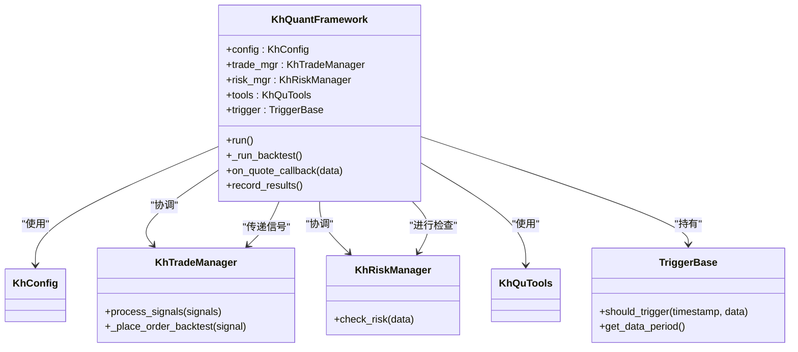
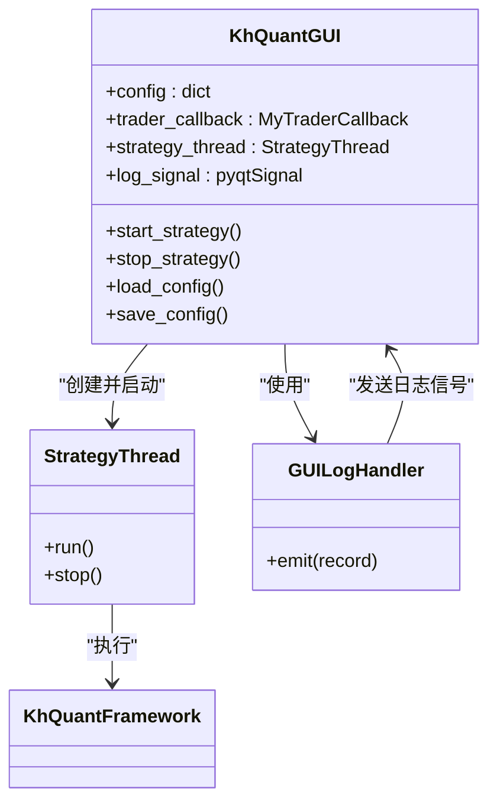

# 系统架构

<cite>
**本文档引用的文件**   
- [khFrame.py](file://khFrame.py)
- [GUIkhQuant.py](file://GUIkhQuant.py)
- [khQTTools.py](file://khQTTools.py)
- [khTrade.py](file://khTrade.py)
- [khRisk.py](file://khRisk.py)
- [khConfig.py](file://khConfig.py)
- [README.md](file://README.md)
</cite>

## 目录
1. [引言](#引言)
2. [模块化与事件驱动设计](#模块化与事件驱动设计)
3. [核心组件分析](#核心组件分析)
4. [组件交互与数据流](#组件交互与数据流)
5. [架构决策与权衡](#架构决策与权衡)
6. [结论](#结论)

## 引言

OSkhQuant 是一个基于 Python 和 PyQt5 构建的开源量化交易系统，旨在为个人投资者和量化研究人员提供一个免费、强大且易于使用的本地化回测与研究平台。该系统深度整合了券商提供的 MiniQMT 交易终端，利用其稳定的数据和交易接口，同时通过精心设计的软件架构，实现了策略逻辑与数据、交易、风控等核心功能的解耦。

本文档旨在深入分析 OSkhQuant 的系统架构，重点阐述其模块化与事件驱动的设计理念。我们将详细剖析核心组件 `khFrame.py` 如何作为量化框架引擎，协调策略触发、数据处理、交易执行与风控检查。同时，我们将解释 `GUIkhQuant.py` 作为主控制器如何集成各 GUI 模块与后台逻辑，并阐明 `khQTTools.py`、`khTrade.py` 和 `khRisk.py` 等核心模块之间的协作关系。通过绘制组件交互图和数据流图，我们将展示从数据输入到信号生成、交易执行、结果输出的完整流程，并讨论架构设计背后的权衡与考量。

## 模块化与事件驱动设计

OSkhQuant 的架构设计遵循了“低耦合、高内聚”的核心原则，通过模块化和事件驱动机制，构建了一个灵活、可维护且易于扩展的系统。

### 模块化设计

系统的模块化设计体现在将不同的功能职责分离到独立的 Python 模块中。这种设计使得每个模块可以独立开发、测试和维护，极大地提高了代码的可读性和可维护性。

*   **GUIkhQuant.py**: 作为系统的主控制器和用户界面，负责管理所有 GUI 组件（如配置面板、日志窗口）和后台逻辑的交互。它不直接处理复杂的业务逻辑，而是作为调度中心，将用户操作转化为对核心框架的调用。
*   **khFrame.py**: 作为量化交易的**核心引擎**，是整个系统的大脑。它负责协调所有后台模块，管理策略的生命周期（初始化、运行、停止），并根据预设的触发器（如 Tick、K线）来驱动策略执行。
*   **khQTTools.py**: 提供**数据获取与指标计算**的通用服务。它封装了与 `xtquant` 库的交互，提供了判断交易日、计算移动平均线等基础工具函数，为策略开发提供了便利。
*   **khTrade.py**: 专注于**订单执行逻辑**。它管理虚拟账户的资产、持仓、委托和成交信息，并根据交易成本（佣金、印花税、滑点）来模拟真实的交易过程。
*   **khRisk.py**: 负责**持仓与风险控制**。它在策略执行前进行风控检查，确保交易行为符合预设的风险限制（如单只股票持仓上限）。
*   **khConfig.py**: 作为**配置管理**中心，负责加载和解析 JSON 格式的配置文件，为系统各模块提供统一的配置参数。

这种清晰的模块划分，使得开发者可以专注于特定领域的开发，例如，策略开发者只需关注 `khFrame.py` 提供的接口，而无需关心 GUI 的实现细节。

### 事件驱动设计

OSkhQuant 采用事件驱动的编程模型来处理异步操作和数据流。当特定事件发生时（如接收到新的行情数据、用户点击“开始运行”按钮），系统会触发相应的回调函数来处理该事件。

*   **行情数据事件**: `khFrame.py` 中的 `on_quote_callback` 方法是核心的事件处理器。当从 `xtdata` 模块接收到新的行情数据时，该方法会被调用。它会依次执行触发器检查、风控检查，并最终调用策略的 `khHandlebar` 函数。
*   **交易事件**: `khTrade.py` 中的 `MyTraderCallback` 类定义了一系列回调方法，如 `on_stock_order`（委托回报）、`on_stock_trade`（成交回报）。当交易状态发生变化时，这些方法会被触发，用于更新日志和内部状态。
*   **UI 事件**: `GUIkhQuant.py` 中的按钮点击、配置更改等用户操作，会触发 Qt 框架的信号与槽机制。例如，点击“开始运行”按钮会触发 `start_strategy` 方法，从而启动回测流程。

这种事件驱动的模式使得系统能够高效地响应外部变化，保持良好的响应性，是实现复杂异步逻辑的关键。

## 核心组件分析

本节将深入分析 OSkhQuant 的核心组件，揭示其内部工作机制和协作关系。

### khFrame.py：量化框架引擎

`khFrame.py` 是 OSkhQuant 的核心，其主要职责是作为策略执行的协调者。其核心类 `KhQuantFramework` 的工作流程如下：

1.  **初始化**: 在 `__init__` 方法中，框架会加载配置文件 (`khConfig`)，初始化交易管理器 (`khTradeManager`)、风险管理器 (`KhRiskManager`) 和工具类 (`KhQuTools`)。它还会根据配置创建相应的触发器（`TriggerFactory.create_trigger`）。
2.  **启动**: `run` 方法是框架的入口。它首先初始化虚拟账户和行情数据，然后进入 `_run_backtest` 方法，开始模拟回测过程。
3.  **事件循环**: 在 `_run_backtest` 中，框架会遍历所有历史数据的时间点。对于每一个时间点：
    *   **触发检查**: 调用 `trigger.should_trigger` 方法，判断当前时间点是否满足触发条件（如是否为 K 线的结束时刻）。
    *   **风控检查**: 如果触发，调用 `risk_mgr.check_risk` 进行风控检查。
    *   **策略执行**: 如果通过风控，将当前的市场数据、账户信息、持仓信息等打包成一个字典，传递给策略的 `khHandlebar` 函数。
    *   **信号处理**: 接收策略返回的交易信号列表，并将其传递给 `trade_mgr.process_signals` 进行处理。
4.  **结果记录**: 在每个交易日结束时，调用 `record_results` 方法，记录当日的资产、持仓和交易情况，用于生成最终的回测报告。

**组件来源**
- [khFrame.py](file://khFrame.py#L1-L2679)
- [khConfig.py](file://khConfig.py#L1-L105)
- [khTrade.py](file://khTrade.py#L1-L560)
- [khRisk.py](file://khRisk.py#L1-L51)
- [khQTTools.py](file://khQTTools.py#L1-L2746)

### GUIkhQuant.py：主控制器

`GUIkhQuant.py` 是系统的用户交互中心，其核心类 `KhQuantGUI` 继承自 `QMainWindow`。它的主要作用是：

1.  **UI 管理**: 创建并管理主窗口、工具栏、三个主要面板（左、中、右）以及各种控件（按钮、输入框、表格）。
2.  **配置管理**: 提供图形化界面来设置回测参数（如起止时间、初始资金、股票池），并将这些设置保存到配置文件中。
3.  **流程控制**: 响应用户的“开始运行”和“停止运行”指令，创建 `StrategyThread` 线程来执行策略，确保 GUI 界面不会因策略计算而卡死。
4.  **日志与状态反馈**: 通过 `GUILogHandler` 将后台模块的日志信息实时显示在右侧面板的“系统日志”中，并通过状态栏和进度条展示回测进度。

**组件来源**
- [GUIkhQuant.py](file://GUIkhQuant.py#L1-L5000)

### khQTTools.py：数据与指标服务

`khQTTools.py` 提供了量化研究所需的基础工具，其核心功能包括：

*   **交易日判断**: `is_trade_day` 函数结合工作日和中国法定节假日，精确判断某一天是否为有效的交易日。
*   **数据获取**: `khHistory` 函数封装了 `xtdata.get_market_data_ex`，用于从本地数据库获取历史行情数据。
*   **指标计算**: `khMA` 函数提供了一个便捷的接口来计算移动平均线，简化了策略编写。
*   **信号生成**: `generate_signal` 函数帮助策略生成标准化的交易信号字典，确保信号格式的统一。

该模块的设计目标是“开箱即用”，让策略开发者能够快速调用这些函数，而无需重复编写基础代码。

### khTrade.py：订单执行逻辑

`khTrade.py` 模拟了真实的交易过程，其核心是 `KhTradeManager` 类。在回测模式下，其主要逻辑在 `_place_order_backtest` 方法中实现：

1.  **成本计算**: `calculate_trade_cost` 方法会计算一笔交易的总成本，包括佣金、印花税、过户费和流量费，并考虑滑点对成交价格的影响。
2.  **资金与持仓检查**: 在执行买入操作前，会检查可用资金是否足够；在执行卖出操作前，会检查可用持仓