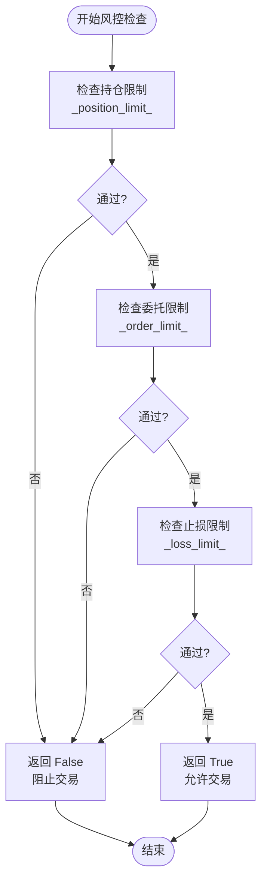
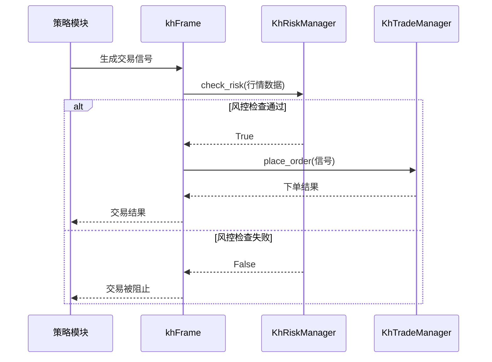

# 风控管理模块 (khRisk)

<cite>
**本文档引用的文件**
- [khRisk.py](file://khRisk.py)
- [khTrade.py](file://khTrade.py)
- [khConfig.py](file://khConfig.py)
- [khFrame.py](file://khFrame.py)
</cite>

## 目录
1. [简介](#简介)
2. [核心风控机制](#核心风控机制)
3. [风控检查流程](#风控检查流程)
4. [与交易模块的交互](#与交易模块的交互)
5. [配置与自定义](#配置与自定义)
6. [典型风控场景示例](#典型风控场景示例)
7. [极端市场条件下的鲁棒性](#极端市场条件下的鲁棒性)

## 简介
`khRisk` 模块是看海量化系统中的核心风险管理组件，负责在每次交易执行前对交易指令进行严格的合规性验证。该模块通过 `KhRiskManager` 类实现，旨在防止因过度交易、资金不足或市场剧烈波动导致的潜在风险。其主要功能包括持仓检查、止损止盈触发、最大持仓限制和风险敞口控制。本模块与 `khTrade` 交易模块紧密协作，确保所有交易行为均符合预设的风险控制规则。

## 核心风控机制

`KhRiskManager` 类通过三个核心检查方法来实现风险控制：`_check_position`、`_check_order` 和 `_check_loss`。这些方法分别对应于持仓限制、委托限制和止损限制的检查逻辑。

**持仓检查** (`_check_position`) 负责验证当前持仓是否超过了系统设定的最大持仓比例。该比例由配置文件中的 `position_limit` 参数定义，通常设置为总资产的一定百分比（例如 95%），以保留部分现金应对市场波动。

**委托检查** (`_check_order`) 用于限制单次交易的委托数量，防止因单笔大额交易对市场造成冲击或超出账户的交易能力。此限制由 `order_limit` 参数控制。

**止损检查** (`_check_loss`) 是风险控制的关键环节，用于判断当前市场行情是否触及预设的止损条件。该检查依赖于实时行情数据，并根据 `loss_limit` 参数（通常表示最大可接受亏损比例）进行决策。

**Section sources**
- [khRisk.py](file://khRisk.py#L25-L45)

## 风控检查流程

风控检查的入口方法是 `check_risk`，该方法在接收到最新的行情数据后，会依次执行上述三项检查。检查流程遵循短路逻辑：一旦任何一项检查失败，将立即返回 `False`，阻止后续交易的执行。



**Diagram sources**
- [khRisk.py](file://khRisk.py#L14-L35)

**Section sources**
- [khRisk.py](file://khRisk.py#L14-L35)

## 与交易模块的交互

`khRisk` 模块与 `khTrade` 模块的交互由 `khFrame` 主框架协调。在策略生成交易信号后，`khFrame` 会首先调用 `KhRiskManager.check_risk` 方法进行风险评估。只有当风控检查通过时，才会将信号传递给 `KhTradeManager` 进行实际的下单处理。



**Diagram sources**
- [khFrame.py](file://khFrame.py#L1808)
- [khRisk.py](file://khRisk.py#L14)
- [khTrade.py](file://khTrade.py#L200)

**Section sources**
- [khFrame.py](file://khFrame.py#L1798-L1825)
- [khTrade.py](file://khTrade.py#L200-L250)

## 配置与自定义

风控规则的参数来源于 `khConfig` 模块，该模块从 JSON 配置文件中读取 `risk` 部分的设置。用户可以通过修改配置文件来自定义风控规则。

| 配置项 | 说明 | 默认值 | 配置路径 |
| :--- | :--- | :--- | :--- |
| `position_limit` | 最大持仓比例 | 0.95 | `config.risk.position_limit` |
| `order_limit` | 单笔委托数量上限 | 100 | `config.risk.order_limit` |
| `loss_limit` | 最大亏损比例 | 0.1 | `config.risk.loss_limit` |

用户可以在 `config.json` 文件中调整这些值，以适应不同的风险偏好和市场环境。例如，保守型投资者可以将 `position_limit` 设置为 0.7，以保持更高的现金比例。

**Section sources**
- [khConfig.py](file://khConfig.py#L47-L49)
- [GUIkhQuant.py](file://GUIkhQuant.py#L1312-L1314)

## 典型风控场景示例

以下是一些常见的风控配置场景：

1.  **保守型配置**：
    ```json
    "risk": {
        "position_limit": 0.7,
        "order_limit": 50,
        "loss_limit": 0.05
    }
    ```
    适用于风险厌恶型投资者，严格控制仓位和亏损。

2.  **平衡型配置**：
    ```json
    "risk": {
        "position_limit": 0.9,
        "order_limit": 200,
        "loss_limit": 0.1
    }
    ```
    在风险和收益之间寻求平衡，适用于大多数市场环境。

3.  **激进型配置**：
    ```json
    "risk": {
        "position_limit": 0.98,
        "order_limit": 500,
        "loss_limit": 0.15
    }
    ```
    适用于对市场有高度信心的投资者，追求更高的收益潜力，但承担相应风险。

## 极端市场条件下的鲁棒性

在极端市场条件下（如市场崩盘或剧烈波动），`khRisk` 模块的 `loss_limit` 规则能有效触发止损，强制平仓以限制损失。虽然当前 `_check_loss` 方法的实现逻辑为占位符（返回 `True`），但其设计框架已为实现复杂的动态止损策略（如基于波动率或技术指标）预留了接口。通过结合 `khTrade` 模块的资金和持仓数据，`khRisk` 可以实现更智能的风险评估，例如根据账户总亏损动态调整后续交易的仓位，从而在危机中保护资本。

**Section sources**
- [khRisk.py](file://khRisk.py#L43-L45)
- [khTrade.py](file://khTrade.py#L300-L350)