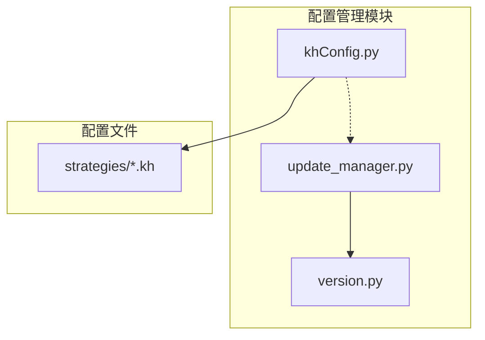
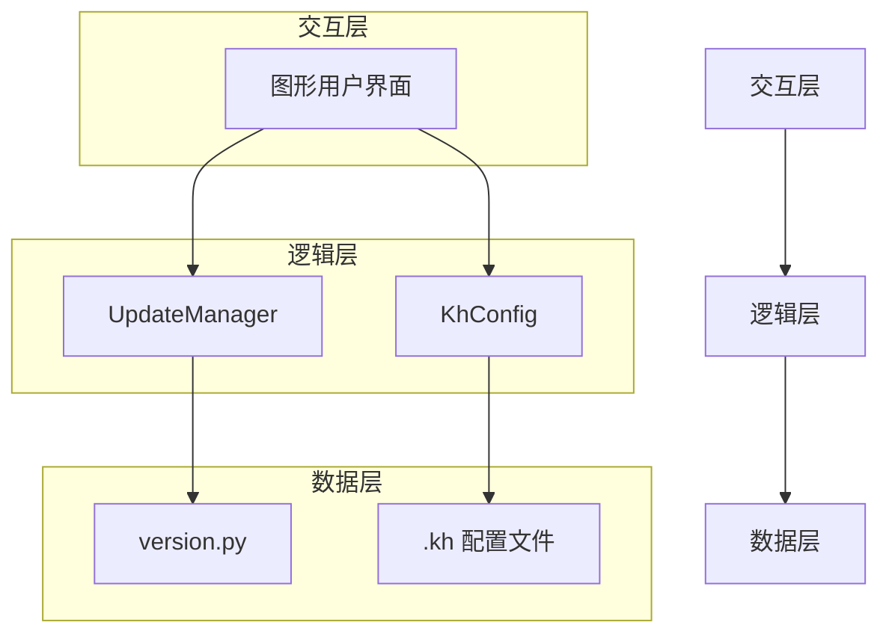
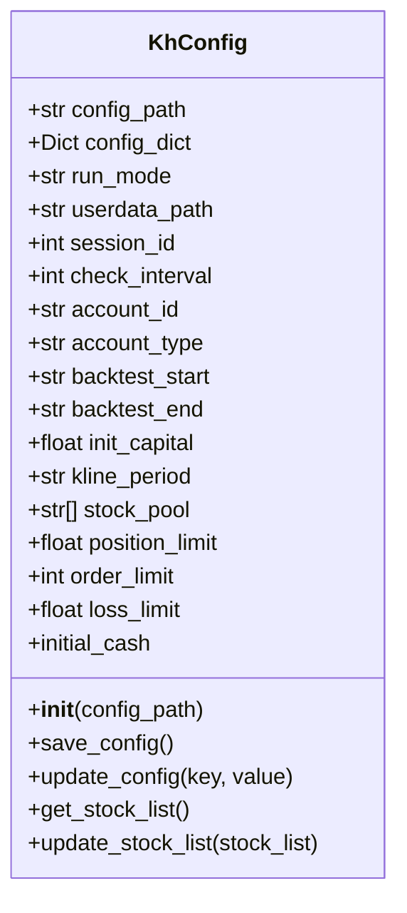
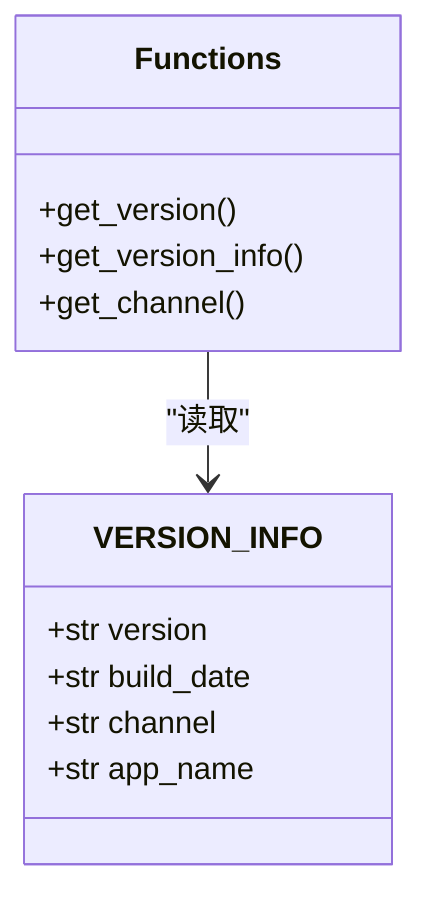
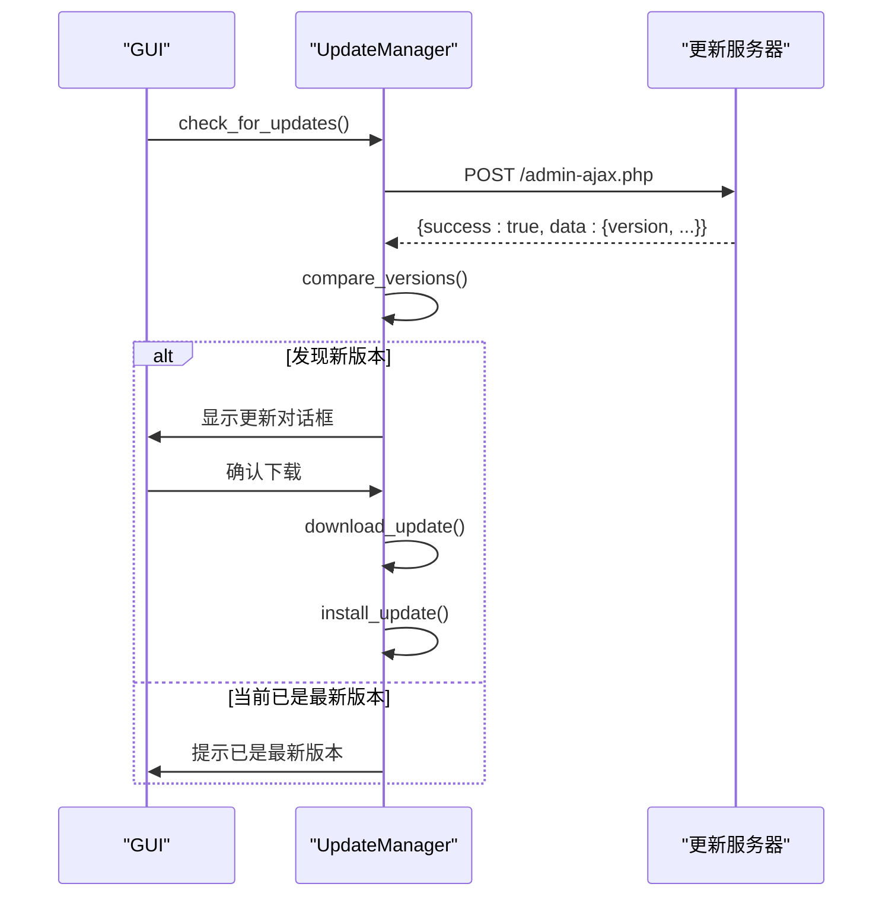
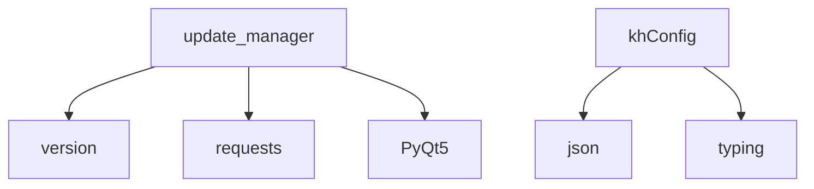

# 配置管理

<cite>
**本文档引用文件**  
- [khConfig.py](file://khConfig.py)
- [version.py](file://version.py)
- [update_manager.py](file://update_manager.py)
- [RSI策略.kh](file://strategies/RSI策略.kh)
</cite>

## 目录
1. [引言](#引言)
2. [项目结构](#项目结构)
3. [核心组件](#核心组件)
4. [架构概述](#架构概述)
5. [详细组件分析](#详细组件分析)
6. [依赖分析](#依赖分析)
7. [性能考虑](#性能考虑)
8. [故障排除指南](#故障排除指南)
9. [结论](#结论)

## 引言
本文档全面记录了看海量化交易系统（KHQuant）的配置管理体系。系统通过`.kh`格式的JSON配置文件统一管理策略路径、回测参数、账户设置等关键信息。`khConfig.py`模块负责配置的解析、加载与持久化，`version.py`定义了版本信息，而`update_manager.py`则实现了自动化的版本检查与升级流程。本系统强调配置的安全性与可维护性，为用户提供了一套可靠、透明的项目设置管理方案。

## 项目结构
系统采用模块化设计，核心配置管理功能由`khConfig.py`、`version.py`和`update_manager.py`三个文件构成。`.kh`配置文件位于`strategies`目录下，与策略脚本文件共同构成可复用的工程单元。`version.py`作为版本信息的单一来源，被`update_manager.py`直接引用，确保了版本控制的准确性。

**Diagram sources**
- [khConfig.py](file://khConfig.py)
- [version.py](file://version.py)
- [update_manager.py](file://update_manager.py)

**Section sources**
- [khConfig.py](file://khConfig.py)
- [version.py](file://version.py)
- [update_manager.py](file://update_manager.py)

## 核心组件
系统的核心配置管理由`KhConfig`类实现，它封装了对`.kh`配置文件的读写操作。`VERSION_INFO`字典在`version.py`中定义了应用的版本、构建日期和更新通道。`UpdateManager`类则负责与远程服务器交互，检查更新并引导用户完成升级。这三个组件协同工作，构成了一个从配置到部署的完整生命周期管理闭环。

**Section sources**
- [khConfig.py](file://khConfig.py#L5-L104)
- [version.py](file://version.py#L2-L19)
- [update_manager.py](file://update_manager.py#L268-L732)

## 架构概述
系统的配置管理架构分为三层：数据层、逻辑层和交互层。数据层由`.kh`文件和`version.py`中的常量构成，存储了所有静态和动态配置。逻辑层以`KhConfig`和`UpdateManager`为核心，处理配置的解析、验证和更新逻辑。交互层则通过GUI与用户进行沟通，提供配置编辑、版本信息展示和更新提示等功能。

**Diagram sources**
- [khConfig.py](file://khConfig.py)
- [version.py](file://version.py)
- [update_manager.py](file://update_manager.py)

## 详细组件分析

### KhConfig 类分析
`KhConfig`类是配置管理的核心，它在初始化时加载指定路径的`.kh`文件，并将JSON数据解析为类的属性。该类提供了`save_config`方法，用于将内存中的配置变更持久化到文件，确保了数据的一致性。

**Diagram sources**
- [khConfig.py](file://khConfig.py#L5-L104)

**Section sources**
- [khConfig.py](file://khConfig.py#L5-L104)

### Version 模块分析
`version.py`模块通过`VERSION_INFO`字典集中管理应用的版本信息。`get_version()`等函数提供了对版本信息的安全访问，避免了硬编码，使得版本信息的维护和更新变得简单且不易出错。

**Diagram sources**
- [version.py](file://version.py#L2-L19)

**Section sources**
- [version.py](file://version.py#L2-L19)

### UpdateManager 类分析
`UpdateManager`类实现了完整的更新流程。它通过`check_for_updates`方法向服务器发起请求，获取最新的版本信息，并与本地版本进行比较。如果发现新版本，会通过`_show_update_dialog`显示更新提示，并引导用户下载和安装。

**Diagram sources**
- [update_manager.py](file://update_manager.py#L268-L732)

**Section sources**
- [update_manager.py](file://update_manager.py#L268-L732)

## 依赖分析
`update_manager.py`依赖于`version.py`来获取当前版本信息，这是实现版本比较的基础。`khConfig.py`虽然不直接依赖其他两个文件，但其管理的`.kh`配置文件中包含了`run_mode`等关键字段，这些字段的值会影响`UpdateManager`的行为（例如，是否在回测模式下检查更新）。`UpdateManager`在内部使用了`requests`库进行HTTP通信，并依赖`PyQt5`的信号与槽机制来实现线程安全的UI更新。

**Diagram sources**
- [update_manager.py](file://update_manager.py)
- [khConfig.py](file://khConfig.py)

**Section sources**
- [update_manager.py](file://update_manager.py)
- [khConfig.py](file://khConfig.py)

## 性能考虑
配置文件的加载和保存是I/O密集型操作。`KhConfig`类在初始化时一次性加载整个配置文件，避免了频繁的磁盘读取。`save_config`方法使用`json.dump`的`indent`参数，虽然牺牲了文件大小，但极大地提高了配置文件的可读性，便于用户手动编辑。`UpdateManager`在检查更新时设置了3秒的超时，防止网络问题导致主程序卡死。

## 故障排除指南
* **配置文件无法加载**：检查文件路径是否正确，确认`.kh`文件是否为有效的JSON格式。可以使用在线JSON验证工具进行检查。
* **更新检查失败**：确认网络连接正常。检查`update_manager.py`中的`update_url`是否正确。查看日志文件以获取更详细的错误信息。
* **版本信息显示错误**：确认`version.py`文件未被意外修改。检查`UpdateManager`的`current_version`属性是否正确地从`version.py`获取了版本号。
* **保存配置后无变化**：确认`save_config`方法被正确调用。检查文件路径是否有写入权限。

**Section sources**
- [khConfig.py](file://khConfig.py#L85-L94)
- [update_manager.py](file://update_manager.py#L268-L732)

## 结论
看海量化交易系统的配置管理体系设计清晰、职责分明。`khConfig.py`提供了稳定可靠的配置管理能力，`version.py`确保了版本信息的集中管理，`update_manager.py`则实现了无缝的用户体验。三者共同构建了一个安全、高效且易于维护的配置与更新机制，为系统的长期稳定运行奠定了坚实的基础。建议用户遵循文档中的最佳实践，妥善管理配置文件和策略代码，以充分发挥系统的潜力。