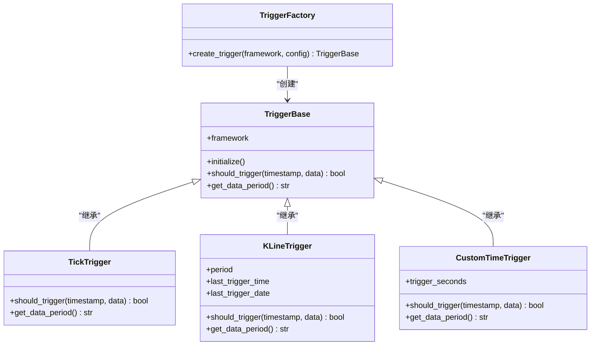
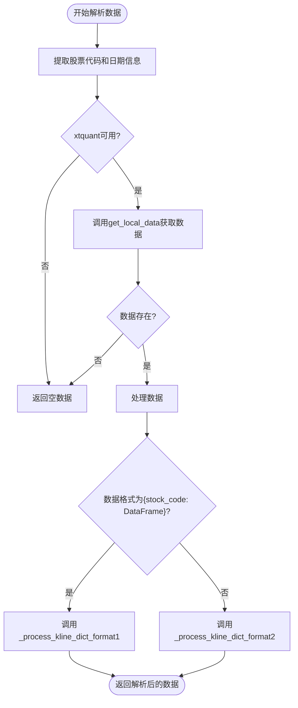
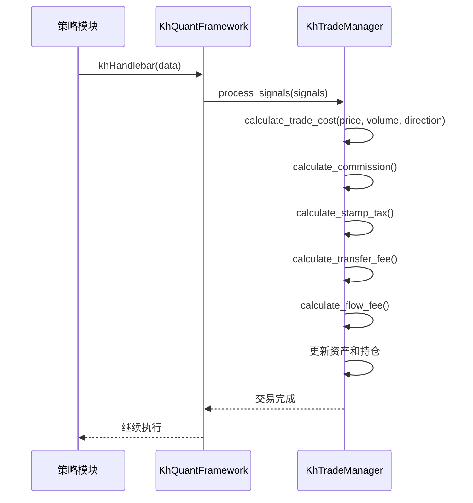

# 性能调优

<cite>
**本文档引用的文件**   
- [khFrame.py](file://khFrame.py)
- [miniQMT_data_parser.py](file://miniQMT_data_parser.py)
- [khTrade.py](file://khTrade.py)
- [khConfig.py](file://khConfig.py)
</cite>

## 目录
1. [引言](#引言)
2. [事件调度机制性能分析](#事件调度机制性能分析)
3. [数据解析逻辑优化](#数据解析逻辑优化)
4. [内存占用减少技巧](#内存占用减少技巧)
5. [交易执行效率提升](#交易执行效率提升)
6. [典型性能瓶颈与解决方案](#典型性能瓶颈与解决方案)

## 引言
OSkhQuant平台提供了一套完整的量化交易解决方案，涵盖从数据加载、策略计算到交易执行的全链路功能。随着策略复杂度和数据量的增加，性能调优成为确保系统高效稳定运行的关键。本文档旨在系统性地介绍OSkhQuant平台的性能调优策略，帮助用户识别并解决潜在的性能瓶颈。我们将深入分析`khFrame.py`中的事件调度机制，指导用户合理设置回测频率与触发粒度；讲解如何优化`miniQMT_data_parser.py`的数据解析逻辑以加快历史数据读取速度；提供减少内存占用的实用技巧；并结合`khTrade.py`中的交易成本计算逻辑，说明如何通过缓存和预计算提升执行效率。

## 事件调度机制性能分析

`khFrame.py`文件中的事件调度机制是整个框架的核心，它决定了策略在何时被触发执行。该机制通过一个工厂模式（`TriggerFactory`）创建不同类型的触发器，包括`TickTrigger`、`KLineTrigger`和`CustomTimeTrigger`。选择合适的触发器类型对性能有显著影响。

- **Tick触发器 (`TickTrigger`)**：在每个Tick数据到达时都触发策略。这是最频繁的触发方式，适用于需要极高响应速度的高频策略。然而，其性能开销最大，因为策略函数`khHandlebar`会被极其频繁地调用，可能导致CPU资源耗尽。建议仅在必要时使用，并确保策略逻辑高度优化。

- **K线触发器 (`KLineTrigger`)**：在K线形成时触发策略，支持1分钟、5分钟和日K线等周期。这是最常用的触发方式，它在性能和策略精度之间取得了良好平衡。例如，1分钟K线触发器通过检查`current_time.second == 0`来判断是否触发，逻辑简单高效。用户应根据策略的交易频率需求选择合适的K线周期，避免使用过短的周期导致不必要的计算。

- **自定义时间触发器 (`CustomTimeTrigger`)**：允许用户在指定的时间点（如["09:30:00", "10:00:00"]）触发策略。该机制在性能上具有智能适配特性：当所有自定义时间点都是整分钟时，系统会自动使用1分钟K线数据；当存在非整分钟的时间点时，系统则会切换到Tick数据以确保精度。这种设计在保证灵活性的同时，也优化了资源使用。

**重要提示**：为了确保数据周期与触发类型匹配，框架在`_check_period_consistency`方法中进行了检查。如果配置不一致（例如，数据周期为"1m"但触发类型为"tick"），系统会弹出警告。用户应遵循警告建议，将数据周期设置为与触发类型一致，以避免性能问题和触发精度问题。

**图源**
- [khFrame.py](file://khFrame.py#L54-L267)

**本节源**
- [khFrame.py](file://khFrame.py#L54-L267)

## 数据解析逻辑优化

`miniQMT_data_parser.py`文件负责解析miniQMT平台的本地二进制数据。优化其数据解析逻辑是加快历史数据读取速度的关键。该文件通过`get_local_data`函数与xtquant库交互，直接读取本地缓存，避免了网络请求的延迟。

主要优化点如下：

1.  **文件路径解析优化**：`_extract_stock_info_from_tick_path`和`_extract_stock_code_from_kline_path`方法通过解析文件路径来提取股票代码和日期信息。这些方法应确保路径处理逻辑高效，避免不必要的字符串操作。

2.  **数据加载范围控制**：`parse_tick_data`和`parse_kline_data`方法都支持`max_records`参数，允许用户限制加载的最大记录数。在进行策略调试或回测初期，应设置一个较小的`max_records`值，以快速加载少量数据进行验证，从而大幅缩短等待时间。

3.  **数据格式智能处理**：`get_local_data`返回的数据结构可能有两种：`{stock_code: DataFrame}` 或 `{field: DataFrame}`。`_process_kline_dict_format1`和`_process_kline_dict_format2`方法分别处理这两种情况。确保这些处理逻辑高效，避免在循环中进行重复的类型检查和数据转换。

4.  **记录数估算**：`_estimate_record_count_by_filesize`方法通过文件大小和预设的记录大小（如32、40字节）来估算文件中的记录数量。这是一种非常高效的预估方法，可以用于快速判断数据量，避免加载过大的文件。

**图源**
- [miniQMT_data_parser.py](file://miniQMT_data_parser.py#L799-L1273)

**本节源**
- [miniQMT_data_parser.py](file://miniQMT_data_parser.py#L0-L1273)

## 内存占用减少技巧

在处理大规模历史数据时，内存占用是一个关键问题。以下技巧可以帮助减少OSkhQuant平台的内存占用：

1.  **及时释放临时变量**：在`khFrame.py`的`_run_backtest`方法中，`historical_data`字典用于存储所有股票的历史数据。一旦回测完成，这些数据应被及时清理。虽然代码中没有显式的`del`语句，但用户应确保在不需要时，让这些大对象超出作用域，以便Python的垃圾回收器可以回收内存。

2.  **使用生成器替代列表**：在`miniQMT_data_parser.py`中，`parse_tick_data`和`parse_kline_data`方法都返回一个`list`。对于超大规模数据，可以考虑修改这些方法，使其返回一个生成器（generator）。生成器在迭代时才逐个产生数据，而不是一次性将所有数据加载到内存中，从而极大地节省内存。例如，可以将`data.append({...})`替换为`yield {...}`。

3.  **利用缓存机制**：`khFrame.py`中使用了多个缓存机制来避免重复计算，例如`daily_price_cache`用于缓存日线价格，`_cached_benchmark_close`用于缓存基准指数收盘价。这些缓存虽然占用内存，但它们避免了对xtdata接口的重复调用，从整体上提升了性能。用户应根据实际内存情况，权衡缓存的利弊。

4.  **避免创建不必要的副本**：在`khFrame.py`的`on_quote_callback`方法中，会创建`data_with_time`字典来合并行情数据和时间信息。应确保这种合并操作是必要的，并且在后续处理中直接使用该字典，避免创建更多的副本。

**本节源**
- [khFrame.py](file://khFrame.py#L800-L2678)
- [miniQMT_data_parser.py](file://miniQMT_data_parser.py#L0-L1273)

## 交易执行效率提升

`khTrade.py`文件中的`KhTradeManager`类负责处理交易信号和计算交易成本。通过缓存和预计算可以显著提升其执行效率。

1.  **交易成本参数缓存**：在`KhTradeManager.__init__`方法中，交易成本参数（如`commission_rate`, `stamp_tax_rate`）从配置中读取并存储为实例变量。这避免了在每次计算时都去访问配置字典，是一种基本的缓存优化。

2.  **滑点计算优化**：`calculate_slippage`方法根据配置的滑点类型（"tick"或"ratio"）计算实际成交价。该方法逻辑清晰，计算量小，是高效的。用户应根据策略需求选择合适的滑点模式。

3.  **预计算与批量处理**：在`_run_backtest`方法中，框架会预先加载所有股票的历史数据，并构建一个包含所有时间点的列表`all_times`。这种预计算和批量加载的方式，比在每个时间点单独请求数据要高效得多。`KhTradeManager`在处理信号时，也是批量处理`signals`列表，而不是逐个处理。

4.  **避免重复计算**：在`khTrade.py`的`_place_order_backtest`方法中，当计算买入所需资金时，会先调用`calculate_trade_cost`来获取总成本，然后计算`required_cash`。这个逻辑是正确的，因为它确保了资金检查的准确性。然而，如果`calculate_trade_cost`本身计算量很大，可以考虑在策略生成信号时就预计算好成本，并将其作为信号的一部分传入，从而避免在下单时重复计算。

**图源**
- [khTrade.py](file://khTrade.py#L0-L559)

**本节源**
- [kh