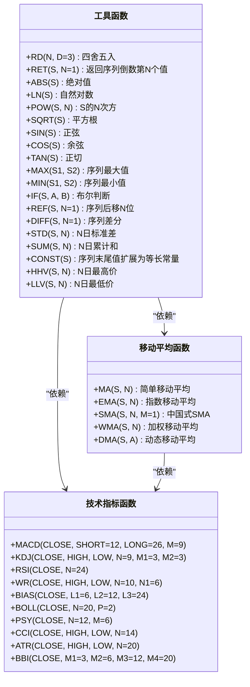
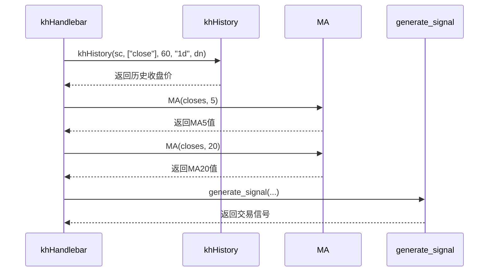
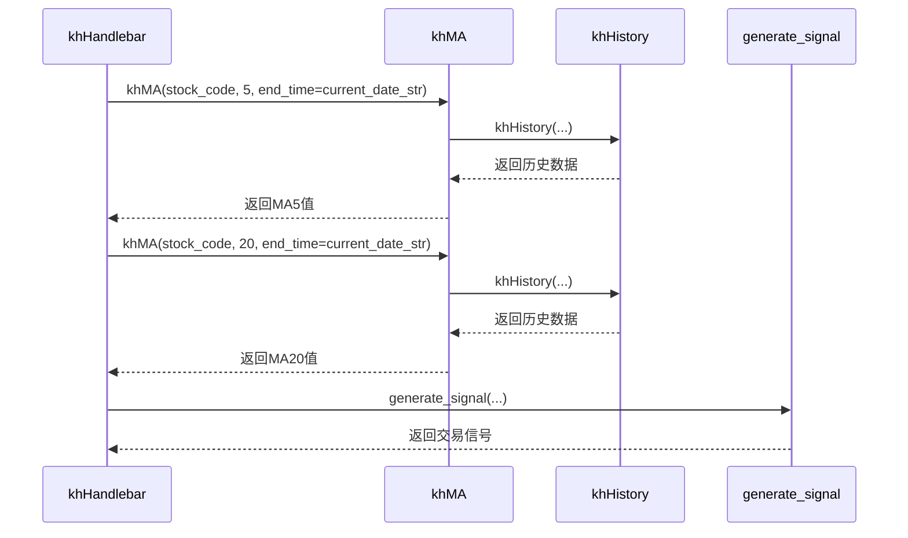
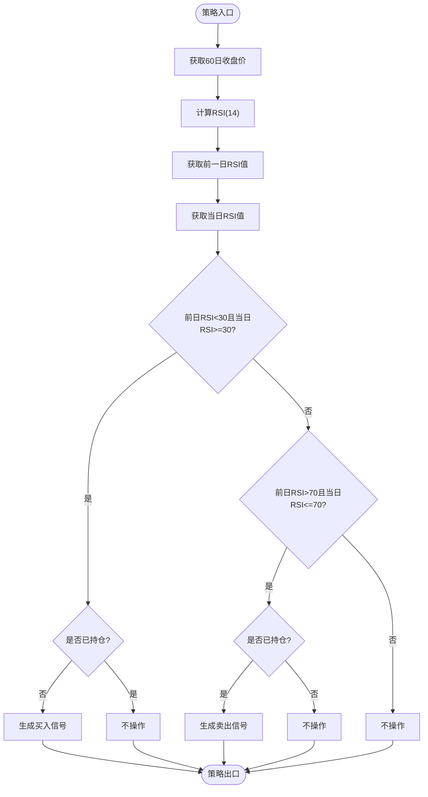
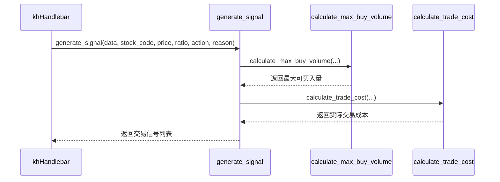

# 策略优化

<cite>
**本文档引用的文件**
- [MyTT.py](file://MyTT.py)
- [双均线多股票_使用MA函数.py](file://strategies/双均线多股票_使用MA函数.py)
- [双均线多股票_使用khMA函数.py](file://strategies/双均线多股票_使用khMA函数.py)
- [RSI策略.py](file://strategies/RSI策略.py)
- [双均线精简_使用khMA函数.py](file://strategies/双均线精简_使用khMA函数.py)
- [khQTTools.py](file://khQTTools.py)
- [khQuantImport.py](file://khQuantImport.py)
</cite>

## 目录
1. [引言](#引言)
2. [核心工具与指标函数分析](#核心工具与指标函数分析)
3. [双均线策略优化对比](#双均线策略优化对比)
4. [RSI策略实现与优化](#rsi策略实现与优化)
5. [多股票回测性能优化](#多股票回测性能优化)
6. [信号生成逻辑重构](#信号生成逻辑重构)
7. [性能诊断与分析](#性能诊断与分析)
8. [结论](#结论)

## 引言
本文档深入探讨量化策略的优化方法，重点分析如何通过减少冗余计算、向量化操作和高效数据结构提升策略执行效率。结合双均线策略和RSI策略的实际代码，展示如何利用MyTT.py中的技术指标函数进行性能优化。解释在多股票回测中如何避免循环嵌套导致的性能瓶颈，并提供使用pandas进行批量处理的最佳实践。讨论信号生成逻辑的重构技巧，以降低延迟并提高回测精度。包含常见性能问题的诊断方法，如使用Python内置profiler进行热点分析。

## 核心工具与指标函数分析
MyTT.py文件提供了量化策略开发所需的核心工具函数和常用技术指标。这些函数基于numpy和pandas实现，支持向量化操作，能够有效提升计算效率。



**图表来源**
- [MyTT.py](file://MyTT.py#L0-L623)

**本节来源**
- [MyTT.py](file://MyTT.py#L0-L623)

## 双均线策略优化对比
通过对比使用MyTT.MA和khMA函数的双均线策略，可以清晰地看到不同实现方式对代码简洁性和执行效率的影响。

### 使用MyTT.MA的双均线策略
该策略需要手动获取历史数据，然后调用MyTT.MA函数计算均线值。这种方式虽然灵活，但增加了代码复杂度。



**图表来源**
- [双均线多股票_使用MA函数.py](file://strategies/双均线多股票_使用MA函数.py#L0-L35)

**本节来源**
- [双均线多股票_使用MA函数.py](file://strategies/双均线多股票_使用MA函数.py#L0-L35)

### 使用khMA函数的双均线策略
该策略直接调用khMA函数，该函数内部封装了行情获取和移动平均计算，大大简化了代码逻辑。



**图表来源**
- [双均线多股票_使用khMA函数.py](file://strategies/双均线多股票_使用khMA函数.py#L0-L32)
- [khQTTools.py](file://khQTTools.py#L279-L325)

**本节来源**
- [双均线多股票_使用khMA函数.py](file://strategies/双均线多股票_使用khMA函数.py#L0-L32)
- [khQTTools.py](file://khQTTools.py#L279-L325)

## RSI策略实现与优化
RSI策略通过计算相对强弱指标来判断市场超买超卖状态，实现买入卖出决策。



**图表来源**
- [RSI策略.py](file://strategies/RSI策略.py#L0-L25)
- [MyTT.py](file://MyTT.py#L210-L213)

**本节来源**
- [RSI策略.py](file://strategies/RSI策略.py#L0-L25)
- [MyTT.py](file://MyTT.py#L210-L213)

## 多股票回测性能优化
在多股票回测中，避免循环嵌套导致的性能瓶颈是关键。通过使用pandas进行批量处理，可以显著提升执行效率。

### 数据获取优化
khHistory函数通过批量获取多只股票的历史数据，避免了逐个获取的低效操作。

```python
# 批量获取多只股票的历史数据
data = khHistory(
    symbol_list=stock_list,
    fields=["close"],
    bar_count=60,
    fre_step="1d",
    current_time=current_date_str,
    fq="pre",
    force_download=False
)
```

### 向量化操作
利用pandas的向量化操作，可以同时对多只股票的数据进行计算，避免了显式的for循环。

```python
# 向量化计算多只股票的均线
ma5_values = data.rolling(5).mean()
ma20_values = data.rolling(20).mean()
```

**本节来源**
- [khQTTools.py](file://khQTTools.py#L2155-L2424)
- [双均线多股票_使用MA函数.py](file://strategies/双均线多股票_使用MA函数.py#L0-L35)

## 信号生成逻辑重构
信号生成逻辑的重构可以降低延迟并提高回测精度。通过将信号生成逻辑封装在独立的函数中，可以提高代码的可维护性和复用性。



**图表来源**
- [khQTTools.py](file://khQTTools.py#L418-L520)
- [khQuantImport.py](file://khQuantImport.py#L425-L520)

**本节来源**
- [khQTTools.py](file://khQTTools.py#L418-L520)
- [khQuantImport.py](file://khQuantImport.py#L425-L520)

## 性能诊断与分析
使用Python内置的profiler可以进行热点分析，找出性能瓶颈。

### 常见性能问题
1. **重复数据获取**：在循环中重复调用数据获取函数
2. **冗余计算**：重复计算相同的指标值
3. **低效循环**：使用Python原生循环而非向量化操作

### 诊断方法
```python
import cProfile
import pstats

# 性能分析
profiler = cProfile.Profile()
profiler.enable()

# 执行策略
signals = khHandlebar(data)

profiler.disable()
stats = pstats.Stats(profiler)
stats.sort_stats('cumulative')
stats.print_stats(10)  # 打印耗时最长的10个函数
```

**本节来源**
- [khQTTools.py](file://khQTTools.py#L2155-L2424)
- [双均线多股票_使用MA函数.py](file://strategies/双均线多股票_使用MA函数.py#L0-L35)

## 结论
通过对双均线策略和RSI策略的分析，我们可以得出以下优化建议：
1. 使用封装良好的函数（如khMA）可以简化代码逻辑，提高开发效率
2. 利用pandas的向量化操作可以显著提升计算性能
3. 批量获取数据避免了重复的I/O操作，提高了执行效率
4. 将信号生成逻辑独立封装，有利于代码维护和复用
5. 使用性能分析工具可以有效识别和解决性能瓶颈

这些优化方法不仅适用于当前的策略，也可以推广到其他量化策略的开发中，帮助开发者构建更高效、更可靠的交易系统。