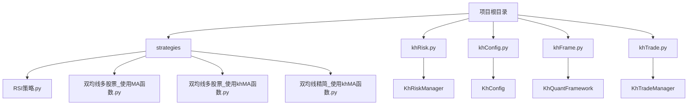
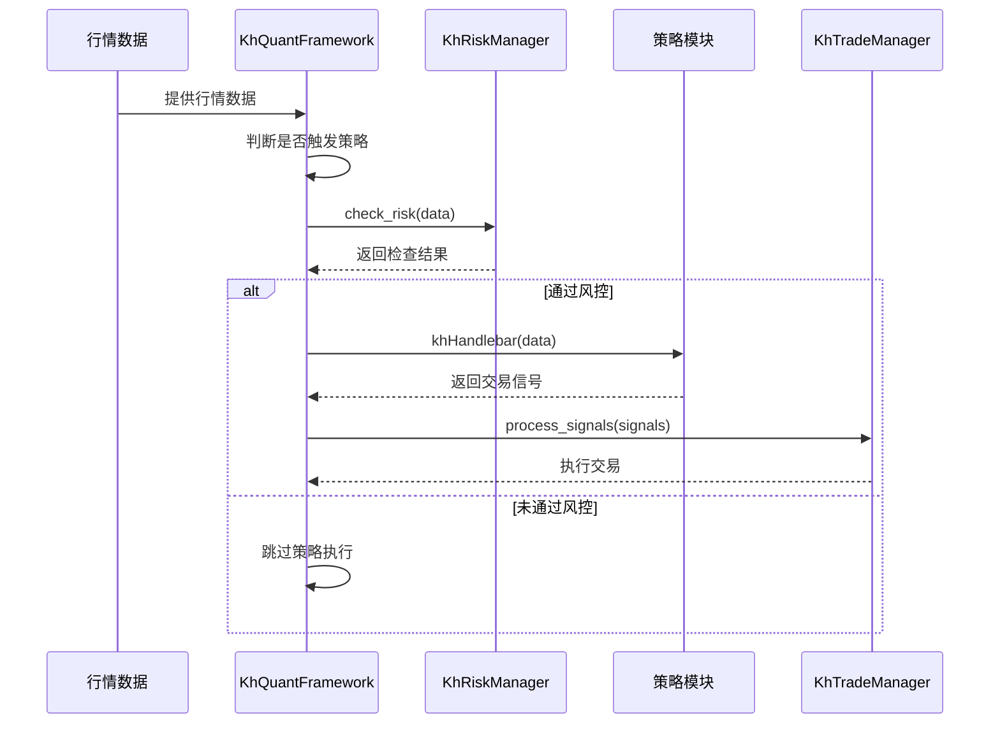
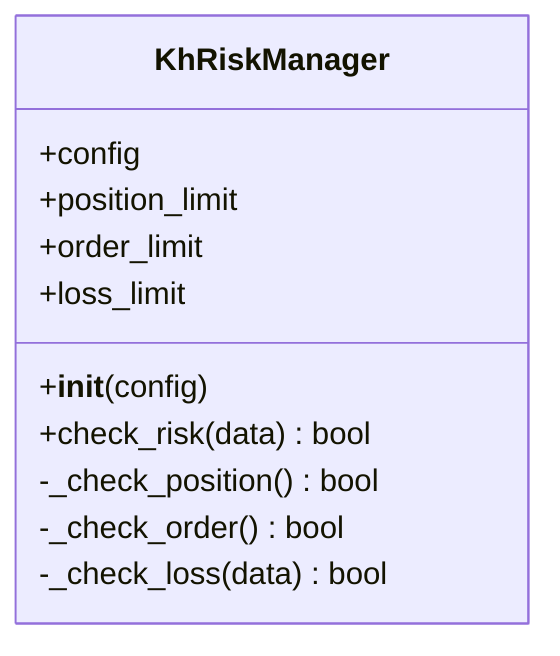
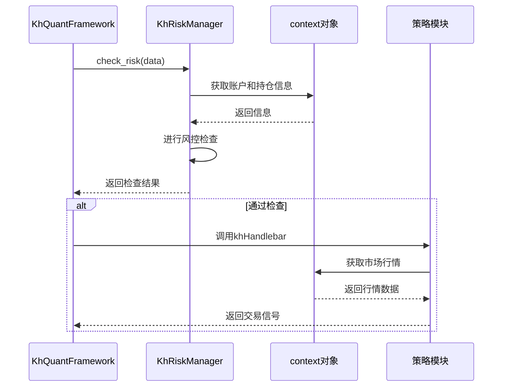
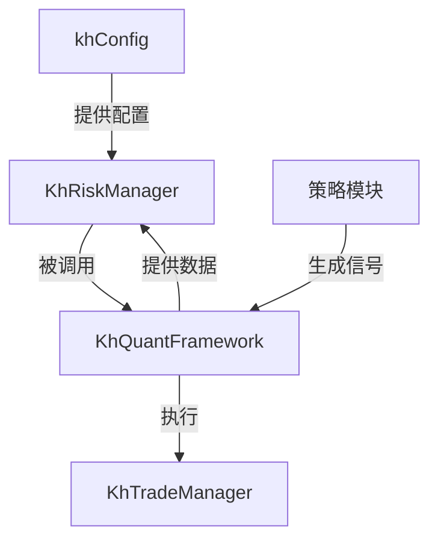

# 风控扩展

<cite>
**本文档引用的文件**   
- [khRisk.py](file://khRisk.py#L0-L50)
- [khConfig.py](file://khConfig.py#L0-L104)
- [khFrame.py](file://khFrame.py#L714-L714)
- [khFrame.py](file://khFrame.py#L1808-L1808)
- [strategies/双均线多股票_使用khMA函数.py](file://strategies/双均线多股票_使用khMA函数.py#L0-L32)
</cite>

## 目录
1. [引言](#引言)
2. [项目结构](#项目结构)
3. [核心组件](#核心组件)
4. [架构概述](#架构概述)
5. [详细组件分析](#详细组件分析)
6. [依赖分析](#依赖分析)
7. [性能考虑](#性能考虑)
8. [故障排除指南](#故障排除指南)
9. [结论](#结论)
10. [附录](#附录)（如有必要）

## 引言
本文档详细说明如何基于`khRisk.py`模块构建自定义风控系统。解析现有风控逻辑的实现机制，包括持仓检查、止损触发和资金占用验证。提供扩展示例：如何添加动态仓位管理、波动率自适应止损、行业集中度限制等高级风控规则。展示如何在策略中通过`context`对象与风控模块交互，并确保交易指令在执行前通过自定义风控校验。结合实际交易场景，说明如何防止过度交易、控制最大回撤和实现组合风险分散。

## 项目结构
本项目采用模块化设计，主要包含策略文件、核心功能模块和框架文件。策略文件位于`strategies`目录下，核心功能模块包括`khRisk.py`（风险管理）、`khTrade.py`（交易管理）、`khConfig.py`（配置管理）等。框架主类`KhQuantFramework`在`khFrame.py`中定义，负责协调各模块的运行。



**图源**
- [khRisk.py](file://khRisk.py#L0-L50)
- [khConfig.py](file://khConfig.py#L0-L104)
- [khFrame.py](file://khFrame.py#L714-L714)

**节源**
- [khRisk.py](file://khRisk.py#L0-L50)
- [khConfig.py](file://khConfig.py#L0-L104)

## 核心组件
`khRisk.py`模块中的`KhRiskManager`类是整个风控系统的核心。它通过`check_risk`方法对交易请求进行综合评估，确保所有交易指令在执行前都符合预设的风险控制规则。该类在初始化时从`KhConfig`实例中读取风控参数，包括持仓限制、委托限制和止损限制。

**节源**
- [khRisk.py](file://khRisk.py#L0-L50)
- [khConfig.py](file://khConfig.py#L0-L104)

## 架构概述
整个风控系统的架构围绕`KhQuantFramework`展开。框架在接收到行情数据后，首先通过`Trigger`判断是否需要触发策略，然后调用`KhRiskManager`的`check_risk`方法进行风控检查。只有通过风控检查的请求才会被传递给策略模块进行处理，最终生成的交易信号再经过`KhTradeManager`执行。



**图源**
- [khFrame.py](file://khFrame.py#L714-L714)
- [khRisk.py](file://khRisk.py#L0-L50)

## 详细组件分析
### KhRiskManager 分析
`KhRiskManager`类通过三个私有方法实现具体的风控逻辑：`_check_position`检查持仓限制，`_check_order`检查委托限制，`_check_loss`检查止损限制。这些方法在`check_risk`方法中被依次调用，只有当所有检查都通过时，交易请求才会被放行。

#### 类图


**图源**
- [khRisk.py](file://khRisk.py#L0-L50)

**节源**
- [khRisk.py](file://khRisk.py#L0-L50)

### 风控与策略交互分析
在策略执行过程中，`context`对象是连接策略与风控系统的关键。策略通过`context`获取当前的账户信息、持仓情况和市场行情，而风控系统则通过`context`中的信息进行风险评估。这种设计使得风控逻辑与策略逻辑解耦，提高了系统的灵活性和可维护性。

#### 交互序列图


**图源**
- [khFrame.py](file://khFrame.py#L714-L714)
- [strategies/双均线多股票_使用khMA函数.py](file://strategies/双均线多股票_使用khMA函数.py#L0-L32)

**节源**
- [khFrame.py](file://khFrame.py#L714-L714)
- [strategies/双均线多股票_使用khMA函数.py](file://strategies/双均线多股票_使用khMA函数.py#L0-L32)

## 依赖分析
`KhRiskManager`类依赖于`KhConfig`类来获取风控参数，同时被`KhQuantFramework`类所依赖，在每次策略执行前进行风控检查。这种依赖关系确保了风控参数的集中管理和风控逻辑的统一执行。



**图源**
- [khRisk.py](file://khRisk.py#L0-L50)
- [khConfig.py](file://khConfig.py#L0-L104)
- [khFrame.py](file://khFrame.py#L714-L714)

**节源**
- [khRisk.py](file://khRisk.py#L0-L50)
- [khConfig.py](file://khConfig.py#L0-L104)

## 性能考虑
风控检查作为策略执行的前置条件，其性能直接影响整个系统的响应速度。目前的实现中，风控检查逻辑较为简单，主要进行参数读取和条件判断，时间复杂度为O(1)。在高频率交易场景下，这种轻量级的风控检查不会成为性能瓶颈。未来如果需要实现更复杂的风控逻辑，建议采用缓存机制和异步处理来保证系统性能。

## 故障排除指南
当交易请求被意外阻止时，首先应检查`KhRiskManager`的风控参数设置是否合理。可以通过在`khConfig.py`中调整`position_limit`、`order_limit`和`loss_limit`等参数来放宽风控条件。同时，检查日志输出，确认是哪个风控检查环节被触发。如果问题依然存在，可以暂时将`KhRiskManager`的相关方法返回值设为`True`进行调试，以确定问题是否出在风控模块。

**节源**
- [khRisk.py](file://khRisk.py#L0-L50)
- [khConfig.py](file://khConfig.py#L0-L104)

## 结论
基于`khRisk.py`模块构建的风控系统为量化交易提供了基础的安全保障。通过解析现有风控逻辑，我们可以在此基础上扩展更高级的风控规则，如动态仓位管理、波动率自适应止损等。与`context`对象的交互机制使得风控系统能够全面获取交易所需信息，确保交易指令在执行前通过严格的风控校验。在实际应用中，合理的风控策略能够有效防止过度交易、控制最大回撤并实现组合风险分散，是量化交易系统不可或缺的重要组成部分。

## 附录
### 风控参数配置示例
在`config.json`文件中，风控参数的配置如下：
```json
"risk": {
    "position_limit": 0.95,
    "order_limit": 100,
    "loss_limit": 0.1
}
```

### 策略中获取风控参数示例
```python
def init(stock_list, context):
    config = context['__framework__'].config
    position_limit = config.position_limit
    order_limit = config.order_limit
    loss_limit = config.loss_limit
    print(f"当前风控参数: 持仓限制={position_limit}, 委托限制={order_limit}, 止损限制={loss_limit}")
```