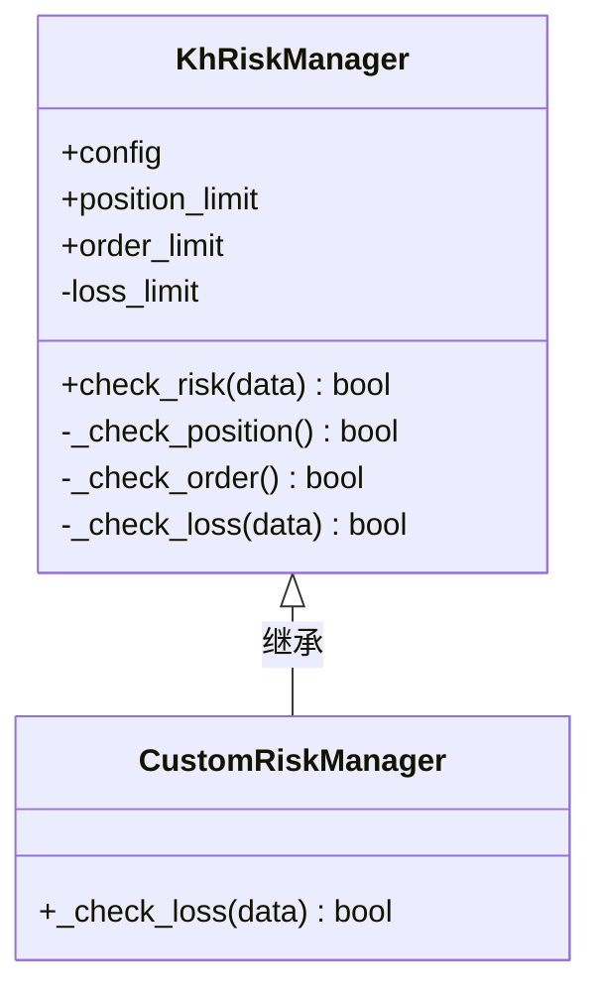
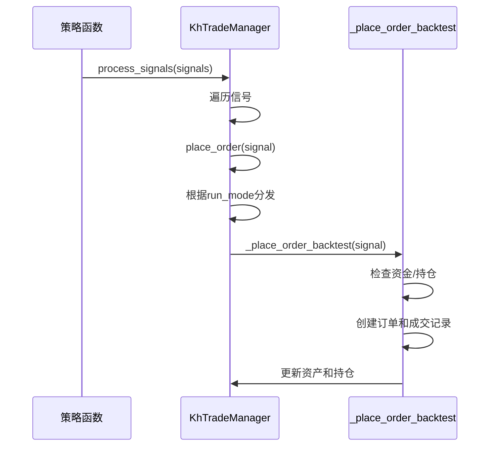

# 高级主题

<cite>
**本文档引用的文件**   
- [khRisk.py](file://khRisk.py)
- [khTrade.py](file://khTrade.py)
- [khConfig.py](file://khConfig.py)
- [khFrame.py](file://khFrame.py)
- [khQTTools.py](file://khQTTools.py)
- [strategies/双均线多股票_使用khMA函数.py](file://strategies/双均线多股票_使用khMA函数.py)
- [strategies/双均线精简_使用khMA函数.py](file://strategies/双均线精简_使用khMA函数.py)
- [khQuantImport.py](file://khQuantImport.py)
</cite>

## 目录
1. [引言](#引言)
2. [扩展个性化风控规则](#扩展个性化风控规则)
3. [支持复杂订单类型](#支持复杂订单类型)
4. [多股票策略中的资金分配与信号同步](#多股票策略中的资金分配与信号同步)
5. [性能剖析与优化](#性能剖析与优化)
6. [事件驱动架构下的状态与并发管理](#事件驱动架构下的状态与并发管理)
7. [高级用法与最佳实践](#高级用法与最佳实践)
8. [结论](#结论)

## 引言

本文档旨在为高级用户提供一份深度技术指南，深入探讨看海量化交易系统（KHQuant）中一系列复杂且关键的主题。我们将超越基础的策略开发，深入到系统的核心机制，包括如何实现高度个性化的风险管理、如何精确建模交易成本以进行高性能回测、以及如何优化策略以应对复杂的多股票场景。文档将结合实际代码案例，分析`khRisk.py`和`khTrade.py`等核心模块的内部实现，指导用户进行二次开发和性能调优，从而充分发挥该平台在量化研究中的潜力。

## 扩展个性化风控规则

看海量化系统通过`khRisk.py`模块提供了基础的风控框架，但其真正的价值在于其可扩展性。用户可以通过继承`KhRiskManager`类并重写其检查方法，来实现高度个性化的风控逻辑。

`KhRiskManager`类的核心是一个`check_risk`方法，它按顺序调用`_check_position`、`_check_order`和`_check_loss`三个私有方法。这种设计模式（模板方法模式）允许用户在不改变整体风控流程的前提下，自由地替换或增强任何一个具体的风控环节。

例如，要实现一个基于波动率的动态止损规则，可以创建一个自定义的风控管理器。首先，从`khRisk.py`中继承`KhRiskManager`。然后，重写`_check_loss`方法。在新的实现中，可以利用`khQTTools.py`中的`khHistory`函数获取股票的历史价格数据，计算其波动率（如ATR指标），并根据当前波动率的大小动态调整止损幅度。这样，系统在市场波动剧烈时会自动放宽止损，避免被噪音触发，而在市场平稳时则收紧止损，以保护利润。

此外，`khConfig.py`中的`KhConfig`类负责加载和管理所有配置，包括风控参数。这意味着用户可以在配置文件中定义自己的风控参数（如`dynamic_stop_loss_multiplier`），并在自定义的风控类中通过`self.config`访问这些参数，从而实现配置驱动的风控策略，无需修改代码即可调整规则。

**代码片段路径**
- [khRisk.py](file://khRisk.py#L1-L51)
- [khConfig.py](file://khConfig.py#L1-L105)

## 支持复杂订单类型

`khTrade.py`模块中的`KhTradeManager`类是交易逻辑的核心，它不仅处理交易成本，还负责将策略信号转化为具体的交易指令。通过分析其`process_signals`和`place_order`方法，我们可以看到扩展复杂订单类型的可能性。

`process_signals`方法接收一个信号列表，每个信号是一个包含`code`（股票代码）、`action`（买卖）、`price`（价格）、`volume`（数量）等字段的字典。这个设计非常灵活，因为它允许在信号字典中添加自定义字段。例如，要支持“最优价”（Best Price）订单，可以在信号中添加一个`order_type`字段，其值为`"best"`。

在`place_order`方法中，系统根据`config.run_mode`选择不同的下单逻辑（实盘、模拟、回测）。在`_place_order_backtest`方法中，订单的`price_type`和`price`字段被设置。通过检查信号中的`order_type`，我们可以修改这一逻辑。如果`order_type`是`"best"`，则可以忽略信号中的`price`，转而根据当前的盘口数据（买一价或卖一价）来确定实际成交价。这需要在`khFrame.py`的框架中，在生成信号前获取实时的盘口数据，并将其作为参数传递给`generate_signal`函数。

此外，`khTrade.py`已经内置了对“限价”（`limit`）和“市价”（`market`）订单的支持。通过类似的扩展，可以支持“冰山单”、“止损单”等更复杂的订单类型。关键在于`khTradeManager`的`place_order`方法作为一个统一的入口，能够根据信号中的元数据（metadata）来决定如何执行订单，这为实现复杂的交易逻辑提供了坚实的基础。

**代码片段路径**
- [khTrade.py](file://khTrade.py#L1-L560)
- [khQTTools.py](file://khQTTools.py#L1-L2746)

## 多股票策略中的资金分配与信号同步

在多股票策略中，如`strategies/双均线多股票_使用khMA函数.py`所示，资金分配和信号同步是两个关键挑战。该策略为每只符合条件的股票生成买入信号，并使用`generate_signal`函数中的`ratio`参数来控制仓位（如0.5表示使用50%的可用资金）。

然而，当多个信号在同一时间点触发时，简单的按比例分配可能会导致问题。例如，如果资金池为100万元，同时有两只股票触发买入信号，且每只都要求使用50%的资金，那么总需求为100万元，但实际可用资金可能因第一笔交易的交易成本而不足。`khTrade.py`在`_place_order_backtest`方法中通过`required_cash`变量精确计算了包含交易成本的总资金需求，并在下单前进行检查，有效避免了超买问题。

关于信号同步，`khFrame.py`中的`KhQuantFramework`类通过`_run_backtest`方法按时间顺序处理所有股票的数据。它首先获取所有股票的历史数据，然后提取所有唯一的时间点（`all_times`），并按时间排序。这确保了在任何一个时间点，所有股票的行情数据都是“同步”的。策略函数`khHandlebar`接收一个包含所有股票数据的`data`字典，因此可以基于同一时间点的全市场信息做出决策，实现了完美的信号同步。

为了优化资金分配，可以实现更高级的算法。例如，根据股票的动量强度或风险评分对`ratio`进行加权，而不是简单地平均分配。这可以通过在策略中计算一个“权重”字段，并将其作为`generate_signal`的参数来实现。

**代码片段路径**
- [strategies/双均线多股票_使用khMA函数.py](file://strategies/双均线多股票_使用khMA函数.py#L1-L33)
- [khTrade.py](file://khTrade.py#L1-L560)
- [khFrame.py](file://khFrame.py#L1-L2679)

## 性能剖析与优化

高性能回测对于复杂策略至关重要。`khFrame.py`中的`_run_backtest`方法是性能优化的关键。通过分析其代码，我们可以识别出主要的性能瓶颈并提出优化方案。

一个显著的瓶颈是数据访问。在原始实现中，每次循环都需要从`xtdata`重新获取数据。优化方案是**数据缓存**。在`_run_backtest`的开始阶段，一次性加载所有股票在回测周期内的全部历史数据，并将其存储在`historical_data_ref`字典中。然后，在循环中，通过`time_idx_cache`（一个时间戳到索引的映射）直接从缓存的`DataFrame`中提取对应时间点的数据，避免了重复的I/O操作。

另一个瓶颈是频繁的日志记录和回调。在回测过程中，`self.trader_callback.gui.log_message`被大量调用。在生产环境或大规模回测中，应将日志级别设置为`ERROR`或`WARNING`，或者在非调试模式下禁用GUI回调，以显著提升速度。

此外，`record_results`方法在每个时间点都计算持仓市值。优化方案是**延迟计算**。只有在交易发生或需要记录每日统计时，才重新计算市值。在其他时间，可以沿用上一个时间点的市值数据。

最后，`khFrame.py`中的`_run_backtest`方法已经实现了**进度条和时间统计**，这对于性能剖析非常有用。通过分析`time_stats`字典，可以精确地知道`构造数据`、`策略处理`、`记录结果`等各个阶段所消耗的时间，从而有针对性地进行优化。

**代码片段路径**
- [khFrame.py](file://khFrame.py#L1-L2679)

## 事件驱动架构下的状态与并发管理

看海量化系统采用事件驱动架构，由`khFrame.py`中的`TriggerBase`及其子类（如`TickTrigger`, `KLineTrigger`）驱动策略执行。在这种架构下，状态管理和并发处理是保证系统稳定性的关键。

系统的状态主要由`KhTradeManager`中的`assets`（资产）、`positions`（持仓）、`orders`（订单）和`trades`（成交）四个字典维护。这些状态在`_place_order_backtest`等方法中被修改。由于回测是单线程执行的，因此不存在并发修改的问题。然而，在未来的实盘或模拟模式下，如果引入多线程（如一个线程处理行情，另一个线程处理交易），就必须考虑并发安全。

`KhTradeManager`的设计是**状态集中管理**。所有的状态变更都通过`process_signals`这一单一入口进行，这简化了并发控制。如果需要支持多线程，可以在`KhTradeManager`内部使用锁（如`threading.Lock`）来保护这些核心状态字典，确保在任何时刻只有一个线程可以修改状态。

此外，`MyTraderCallback`类中的回调方法（如`on_stock_order`, `on_stock_trade`）是事件处理的终点。这些方法可能会被异步的交易接口调用，因此它们的执行是并发的。为了避免在回调中直接修改核心状态，最佳实践是将这些事件放入一个队列（`queue.Queue`），然后由主事件循环在安全的上下文中处理队列中的事件，从而将异步事件同步化。

**代码片段路径**
- [khFrame.py](file://khFrame.py#L1-L2679)

## 高级用法与最佳实践

结合以上分析，以下是使用看海量化系统的高级用法和最佳实践：

1.  **模块化开发**：遵循`khQuantImport.py`的设计理念，将复杂的策略逻辑分解为独立的函数或类。例如，将风控、资金管理、信号生成等模块分开，提高代码的可读性和可维护性。
2.  **利用便捷函数**：充分利用`khQuantImport.py`中提供的`khGet`, `khPrice`, `khHas`, `khBuy`, `khSell`等便捷函数，它们封装了底层的复杂性，使策略代码更加简洁。
3.  **配置驱动**：将策略的参数（如均线周期、仓位比例）定义在`khConfig.py`的配置文件中，而不是硬编码在策略里。这使得策略的参数调整和回测变得极其方便。
4.  **性能优先**：在编写策略时，避免在`khHandlebar`函数中进行耗时的计算（如复杂的机器学习模型预测）。应将这些计算移到`init`函数或盘前回调`khPreMarket`中，因为它们只执行一次。
5.  **利用回调**：善用`khPreMarket`和`khPostMarket`回调函数。可以在`khPreMarket`中预计算全市场指标，在`khPostMarket`中进行日终的绩效分析和日志记录。

## 结论

通过对`khRisk.py`、`khTrade.py`和`khFrame.py`等核心模块的深入分析，我们可以看到看海量化系统为高级用户提供了强大的扩展性和优化空间。通过继承和重写，用户可以实现个性化的风控和复杂的订单类型；通过理解其事件驱动和数据处理机制，可以解决多股票策略中的资金分配与信号同步问题；通过性能剖析，可以识别瓶颈并进行针对性优化。掌握这些高级主题，将使用户能够构建出更稳健、更高效、更智能的量化交易策略。